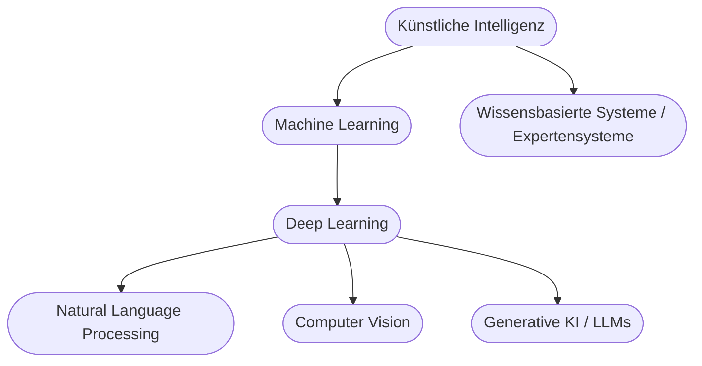

# Kapitel 1 – Überblick Künstliche Intelligenz

{{ progress(1) }}

<div class="lernziele" markdown>
<h3>Was du in diesem Kapitel lernst</h3>

- Was mit **Künstlicher Intelligenz (KI)** gemeint ist und wie sie sich von klassischer Software unterscheidet
- Welche **Teilgebiete** die KI hat (Machine Learning, Deep Learning, NLP, Computer Vision …)
- Der Unterschied zwischen **schwacher** und **starker** KI – und wo wir heute stehen
- Wo dir KI im Arbeitsalltag begegnet und was **Microsoft Copilot** in diese Landschaft einordnet
</div>

---

## So gehst du vor

1. Lies die Kapitelinhalte und präge dir die zentralen Begriffe ein.
2. Bearbeite die **Kurzübungen** – die meisten setzt du direkt in **Microsoft Copilot** um.
3. Arbeite die **Workshop-Aufgabe** durch. Sie verknüpft das Gelernte mit deinem eigenen Arbeitsumfeld.

---

## 1.1 Was ist Künstliche Intelligenz?

**Künstliche Intelligenz** ist ein Teilgebiet der Informatik, das sich mit Systemen beschäftigt, die Aufgaben lösen, für die man normalerweise **menschliche Intelligenz** voraussetzt: Sprache verstehen, Muster erkennen, Entscheidungen treffen, aus Erfahrung lernen.

Der entscheidende Unterschied zu klassischer Software:

| Klassische Software | KI-System |
|---|---|
| Folgt fest programmierten **Regeln** (`wenn … dann …`) | **Lernt Muster** aus Daten und Beispielen |
| Verhalten ist vollständig vorhersehbar | Verhalten ist **statistisch**, nicht immer identisch |
| Entwickler beschreibt jeden Fall | Entwickler stellt **Daten** und ein Lernverfahren bereit |
| Beispiel: Taschenrechner, Buchhaltungssoftware | Beispiel: Spam-Filter, Sprachassistent, Copilot |

!!! info "Merksatz"
    Klassische Software wird **programmiert**, KI wird **trainiert**. Statt „Sag dem Computer genau, was er tun soll" heißt es bei KI „Zeig dem Computer viele Beispiele, damit er das Muster selbst findet".

---

## 1.2 Die Teilgebiete der KI

KI ist ein Oberbegriff. Darunter liegen mehrere ineinander verschachtelte Teilgebiete:



| Teilgebiet | Worum es geht | Beispiel |
|---|---|---|
| Machine Learning (ML) | Systeme lernen Muster aus Daten | Kreditwürdigkeit einschätzen |
| Deep Learning | ML mit tiefen neuronalen Netzen | Bilderkennung, Sprachmodelle |
| Natural Language Processing (NLP) | Verarbeitung natürlicher Sprache | Übersetzung, Chatbots |
| Computer Vision | Verstehen von Bildern und Videos | Qualitätsprüfung, Gesichtserkennung |
| Generative KI | Erzeugen neuer Inhalte | Text, Bild, Code (Copilot, ChatGPT) |

!!! tip "Einordnung von Copilot"
    **Microsoft Copilot** basiert auf **großen Sprachmodellen (LLMs)** und gehört damit zur **generativen KI** – also ganz unten rechts in der Grafik. Es erzeugt Texte, Zusammenfassungen, Code und Bilder auf Basis deiner Eingaben (Prompts).

---

## 1.3 Schwache vs. starke KI

| Merkmal | Schwache KI (Narrow AI) | Starke KI (General AI) |
|---|---|---|
| Fähigkeit | Löst **eine** konkrete Aufgabe | Beliebige Aufgaben wie ein Mensch |
| Beispiel | Übersetzer, Copilot, Navi | (existiert **nicht**, Forschung/Vision) |
| Bewusstsein | Nein | Hypothetisch |
| Stand heute | **Alle** heutigen Systeme | Nicht erreicht |

!!! warning "Häufiges Missverständnis"
    Auch beeindruckende Systeme wie Copilot sind **schwache KI**: Sie sind extrem gut in Sprachaufgaben, „verstehen" aber nicht im menschlichen Sinn und haben kein Bewusstsein. Sie berechnen das **wahrscheinlich passende nächste Wort**.

---

## 1.4 Wo dir KI im Arbeitsalltag begegnet

KI steckt heute in vielen Werkzeugen, oft unsichtbar:

- **Suche & Empfehlungen:** Suchmaschinen, Produktvorschläge
- **Kommunikation:** Spam-Filter, automatische Antwortvorschläge, Übersetzung
- **Office & Produktivität:** Zusammenfassungen, Textentwürfe, Formeln – hier setzt **Microsoft Copilot** in Word, Excel, Outlook und Teams an
- **Analyse:** Prognosen, Auffälligkeiten in Daten

**Copilot-Prompt zum Ausprobieren** – öffne Copilot und gib ein:

```text
Erkläre einer Kollegin ohne IT-Hintergrund in 5 Sätzen, was Künstliche
Intelligenz ist und wie sie sich von normaler Software unterscheidet.
Nutze ein Alltagsbeispiel.
```

Beobachte, wie Copilot den Auftrag interpretiert. Genau dieses gezielte Formulieren von Aufträgen ist **Prompt Engineering** – der rote Faden dieses Kurses.

---

## Kurzübungen

{{ task(file="tasks/k01_01.yaml") }}

{{ task(file="tasks/k01_02.yaml") }}

---

## Workshop

{{ task(file="tasks/workshop_k01.yaml") }}
