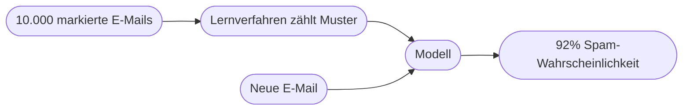

# Kapitel 1 – Überblick Künstliche Intelligenz

{{ progress(1) }}

<div class="lernziele" markdown>
<h3>Was du in diesem Kapitel lernst</h3>

- Was mit **Künstlicher Intelligenz (KI)** gemeint ist und wie sie sich von klassischer Software unterscheidet
- Warum es **keine** einheitliche Definition gibt und was der „KI-Effekt" damit zu tun hat
- Welche **Teilgebiete** die KI hat (Machine Learning, Deep Learning, NLP, Computer Vision …) und wie sie zusammenhängen
- Der Unterschied zwischen **schwacher** und **starker** KI – und wo wir heute realistisch stehen
- Wie das **Paradigma „Daten statt Regeln"** funktioniert – an einem durchgerechneten Beispiel
- Wo dir KI im Arbeitsalltag begegnet und was **Microsoft Copilot** in diese Landschaft einordnet
</div>

---

## So gehst du vor

1. Lies die Kapitelinhalte und präge dir die zentralen Begriffe ein.
2. Bearbeite die **Kurzübungen** – die meisten setzt du direkt in **Microsoft Copilot** um.
3. Arbeite die **Workshop-Aufgabe** durch. Sie verknüpft das Gelernte mit deinem eigenen Arbeitsumfeld.

---

## 1.1 Was ist Künstliche Intelligenz?

**Künstliche Intelligenz** ist ein Teilgebiet der Informatik, das sich mit Systemen beschäftigt, die Aufgaben lösen, für die man normalerweise **menschliche Intelligenz** voraussetzt: Sprache verstehen, Muster erkennen, Entscheidungen treffen, aus Erfahrung lernen.

Wichtig ist die Betonung auf **„für die man menschliche Intelligenz voraussetzt"**. KI muss nicht denken wie ein Mensch – sie muss nur ein Ergebnis liefern, das wir sonst nur von intelligenten Menschen erwarten würden. Ein Taschenrechner rechnet schneller als jeder Mensch, gilt aber nicht als KI, weil das Vorgehen fest vorgegeben ist. Ein System, das aus tausenden E-Mails **selbst lernt**, welche Spam sind, gilt als KI.

### Der entscheidende Unterschied: Regeln vs. Lernen

| Klassische Software | KI-System |
|---|---|
| Folgt fest programmierten **Regeln** (`wenn … dann …`) | **Lernt Muster** aus Daten und Beispielen |
| Verhalten ist vollständig vorhersehbar | Verhalten ist **statistisch**, nicht immer identisch |
| Entwickler beschreibt jeden Fall | Entwickler stellt **Daten** und ein Lernverfahren bereit |
| Fehler = Programmierfehler (Bug) | Fehler = ungünstige Daten oder Grenzfall |
| Beispiel: Taschenrechner, Buchhaltungssoftware | Beispiel: Spam-Filter, Sprachassistent, Copilot |

!!! info "Merksatz"
    Klassische Software wird **programmiert**, KI wird **trainiert**. Statt „Sag dem Computer genau, was er tun soll" heißt es bei KI „Zeig dem Computer viele Beispiele, damit er das Muster selbst findet".

### Warum es keine eindeutige Definition gibt

„Künstliche Intelligenz" ist ein **bewegliches Ziel**. Sobald ein Problem gelöst ist, wirkt es plötzlich nicht mehr wie „echte" Intelligenz – dieses Phänomen nennt man den **KI-Effekt**: *„KI ist alles, was noch nicht funktioniert."*

!!! example "Der KI-Effekt in der Praxis"
    - In den 1990ern galt „ein Computer schlägt den Schachweltmeister" als Beweis für Intelligenz. Heute sagt man: „Das ist doch nur Rechenleistung."
    - Spracherkennung, Gesichtserkennung, Übersetzung – alles galt einmal als „KI-Meilenstein" und wird heute als selbstverständliche Funktion wahrgenommen.

    Für die Praxis ist die genaue Definition zweitrangig. Entscheidend ist: **Lernt das System aus Daten, oder folgt es festen Regeln?**

---

## 1.2 Das Paradigma „Daten statt Regeln" – durchgerechnet

Um den Unterschied wirklich zu verstehen, betrachten wir dieselbe Aufgabe zweimal: **Erkenne, ob eine E-Mail Spam ist.**

**Ansatz 1 – klassische Regeln (von Hand programmiert):**

```text
WENN Betreff enthält "Gewinn" ODER "gratis" ODER "!!!"
   DANN markiere als Spam
```

Das Problem: Spammer schreiben „G-r-a-t-i-s" oder „Gew1nn". Für jede neue Masche muss ein Mensch eine neue Regel ergänzen. Das Regelwerk wird unübersichtlich und ist immer einen Schritt hinterher.

**Ansatz 2 – KI (aus Daten gelernt):**

Man gibt dem System **10.000 E-Mails**, jeweils markiert mit „Spam" oder „kein Spam". Das Verfahren zählt, welche Merkmale bei Spam häufiger vorkommen, und leitet daraus **Wahrscheinlichkeiten** ab. Trifft eine neue E-Mail ein, berechnet es: „Mit 92 % Wahrscheinlichkeit Spam."



!!! info "Warum das mächtiger ist"
    Taucht eine neue Spam-Masche auf, muss niemand eine Regel schreiben – man ergänzt einfach neue **Beispiele** und trainiert nach. Das System passt sich an, statt starr zu bleiben. Genau dieser Wechsel von „Regeln von Hand" zu „Muster aus Daten" ist der Kern moderner KI.

---

## 1.3 Die Teilgebiete der KI

KI ist ein Oberbegriff. Darunter liegen mehrere ineinander verschachtelte Teilgebiete:


| Teilgebiet | Worum es geht | Beispiel | Bezug zu Copilot |
|---|---|---|---|
| Machine Learning (ML) | Systeme lernen Muster aus Daten | Kreditwürdigkeit einschätzen | Grundlage |
| Deep Learning | ML mit tiefen neuronalen Netzen | Bilderkennung, Sprachmodelle | direkt |
| Natural Language Processing (NLP) | Verarbeitung natürlicher Sprache | Übersetzung, Chatbots | Kernstück |
| Computer Vision | Verstehen von Bildern und Videos | Qualitätsprüfung, Gesichtserkennung | teilweise (Bild-Upload) |
| Generative KI | Erzeugen neuer Inhalte | Text, Bild, Code (Copilot, ChatGPT) | genau hier |

Wichtig ist die **Verschachtelung**: Deep Learning ist ein Teil von Machine Learning, Machine Learning ist ein Teil von KI. NLP und Computer Vision sind **Anwendungsfelder**, die heute meist mit Deep Learning umgesetzt werden. Ganz früher (bis in die 1980er) dominierten dagegen **Expertensysteme**, die auf handgeschriebenen Regeln beruhten – ohne Lernen.

!!! tip "Einordnung von Copilot"
    **Microsoft Copilot** basiert auf **großen Sprachmodellen (LLMs)** und gehört damit zur **generativen KI** – also ganz unten rechts in der Grafik. Es erzeugt Texte, Zusammenfassungen, Code und Bilder auf Basis deiner Eingaben (Prompts). Unter der Haube stecken Deep Learning und NLP; das gesamte Fundament vertiefst du in **Block 2**.

---

## 1.4 Schwache vs. starke KI

| Merkmal | Schwache KI (Narrow AI) | Starke KI (General AI / AGI) |
|---|---|---|
| Fähigkeit | Löst **eine** (Klasse von) Aufgaben | Beliebige Aufgaben wie ein Mensch |
| Beispiel | Übersetzer, Copilot, Navi, Schach-KI | (existiert **nicht**, Forschung/Vision) |
| Übertragbarkeit | kann Gelerntes kaum auf Fremdes übertragen | flexibel wie menschliche Intelligenz |
| Bewusstsein | Nein | hypothetisch |
| Stand heute | **Alle** heutigen Systeme | nicht erreicht |

Zwischen beiden gibt es keine „graduelle" Skala, die man einfach hochzählt. Auch ein sehr fähiges System wie Copilot ist **schwache KI** – es ist erstaunlich breit einsetzbar (Text, Code, Zusammenfassung), aber es „versteht" nicht im menschlichen Sinn und kann sich kein eigenes Ziel setzen.

!!! warning "Häufiges Missverständnis"
    Dass Copilot flüssig und „klug" antwortet, verleitet zur Annahme, es „denke". Tatsächlich berechnet es das **wahrscheinlich passende nächste Wort** auf Basis riesiger Textmengen (Details in Kapitel 15). Es hat kein Bewusstsein, keine Absichten und kein echtes Weltverständnis. Diese Einordnung ist entscheidend, um Ergebnisse **richtig einzuschätzen und zu prüfen**.

!!! info "Und die 'Superintelligenz'?"
    In den Medien ist oft von „Superintelligenz" die Rede – einer KI, die den Menschen in **allen** Bereichen übertrifft. Das ist eine **hypothetische** Stufe jenseits der starken KI und gehört in die Zukunfts-/Risikodebatte, nicht in die heutige betriebliche Praxis.

---

## 1.5 Wo dir KI im Arbeitsalltag begegnet

KI steckt heute in vielen Werkzeugen, oft unsichtbar:

| Bereich | Sichtbare Funktion | Dahinterliegendes KI-Feld |
|---|---|---|
| Suche & Empfehlungen | Produktvorschläge, Auto-Vervollständigung | ML, NLP |
| Kommunikation | Spam-Filter, Antwortvorschläge, Übersetzung | NLP |
| Office & Produktivität | Zusammenfassungen, Textentwürfe, Formeln | generative KI (**Copilot**) |
| Analyse | Prognosen, Anomalie-Erkennung | ML |
| Medien | Untertitel, Bildbearbeitung, Sprachausgabe | Deep Learning |

### Erste praktische Erfahrung mit Copilot

Öffne Copilot und gib ein:

```text
Erkläre einer Kollegin ohne IT-Hintergrund in 5 Sätzen, was Künstliche
Intelligenz ist und wie sie sich von normaler Software unterscheidet.
Nutze ein Alltagsbeispiel.
```

Beobachte die Antwort – und schärfe dann nach:

```text
Kürze auf 3 Sätze und ersetze das Beispiel durch eines aus dem Kundenservice.
```

!!! example "Was du dabei lernst"
    Zwei Dinge werden sofort sichtbar: (1) Copilot liefert **sprachlich sauberen** Text – aber ob Beispiel und Ton passen, entscheidest **du**. (2) Der **zweite, präzisere Auftrag** verbessert das Ergebnis gezielt. Genau dieses schrittweise Steuern von Aufträgen ist **Prompt Engineering** – der rote Faden dieses Kurses (systematisch in Kapitel 14).

!!! warning "Verantwortung von Anfang an"
    KI liefert **Entwürfe und Vorschläge**, keine geprüften Wahrheiten. Fakten, Ton und Freigabe bleiben immer beim Menschen. Diese Haltung begleitet dich durch den ganzen Kurs (vertieft in Block 4).

---

## Zusammenfassung

- KI löst Aufgaben, die man sonst menschlicher Intelligenz zuschreibt – der Kern ist **Lernen aus Daten statt fester Regeln**.
- Eine feste Definition gibt es nicht (**KI-Effekt**); die praktische Leitfrage lautet: lernt das System aus Daten?
- Teilgebiete sind verschachtelt: **Deep Learning ⊂ Machine Learning ⊂ KI**; Copilot ist **generative KI**.
- Alle heutigen Systeme sind **schwache KI** – auch Copilot berechnet Wahrscheinlichkeiten, es „denkt" nicht.
- KI ist im Arbeitsalltag allgegenwärtig; der bewusste, prüfende Umgang ist entscheidend.

---

## Kurzübungen

{{ task(file="tasks/k01_01.yaml") }}

{{ task(file="tasks/k01_02.yaml") }}

---

## Workshop

{{ task(file="tasks/workshop_k01.yaml") }}
