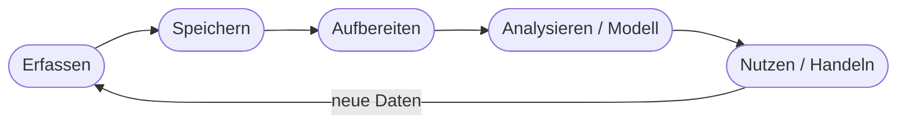

# Kapitel 11 – Big Data: Operationalisierung und Prozesse

{{ progress(11) }}

<div class="lernziele" markdown>
<h3>Was du in diesem Kapitel lernst</h3>

- Was **Big Data** ausmacht – die **„V's"** (Volume, Velocity, Variety, Veracity, Value)
- Wie eine **Datenpipeline** vom Rohdatum bis zur Nutzung aussieht
- Was **Operationalisierung** bedeutet: von der Idee in den laufenden Betrieb
- Warum **Datenqualität, Governance und Monitoring** im Dauerbetrieb entscheidend sind
- Wie sich der **Copilot-Alltag** in dieses größere Datenbild einordnet
</div>

---

## 11.1 Was ist Big Data?

**Big Data** meint Datenmengen, die so **groß, schnell und vielfältig** sind, dass klassische Werkzeuge (eine einzelne Excel-Tabelle, eine kleine Datenbank) an ihre Grenzen stoßen. Charakterisiert wird Big Data über die **„V's"**:

| V | Bedeutung | Beispiel |
|---|---|---|
| **Volume** (Menge) | sehr große Datenmengen | Millionen Sensormesswerte täglich |
| **Velocity** (Geschwindigkeit) | Daten entstehen in Echtzeit | Klickströme, Maschinendaten |
| **Variety** (Vielfalt) | verschiedene Formate | Text, Bild, Tabellen, Logs |
| **Veracity** (Verlässlichkeit) | Datenqualität schwankt | fehlerhafte/fehlende Werte |
| **Value** (Wert) | erst Auswertung schafft Nutzen | Prognosen, Einsparungen |

!!! info "Nicht nur 'viel'"
    Big Data ist mehr als „viele Daten". Entscheidend ist das **Zusammenspiel** der V's: schnell **und** vielfältig **und** in schwankender Qualität. Der letzte, wichtigste Punkt ist **Value**: Daten allein sind wertlos – erst die richtige Auswertung macht sie zum Vorteil.

---

## 11.2 Die Datenpipeline

Damit Daten nutzbar werden, durchlaufen sie einen wiederkehrenden Weg – die **Datenpipeline**:



| Stufe | Aufgabe | Beispiel-Werkzeug |
|---|---|---|
| Erfassen | Daten sammeln | Sensoren, APIs, Formulare |
| Speichern | dauerhaft ablegen | Datenbank, Data Lake, Cloud |
| Aufbereiten | bereinigen/transformieren | ETL-Prozesse (Kap. 10) |
| Analysieren | Muster/Prognosen finden | ML-Modelle, BI-Tools |
| Nutzen | Entscheidungen/Aktionen ableiten | Dashboards, Copilot, Alerts |

Die Pipeline ist ein **Kreislauf**: Ergebnisse und neue Ereignisse erzeugen wieder Daten. Deshalb ist Datenarbeit keine einmalige Aktion, sondern ein **Dauerbetrieb**.

---

## 11.3 Operationalisierung: von der Idee in den Betrieb

Ein Modell im Labor ist wertlos, solange es nicht **im Alltag** läuft. **Operationalisierung** bedeutet, eine KI-/Datenlösung stabil in bestehende Prozesse und Systeme einzubetten.


**Was dazugehört:**

| Aspekt | Frage |
|---|---|
| Integration | Läuft die Lösung in unseren Systemen (ERP, M365)? |
| Automatisierung | Werden Daten automatisch verarbeitet? |
| Rollen | Wer betreibt und verantwortet die Lösung? |
| Monitoring | Wie merken wir, wenn die Qualität nachlässt? |

!!! warning "Model Drift – das stille Nachlassen"
    Ein Modell, das heute gut funktioniert, kann morgen schlechter werden, weil sich die **Realität ändert** (neue Produkte, neues Kundenverhalten). Das nennt man **Model Drift**. Deshalb braucht jede produktive KI-Lösung **Überwachung** und regelmäßiges Nachjustieren – „einmal bauen und vergessen" funktioniert nicht.

---

## 11.4 Data Governance

Bei großen Datenmengen braucht es klare **Regeln und Zuständigkeiten** – **Data Governance**:

- **Wem gehören** welche Daten? Wer darf sie nutzen?
- **Qualitätsstandards**: Wie stellen wir saubere Daten sicher?
- **Zugriffsrechte & Datenschutz**: Wer sieht was? (Kap. 33)
- **Nachvollziehbarkeit**: Woher stammt ein Wert (Data Lineage)?

Ohne Governance entstehen „Datensilos", widersprüchliche Zahlen und Datenschutzrisiken. Governance ist die organisatorische Voraussetzung dafür, dass Werkzeuge wie Copilot auf **verlässliche** Daten zugreifen.

---

## 11.5 Einordnung: Copilot im großen Datenbild

Als Copilot-Nutzer:in arbeitest du meist am **Ende** der Pipeline – beim **Nutzen** der Daten: zusammenfassen, auswerten, Berichte erstellen. Die Stufen davor (Erfassen, Speichern, Aufbereiten, Governance) sind die Arbeit von IT- und Datenteams, aber sie bestimmen, wie gut deine Copilot-Ergebnisse sein können.

**Copilot-Prompt zum Ausprobieren:**

```text
Erkläre die fünf V's von Big Data mit je einem Beispiel aus einem
produzierenden Unternehmen. Nenne anschließend, welche zwei V's in der
Praxis am häufigsten unterschätzt werden und warum.
```

!!! tip "Merke"
    Copilot ist ein starkes Werkzeug am Ende der Kette. Seine Qualität hängt aber direkt an dem, was **davor** passiert – gute Erfassung, Aufbereitung und Governance. Datenkompetenz im Team zahlt sich damit doppelt aus.

---

## Zusammenfassung

- **Big Data** wird über die **V's** beschrieben – entscheidend ist am Ende der **Value**.
- Daten durchlaufen eine **Pipeline** (Erfassen → Speichern → Aufbereiten → Analysieren → Nutzen) als Kreislauf.
- **Operationalisierung** bringt Lösungen stabil in den Betrieb – inkl. **Monitoring** gegen Model Drift.
- **Data Governance** schafft Regeln, Qualität und Nachvollziehbarkeit.
- **Copilot** arbeitet am Ende der Kette; seine Qualität hängt an den vorgelagerten Stufen.

---

## Kurzübungen

{{ task(file="tasks/k11_01.yaml") }}

{{ task(file="tasks/k11_02.yaml") }}

---

## Workshop

{{ task(file="tasks/workshop_k11.yaml") }}
