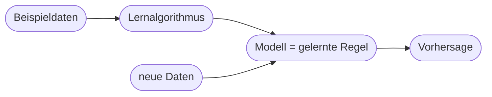
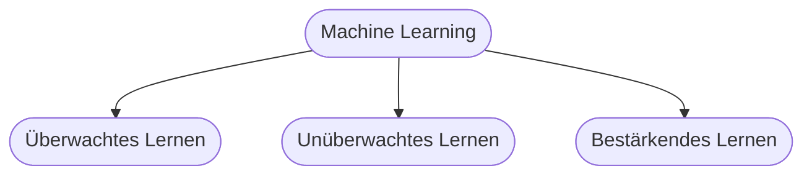
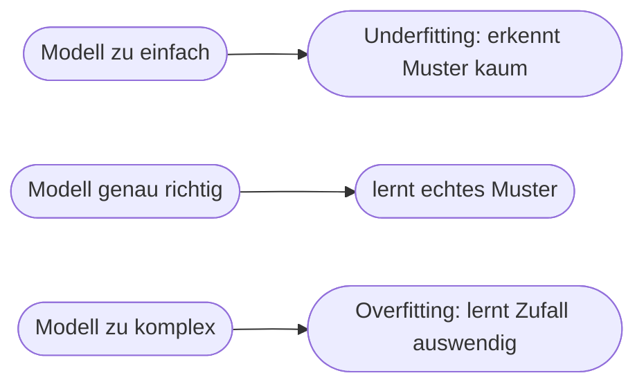

# Kapitel 12 – Machine Learning

{{ progress(12) }}

<div class="lernziele" markdown>
<h3>Was du in diesem Kapitel lernst</h3>

- Was **Machine Learning (ML)** ist und wie es sich vom klassischen Programmieren unterscheidet
- Die drei **Lernarten**: überwachtes, unüberwachtes und bestärkendes Lernen
- Wie ein Modell **trainiert, getestet** und bewertet wird – mit dem Begriff **Overfitting**
- Was **Features, Labels, Training/Test-Split** bedeuten
- Wo ML in Copilot steckt und wo die Grenzen der „Blackbox" liegen
</div>

---

## 12.1 Was ist Machine Learning?

**Machine Learning** ist das Herzstück moderner KI: Statt Regeln vorzugeben, lernt das System **Muster aus Beispielen**. Man zeigt dem Computer viele Daten, und er leitet selbst eine Regel ab.



**Vergleich mit klassischem Programmieren:**

| | Klassisch | Machine Learning |
|---|---|---|
| Eingabe | Regeln + Daten | Daten + gewünschte Ergebnisse |
| Der Mensch liefert | die Regel | die Beispiele |
| Ergebnis | Ausgabe | die **Regel** (das Modell) |

!!! info "Der Perspektivwechsel"
    Beim klassischen Programmieren schreibt der Mensch die Regel und der Computer wendet sie an. Beim ML liefert der Mensch **Beispiele mit Ergebnis**, und der Computer **findet die Regel selbst**. Genau deshalb kann ML Aufgaben lösen, für die niemand eine explizite Regel formulieren könnte (z. B. „Ist auf diesem Foto eine Katze?").

---

## 12.2 Die drei Lernarten



### Überwachtes Lernen (Supervised Learning)

Das System lernt aus Beispielen **mit bekannter Antwort** (Label). Ziel: die richtige Antwort für **neue** Fälle vorhersagen.

- **Klassifikation:** Kategorie vorhersagen („Spam / kein Spam", „Kunde kündigt / bleibt")
- **Regression:** Zahl vorhersagen (Umsatz, Preis, Temperatur)
- Beispiel: 10.000 als Spam/kein Spam markierte Mails → Modell erkennt neue Spam-Mails

### Unüberwachtes Lernen (Unsupervised Learning)

Das System bekommt Daten **ohne** vorgegebene Antworten und sucht selbst **Strukturen**.

- **Clustering:** ähnliche Gruppen finden (z. B. Kundensegmente)
- **Ausreißererkennung:** Auffälligkeiten finden (z. B. Betrug)
- Beispiel: Kunden nach Kaufverhalten automatisch in Gruppen einteilen

### Bestärkendes Lernen (Reinforcement Learning)

Das System lernt durch **Ausprobieren und Belohnung** – Details in Kapitel 17.

| Lernart | Braucht Labels? | Typische Aufgabe |
|---|---|---|
| Überwacht | ja | Vorhersagen (Klassifikation/Regression) |
| Unüberwacht | nein | Strukturen/Gruppen finden |
| Bestärkend | Belohnungssignal | Verhalten/Strategie lernen |

---

## 12.3 Grundbegriffe: Features, Labels, Training

Ein einfaches Beispiel: **Wird ein Kunde kündigen?**

| Begriff | Bedeutung | Im Beispiel |
|---|---|---|
| **Feature** (Merkmal) | Eingabegröße | Vertragsdauer, Nutzung, Reklamationen |
| **Label** (Zielwert) | gewünschte Antwort | „gekündigt: ja/nein" |
| **Trainingsdaten** | Beispiele zum Lernen | 8.000 alte Kundenfälle |
| **Testdaten** | Beispiele zum Prüfen | 2.000 zurückgehaltene Fälle |

!!! info "Warum Training UND Test getrennt sein müssen"
    Man teilt die Daten auf: Mit den **Trainingsdaten** lernt das Modell, mit den **zurückgehaltenen Testdaten** prüft man, ob es auch bei **unbekannten** Fällen funktioniert. Würde man mit denselben Daten lernen und testen, wäre das wie eine Prüfung, deren Lösungen man vorher gesehen hat – das Ergebnis wäre wertlos.

---

## 12.4 Overfitting: auswendig lernen statt verstehen



**Overfitting** ist der häufigste Fehler: Das Modell lernt die Trainingsdaten *zu gut* – inklusive Zufälligkeiten und Rauschen. Es glänzt beim Training, versagt aber bei neuen Daten.

!!! example "Analogie"
    Ein Schüler, der die Lösungen der Übungsklausur **auswendig** lernt, besteht die Übung glänzend – fällt aber durch die echte Klausur mit neuen Fragen. Genau das ist Overfitting. Deshalb ist die Prüfung an **Testdaten** so wichtig.

---

## 12.5 ML in der Praxis und in Copilot

Als Copilot-Nutzer:in trainierst du keine eigenen ML-Modelle – aber das Verständnis hilft dir, Ergebnisse einzuordnen:

- **Copilot beruht auf ML** (genauer: Deep Learning, Kap. 15). Es hat aus riesigen Textmengen Muster gelernt.
- **Es ist eine Blackbox:** Warum genau eine bestimmte Antwort kommt, ist von außen nicht nachvollziehbar (Erklärbarkeit, Kap. 34).
- **Es rät auf Basis von Wahrscheinlichkeiten** – daher können Antworten überzeugend klingen und trotzdem falsch sein.

**Copilot-Prompt zum Ausprobieren:**

```text
Erkläre den Unterschied zwischen überwachtem und unüberwachtem Lernen an einem
Beispiel aus dem Marketing. Nenne für beide je eine konkrete Geschäftsfrage,
die sich damit beantworten lässt.
```

!!! tip "Merke"
    ML ist der Grund, warum Copilot flexibel wirkt – und zugleich der Grund, warum es **irren** kann. Wer versteht, dass ein Modell nur **Wahrscheinlichkeiten** aus Mustern zieht, prüft Ergebnisse selbstverständlicher.

---

## Zusammenfassung

- **Machine Learning** lernt Regeln aus Beispielen, statt sie vorzugeben.
- Drei Lernarten: **überwacht** (mit Labels), **unüberwacht** (Strukturen finden), **bestärkend** (Belohnung).
- Zentrale Begriffe: **Features, Labels, Training-/Test-Split**; getestet wird an **unbekannten** Daten.
- **Overfitting** = auswendig lernen statt verstehen – der häufigste Fehler.
- Copilot beruht auf ML, ist eine **Blackbox** und rät nach **Wahrscheinlichkeit** – deshalb prüfen.

---

## Kurzübungen

{{ task(file="tasks/k12_01.yaml") }}

{{ task(file="tasks/k12_02.yaml") }}

---

## Workshop

{{ task(file="tasks/workshop_k12.yaml") }}
