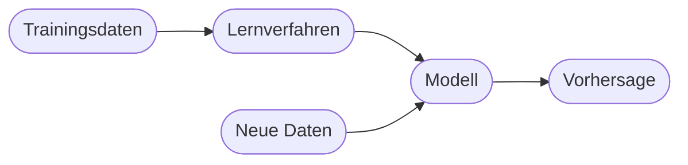
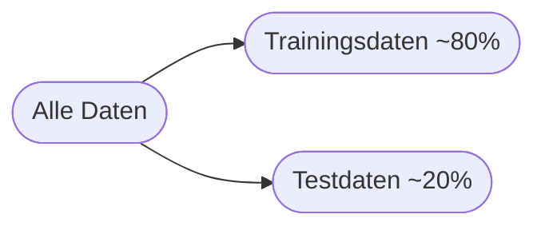

# Kapitel 12 – Machine Learning

{{ progress(12) }}

<div class="lernziele" markdown>
<h3>Was du in diesem Kapitel lernst</h3>

- Was **Machine Learning (ML)** ist und wie es sich vom klassischen Programmieren unterscheidet
- Die drei **Lernarten**: überwacht, unüberwacht, verstärkend
- Wie **Training, Test und Overfitting** zusammenhängen
- Warum ML die Grundlage für Copilot & Co. ist
</div>

---

## 12.1 Was ist Machine Learning?

**Machine Learning** ist der Teil der KI, bei dem Systeme aus **Beispielen** lernen, statt fest programmiert zu werden. Das Modell erkennt **Muster** in Trainingsdaten und wendet sie auf neue Fälle an.



---

## 12.2 Die drei Lernarten

| Lernart | Prinzip | Beispiel |
|---|---|---|
| **Überwacht** (supervised) | Lernen mit „richtigen Antworten" (Labels) | Spam / kein Spam |
| **Unüberwacht** (unsupervised) | Muster ohne Vorgaben finden | Kundensegmente bilden |
| **Verstärkend** (reinforcement) | Lernen durch Belohnung/Bestrafung | Spiel- und Steuerungsaufgaben |

!!! info "Klassifikation vs. Regression"
    Beim überwachten Lernen unterscheidet man **Klassifikation** (Kategorie vorhersagen, z. B. „Spam") und **Regression** (Zahl vorhersagen, z. B. „Umsatz nächsten Monat").

---

## 12.3 Training, Test und Overfitting

Daten werden aufgeteilt:

- **Trainingsdaten** – das Modell lernt daraus
- **Testdaten** – prüfen, ob das Modell auch auf **neue** Daten passt



!!! warning "Overfitting"
    **Overfitting** heißt: Das Modell „lernt die Trainingsdaten auswendig" und versagt bei neuen Daten. Man erkennt es daran, dass es im Training top, im Test aber schlecht abschneidet.

---

## 12.4 Bezug zu Copilot

Copilot beruht auf einem **großen, vortrainierten** ML-Modell (einem LLM). Du trainierst es nicht selbst – du **nutzt** es über Prompts. Das Verständnis von ML hilft dir, seine Stärken und Grenzen einzuschätzen.

**Copilot-Prompt zum Ausprobieren:**

```text
Erkläre den Unterschied zwischen überwachtem und unüberwachtem Lernen an je
einem Beispiel aus dem Vertrieb. Nenne, welche Daten man jeweils braucht.
```

---

## Kurzübungen

{{ task(file="tasks/k12_01.yaml") }}

{{ task(file="tasks/k12_02.yaml") }}

---

## Workshop

{{ task(file="tasks/workshop_k12.yaml") }}
