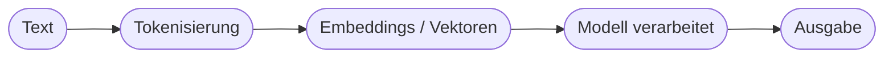

# Kapitel 13 – Natural Language Processing (NLP)

{{ progress(13) }}

<div class="lernziele" markdown>
<h3>Was du in diesem Kapitel lernst</h3>

- Was **NLP** ist und welche Aufgaben es löst
- Zentrale Begriffe: **Token**, **Embedding**, **Kontext**
- Wie NLP die Grundlage für Chatbots und Copilot bildet
- Typische NLP-Aufgaben im Arbeitsalltag
</div>

---

## 13.1 Was ist NLP?

**Natural Language Processing** (Verarbeitung natürlicher Sprache) ist das Teilgebiet der KI, das Computern hilft, **menschliche Sprache** zu verstehen und zu erzeugen – geschrieben oder gesprochen.

**Typische NLP-Aufgaben:**

| Aufgabe | Beispiel |
|---|---|
| Klassifikation | E-Mail als Beschwerde/Anfrage einordnen |
| Extraktion | Namen, Beträge, Daten aus Texten ziehen |
| Zusammenfassung | langen Bericht kürzen |
| Übersetzung | Deutsch → Englisch |
| Generierung | Text erzeugen (Copilot, ChatGPT) |
| Sentiment-Analyse | Stimmung einer Bewertung erkennen |

---

## 13.2 Wie „liest" ein Computer Sprache?

Sprache muss in Zahlen umgewandelt werden, denn Modelle rechnen nur mit Zahlen.



| Begriff | Bedeutung |
|---|---|
| **Token** | kleine Text-Bausteine (Wörter/Wortteile) |
| **Embedding** | Zahlen-Darstellung eines Tokens, die **Bedeutung** abbildet |
| **Kontext** | die umliegenden Wörter, die die Bedeutung bestimmen |

!!! info "Warum Embeddings so wichtig sind"
    In der Zahlen-Darstellung liegen ähnliche Bedeutungen nah beieinander: „Auto" und „Fahrzeug" sind sich „näher" als „Auto" und „Banane". So erfasst das Modell **Bedeutung**, nicht nur Buchstaben.

---

## 13.3 Von NLP zu Copilot

Moderne Sprachmodelle sind hochentwickeltes NLP. Copilot nutzt sie, um deine Anfrage zu **verstehen** und passenden Text zu **erzeugen**. Fast jede Copilot-Aufgabe ist im Kern eine NLP-Aufgabe.

**Copilot-Prompt zum Ausprobieren:**

```text
Analysiere die folgenden 5 Kundenbewertungen: Bestimme je Bewertung die Stimmung
(positiv/neutral/negativ) und extrahiere das Hauptthema. Stelle es als Tabelle dar.
[Bewertungen einfügen]
```

Damit nutzt du gleich mehrere NLP-Aufgaben: **Sentiment-Analyse** und **Extraktion**.

---

## Kurzübungen

{{ task(file="tasks/k13_01.yaml") }}

{{ task(file="tasks/k13_02.yaml") }}

---

## Workshop

{{ task(file="tasks/workshop_k13.yaml") }}
