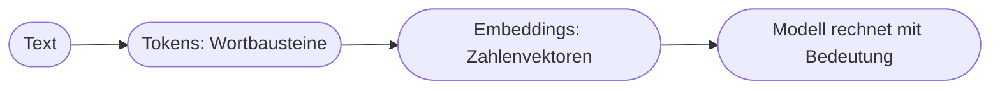

# Kapitel 13 – Natural Language Processing (NLP)

{{ progress(13) }}

<div class="lernziele" markdown>
<h3>Was du in diesem Kapitel lernst</h3>

- Was **Natural Language Processing (NLP)** ist und warum Sprache für Computer so schwierig ist
- Die typischen **NLP-Aufgaben**: Klassifikation, Extraktion, Übersetzung, Zusammenfassung, Generierung
- Wie ein Computer Sprache **verarbeitbar** macht (Tokens, Embeddings)
- Warum moderne Sprachmodelle einen **Qualitätssprung** gebracht haben
- Wie **Copilot** NLP-Aufgaben im Alltag löst
</div>

---

## 13.1 Was ist NLP – und warum ist Sprache so schwer?

**Natural Language Processing** ist das Teilgebiet der KI, das sich mit **menschlicher Sprache** befasst – Verstehen, Verarbeiten und Erzeugen von Text und gesprochener Sprache.

Sprache ist für Computer aus mehreren Gründen schwierig:

| Herausforderung | Beispiel |
|---|---|
| **Mehrdeutigkeit** | „Bank" (Sitzmöbel oder Geldinstitut?) |
| **Kontextabhängigkeit** | „Das ist ja toll" – ernst oder ironisch? |
| **Bezüge** | „Der Chef sagte dem Mitarbeiter, dass **er** …" – wer? |
| **Variabilität** | dieselbe Aussage in tausend Formulierungen |
| **Weltwissen** | „Es regnet, nimm einen …" → Regenschirm |

!!! info "Der Kern des Problems"
    Menschen verstehen Sprache mühelos, weil sie **Kontext und Weltwissen** mitbringen. Ein Computer hat das nicht von Natur aus – er muss es aus riesigen Textmengen **statistisch lernen**. Genau hier liegt der Durchbruch der letzten Jahre.

---

## 13.2 Typische NLP-Aufgaben

| Aufgabe | Was passiert | Beispiel |
|---|---|---|
| **Klassifikation** | Text einer Kategorie zuordnen | Stimmung einer Bewertung (positiv/negativ) |
| **Informationsextraktion** | Fakten herausziehen | aus Vertrag: Datum, Betrag, Partei |
| **Übersetzung** | Sprache übertragen | Deutsch → Englisch |
| **Zusammenfassung** | Kernaussagen verdichten | 10 Seiten → 5 Stichpunkte |
| **Generierung** | neuen Text erzeugen | E-Mail-Entwurf, Bericht |
| **Frage-Antwort** | Fragen zu Inhalten beantworten | „Was steht in Abschnitt 3?" |

Fast alles, was du mit **Copilot** an Text machst, ist eine dieser NLP-Aufgaben.

---

## 13.3 Wie ein Computer Sprache „lesbar" macht

Ein Computer kann mit Buchstaben nicht direkt rechnen. Text wird deshalb in **Zahlen** übersetzt:



- **Tokens:** Der Text wird in kleine Einheiten zerlegt (Wörter oder Wortteile). „Datenschutz" kann z. B. in „Daten" + „schutz" zerfallen.
- **Embeddings:** Jedes Token wird zu einer Liste von Zahlen (einem **Vektor**), die seine **Bedeutung** im Verhältnis zu anderen Wörtern abbildet.

!!! info "Die zentrale Idee: Bedeutung als Nähe"
    Bei Embeddings liegen **ähnliche Bedeutungen nah beieinander**: „Hund" und „Katze" sind näher zusammen als „Hund" und „Steuererklärung". So kann der Computer mit **Bedeutung** rechnen, ohne Sprache im menschlichen Sinn zu „verstehen". Dieses Prinzip ist auch die Grundlage von RAG (Kap. 5) und Sprachmodellen (Kap. 15).

---

## 13.4 Der Qualitätssprung durch moderne Sprachmodelle

Frühere NLP-Systeme waren spezialisiert: ein System für Übersetzung, eines für Zusammenfassung, jedes einzeln gebaut. Moderne **große Sprachmodelle** (LLMs, Kap. 15) beherrschen **alle** diese Aufgaben mit **einem** Modell – gesteuert allein über den Prompt.

| | Früher (klassisches NLP) | Heute (LLMs) |
|---|---|---|
| Aufgaben | je Aufgabe ein System | ein Modell für viele Aufgaben |
| Steuerung | Programmierung | natürliche Sprache (Prompt) |
| Qualität | begrenzt | deutlich höher, flüssiger |
| Zugang | Fachleute | jede:r über Chat |

Das ist der Grund, warum du **eine** Copilot-Oberfläche für Übersetzung, Zusammenfassung und Textentwurf nutzen kannst.

---

## 13.5 NLP mit Copilot im Alltag

**Beispiel-Prompts für typische NLP-Aufgaben:**

```text
Klassifiziere die Stimmung dieser 5 Kundenbewertungen (positiv/neutral/negativ)
und begründe je Bewertung in einem Halbsatz: [Bewertungen einfügen]
```

```text
Extrahiere aus diesem Vertragstext folgende Angaben als Tabelle:
Vertragspartner, Laufzeit, Kündigungsfrist, monatliche Kosten: [Text einfügen]
```

```text
Fasse dieses Protokoll in 5 Stichpunkten zusammen und übersetze die
Zusammenfassung anschließend ins Englische.
```

!!! warning "Grenzen im Blick behalten"
    Bei **Extraktion** aus Verträgen oder Zahlen gilt: immer gegen das Original prüfen. Das Modell kann Werte plausibel, aber falsch wiedergeben. Bei **Klassifikation** von Stimmungen liegt es bei Ironie oder Fachjargon manchmal daneben. NLP-Ergebnisse sind ein **schneller erster Aufschlag**, keine Endabnahme.

---

## Zusammenfassung

- **NLP** befasst sich mit menschlicher Sprache; sie ist schwer wegen **Mehrdeutigkeit, Kontext und Weltwissen**.
- Typische Aufgaben: **Klassifikation, Extraktion, Übersetzung, Zusammenfassung, Generierung, Frage-Antwort**.
- Text wird über **Tokens** und **Embeddings** in Zahlen übersetzt – ähnliche Bedeutungen liegen nah beieinander.
- **Moderne LLMs** lösen viele NLP-Aufgaben mit einem Modell, gesteuert per Prompt – das ist Copilots Grundlage.

---

## Kurzübungen

{{ task(file="tasks/k13_01.yaml") }}

{{ task(file="tasks/k13_02.yaml") }}

---

## Workshop

{{ task(file="tasks/workshop_k13.yaml") }}
