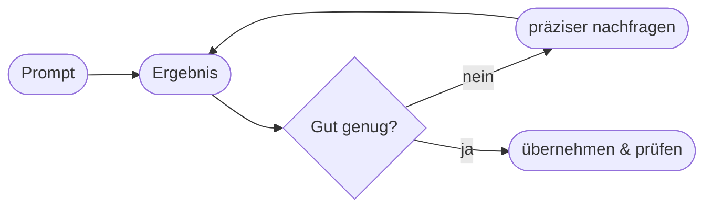

# Kapitel 14 – Prompt Engineering: Grundlagen und Best Practices

{{ progress(14) }}

<div class="lernziele" markdown>
<h3>Was du in diesem Kapitel lernst</h3>

- Was **Prompt Engineering** ist und warum es die **Schlüsselkompetenz** dieses Kurses ist
- Die **fünf Bausteine** eines guten Prompts (Rolle, Aufgabe, Kontext, Format, Beispiele)
- Bewährte **Techniken**: Zero-/Few-Shot, Chain-of-Thought, Rollen-Prompting, iteratives Nachschärfen
- Häufige **Fehler** und wie du sie vermeidest
- Wie du Prompts **systematisch verbesserst**, statt zu raten
</div>

---

## 14.1 Was ist Prompt Engineering?

Ein **Prompt** ist die Eingabe, mit der du eine KI wie Copilot steuerst. **Prompt Engineering** ist die Kunst und Technik, Prompts so zu formulieren, dass **verlässlich gute Ergebnisse** entstehen.

!!! info "Warum das eine echte Kompetenz ist"
    Dasselbe Sprachmodell liefert – je nach Prompt – ein brillantes oder ein unbrauchbares Ergebnis. Der Unterschied liegt nicht am Modell, sondern an **dir**. Prompt Engineering ist damit die **Bedienkompetenz** für generative KI – vergleichbar damit, eine gute Suchanfrage oder eine präzise Arbeitsanweisung zu formulieren.

Die Kernidee: KI kann Gedanken **nicht lesen**. Je klarer du sagst, **wer** etwas **für wen**, **wie** und **in welcher Form** tun soll, desto besser das Ergebnis.

---

## 14.2 Die fünf Bausteine eines guten Prompts


| Baustein | Frage | Beispiel |
|---|---|---|
| **Rolle** | Wer soll die KI sein? | „Du bist eine erfahrene Vertriebsassistenz." |
| **Aufgabe** | Was genau soll getan werden? | „Schreibe eine Angebots-E-Mail." |
| **Kontext** | Was muss die KI wissen? | „Kunde X, Budget knapp, langjährige Beziehung." |
| **Format** | Wie soll das Ergebnis aussehen? | „Max. 150 Wörter, Sie-Form, mit Betreff." |
| **Beispiele** | Wie sieht ein gutes Ergebnis aus? | ein Muster mitliefern (optional) |

### Vom schwachen zum starken Prompt

!!! example "Schlecht → Gut"
    **Schwach:**
    ```text
    Schreib eine E-Mail an den Kunden.
    ```
    **Stark:**
    ```text
    Du bist eine erfahrene Vertriebsassistenz. Schreibe eine freundliche
    Angebots-E-Mail an einen langjährigen Kunden, der auf den Preis achtet.
    Betone unsere Zuverlässigkeit, biete ein Gespräch nächste Woche an.
    Format: Sie-Form, max. 150 Wörter, mit Betreffzeile.
    ```
    Der starke Prompt enthält **Rolle, Aufgabe, Kontext und Format** – und liefert ein sofort brauchbares Ergebnis, während der schwache Prompt raten lässt.

---

## 14.3 Bewährte Techniken

### Zero-Shot vs. Few-Shot

- **Zero-Shot:** Du gibst nur die Aufgabe, ohne Beispiel. Gut für einfache Aufgaben.
- **Few-Shot:** Du gibst **1–3 Beispiele** für das gewünschte Ergebnis mit. Ideal, wenn Ton, Stil oder Format genau stimmen müssen.

!!! example "Few-Shot in Aktion"
    ```text
    Formuliere Produktnamen in knackige Slogans. Beispiele:
    - Kaffeemaschine → „Dein Morgen, perfekt gebrüht."
    - Bürostuhl → „Sitz gut. Arbeite besser."
    Jetzt: Schreibtischlampe →
    ```
    Die Beispiele zeigen dem Modell den gewünschten Stil viel wirksamer als jede Beschreibung.

### Chain-of-Thought: „Denk in Schritten"

Bei komplexen Aufgaben hilft die Aufforderung, **schrittweise** vorzugehen:

```text
Löse folgende Aufgabe Schritt für Schritt und zeige deinen Rechenweg,
bevor du das Endergebnis nennst: [Aufgabe]
```

Das reduziert Flüchtigkeitsfehler, weil das Modell die Teilschritte „ausformuliert", statt sofort zu raten.

### Rollen-Prompting

Eine **Rolle** verändert Ton, Tiefe und Perspektive spürbar:

| Rolle | Wirkung |
|---|---|
| „Erkläre wie einem Kind" | einfache Sprache |
| „Du bist Steuerberater:in" | fachlich, vorsichtig |
| „Du bist kritischer Reviewer" | findet Schwachstellen |

### Iteratives Nachschärfen

Der wichtigste Trick: **den ersten Wurf verbessern**, statt neu anzufangen.



```text
Guter Anfang. Mach es 30 % kürzer, verwende die Sie-Form und ergänze
einen konkreten Terminvorschlag für nächste Woche.
```

---

## 14.4 Häufige Fehler

| Fehler | Folge | Besser |
|---|---|---|
| Zu vage („mach was Gutes") | beliebiges Ergebnis | Ziel + Format klar benennen |
| Zu viel auf einmal | verwirrtes Ergebnis | in Teilschritte zerlegen |
| Kein Kontext | generischer Text | relevante Fakten mitgeben |
| Kein Format | falsche Länge/Form | Länge, Ton, Struktur vorgeben |
| Erste Antwort blind übernehmen | Fehler bleiben | prüfen + nachschärfen |

!!! warning "Der teuerste Fehler"
    Der gefährlichste Fehler ist **nicht** ein schlechter Prompt – den merkt man sofort. Es ist die **ungeprüfte Übernahme** einer gut klingenden, aber falschen Antwort. Prompt Engineering endet nie beim Ergebnis, sondern bei deiner **Prüfung**.

---

## 14.5 Ein wiederverwendbares Prompt-Gerüst

```text
Rolle: Du bist [Rolle/Expertise].
Aufgabe: [Was genau soll erledigt werden?]
Kontext: [Relevante Fakten, Zielgruppe, Rahmenbedingungen]
Format: [Länge, Ton, Struktur, Sprache]
Wenn dir Informationen fehlen, frage nach, bevor du beginnst.
```

Der letzte Satz ist mächtig: Er bringt Copilot dazu, **Rückfragen** zu stellen, statt auf Basis fehlender Infos zu raten.

**Copilot-Prompt zum Ausprobieren:**

```text
Du bist Kommunikationsprofi. Formuliere eine Absage an einen Bewerber,
wertschätzend und kurz (max. 120 Wörter, Sie-Form). Wenn dir Angaben zur
Position oder zum Grund fehlen, frage zuerst nach.
```

!!! tip "Prompt-Bibliothek anlegen"
    Sammle deine besten Prompts (z. B. in OneNote), passe sie an und teile sie im Team. So wird Prompt Engineering vom Einzelkönnen zur **organisationalen Fähigkeit** – der Bogen zu Kapitel 40.

---

## Zusammenfassung

- **Prompt Engineering** ist die Bedienkompetenz für generative KI – der rote Faden dieses Kurses.
- Gute Prompts enthalten **Rolle, Aufgabe, Kontext, Format** (und bei Bedarf **Beispiele**).
- Techniken: **Few-Shot, Chain-of-Thought, Rollen-Prompting, iteratives Nachschärfen**.
- Häufige Fehler sind Vagheit und Überfrachtung – der teuerste ist die **ungeprüfte Übernahme**.
- Ein festes **Prompt-Gerüst** und eine **Prompt-Bibliothek** machen dich schnell und konsistent.

---

## Kurzübungen

{{ task(file="tasks/k14_01.yaml") }}

{{ task(file="tasks/k14_02.yaml") }}

{{ task(file="tasks/k14_03.yaml") }}

---

## Workshop

{{ task(file="tasks/workshop_k14.yaml") }}
