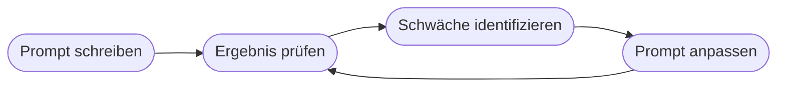

# Kapitel 14 – Prompt Engineering: Grundlagen und Best Practices

{{ progress(14) }}

<div class="lernziele" markdown>
<h3>Was du in diesem Kapitel lernst</h3>

- Was **Prompt Engineering** ist und warum es die Schlüsselkompetenz dieses Kurses ist
- Die **Anatomie** eines guten Prompts (Rolle, Aufgabe, Kontext, Format)
- Bewährte **Prompt-Muster**: Rollen-Prompt, Few-Shot, Schritt-für-Schritt, Format-Vorgabe
- Wie du Prompts **iterativ** verbesserst – und häufige Fehler vermeidest
</div>

---

## 14.1 Was ist Prompt Engineering?

Ein **Prompt** ist die Eingabe, mit der du ein Sprachmodell wie **Copilot** steuerst. **Prompt Engineering** ist die Kunst, diese Eingaben so zu formulieren, dass du **zuverlässig gute** Ergebnisse bekommst.

!!! info "Warum das wichtig ist"
    Dasselbe Modell liefert bei einem vagen Prompt mittelmäßige und bei einem präzisen Prompt hervorragende Ergebnisse. Der Unterschied liegt **nicht** am Modell, sondern an deiner Eingabe.

---

## 14.2 Die Anatomie eines guten Prompts

Ein starker Prompt beantwortet vier Fragen:


| Baustein | Beispiel |
|---|---|
| **Rolle** | „Du bist ein erfahrener Vertriebsassistent." |
| **Aufgabe** | „Schreibe eine Angebots-E-Mail." |
| **Kontext** | „Kunde X interessiert sich für Produkt Y, Budget Z." |
| **Format** | „Max. 150 Wörter, förmlich, mit Betreffzeile." |

**Beispiel eines vollständigen Prompts:**

```text
Du bist ein erfahrener Vertriebsassistent. Schreibe eine Angebots-E-Mail an einen
Geschäftskunden, der sich für unsere Buchhaltungssoftware interessiert.
Kontext: Das Unternehmen hat 50 Mitarbeitende und nutzt bisher Excel.
Format: max. 150 Wörter, höflich-professionell (Sie-Form), mit Betreffzeile und
einem klaren Handlungsaufruf (Terminvorschlag).
```

---

## 14.3 Bewährte Prompt-Muster

| Muster | Idee | Wann nutzen |
|---|---|---|
| **Rollen-Prompt** | Perspektive/Expertise vorgeben | fast immer sinnvoll |
| **Few-Shot** | 1–3 Beispiele mitgeben | für konsistentes Format/Stil |
| **Schritt für Schritt** | „Denke Schritt für Schritt" | bei komplexen Aufgaben |
| **Format-Vorgabe** | Tabelle, Liste, JSON verlangen | für weiterverarbeitbare Ausgaben |
| **Zerlegen** | große Aufgabe in Teilprompts | bei langen Vorhaben |

!!! tip "Few-Shot in der Praxis"
    „Formuliere Produkttexte in diesem Stil. Beispiel 1: … Beispiel 2: … Schreibe nun einen Text für Produkt Z." Beispiele wirken oft stärker als lange Beschreibungen.

---

## 14.4 Prompts iterativ verbessern

Der erste Prompt ist selten perfekt. Verbessere gezielt:



**Häufige Verbesserungen:** klarere Rolle, konkreteres Format, Beispiele ergänzen, Umfang begrenzen, Zielgruppe nennen.

---

## 14.5 Häufige Fehler

!!! warning "Diese Fehler kosten Qualität"
    - **Zu vage:** „Schreib was über KI." → Ziel, Länge, Zielgruppe fehlen.
    - **Zu viel auf einmal:** fünf Aufgaben in einem Prompt.
    - **Kein Format:** Ergebnis lässt sich nicht weiterverwenden.
    - **Keine Prüfung:** Ausgaben ungeprüft übernehmen (Gefahr von Fehlern/„Halluzinationen").

---

## Kurzübungen

{{ task(file="tasks/k14_01.yaml") }}

{{ task(file="tasks/k14_02.yaml") }}

{{ task(file="tasks/k14_03.yaml") }}

---

## Workshop

{{ task(file="tasks/workshop_k14.yaml") }}
