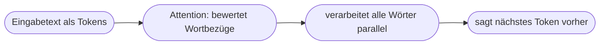
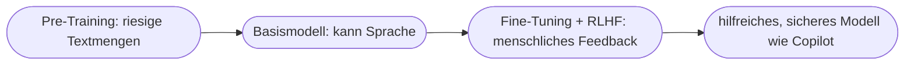

# Kapitel 16 – Generative Pre-trained Transformers (GPT)

{{ progress(16) }}

<div class="lernziele" markdown>
<h3>Was du in diesem Kapitel lernst</h3>

- Was die drei Buchstaben **GPT** bedeuten – **G**enerative, **P**re-trained, **T**ransformer
- Was die **Transformer-Architektur** ausmacht und warum sie den Durchbruch brachte
- Wie das Prinzip **„Attention"** (Aufmerksamkeit) funktioniert – anschaulich
- Die zwei Trainingsphasen: **Pre-Training** und **Fine-Tuning / RLHF**
- Wie GPT-Modelle die Basis von **Microsoft Copilot** bilden
</div>

---

## 16.1 GPT entschlüsselt

**GPT** steht für **G**enerative **P**re-trained **T**ransformer. Jeder Teil beschreibt eine Eigenschaft:

| Buchstabe | Bedeutung | Was es heißt |
|---|---|---|
| **Generative** | erzeugend | erschafft neuen Text, statt nur zu wählen |
| **Pre-trained** | vortrainiert | hat vorab aus riesigen Textmengen gelernt |
| **Transformer** | die Architektur | das neuronale Netz-Design dahinter |

Die Modelle hinter **Copilot** und **ChatGPT** gehören zu dieser Familie.

---

## 16.2 Die Transformer-Architektur

Der **Transformer** (vorgestellt 2017 im Aufsatz *„Attention Is All You Need"*) ist die technische Grundlage aller heutigen Sprachmodelle. Er löste ein zentrales Problem älterer Ansätze: Diese lasen Text **Wort für Wort nacheinander** und verloren dabei den Bezug zu weit entfernten Wörtern.



**Zwei Neuerungen machten den Unterschied:**

1. **Parallele Verarbeitung:** Der Transformer betrachtet **alle Wörter gleichzeitig** statt nacheinander. Das machte das Training auf riesigen Datenmengen überhaupt erst praktikabel (nutzt GPUs effizient).
2. **Attention** – siehe nächster Abschnitt.

---

## 16.3 „Attention" – das Herzstück

**Attention** (Aufmerksamkeit) erlaubt dem Modell, für jedes Wort zu bewerten, **welche anderen Wörter im Satz wichtig sind**, um es zu verstehen.

!!! example "Attention an einem Beispiel"
    Satz: *„Der Anwalt gab dem Mandanten seine Akte, weil **er** sie brauchte."*

    Worauf bezieht sich „er" – Anwalt oder Mandant? Und „sie" – die Akte? Attention berechnet genau diese **Bezüge**: Das Modell „richtet seine Aufmerksamkeit" auf die relevanten Wörter und gewichtet sie stärker. So versteht es Zusammenhänge auch über größere Entfernung im Text.

!!! info "Warum das den Durchbruch brachte"
    Ältere Modelle „vergaßen" den Satzanfang, wenn der Satz lang wurde. Attention hält **alle** Bezüge gleichzeitig verfügbar und gewichtet sie flexibel. Das ist der Grund, warum LLMs so kohärente, zusammenhängende Texte erzeugen – und warum die Architektur „Transformer" heißt: Sie *transformiert* Eingabetext unter Berücksichtigung aller inneren Bezüge in eine sinnvolle Fortsetzung.

---

## 16.4 Zwei Trainingsphasen



### Phase 1: Pre-Training

Das Modell lernt aus enormen Textmengen **allgemeine Sprache und Weltwissen** – indem es millionenfach übt, das nächste Wort vorherzusagen. Ergebnis: ein „Basismodell", das viel weiß, aber noch nicht gut auf Anweisungen reagiert.

### Phase 2: Fine-Tuning und RLHF

Danach wird das Modell **nachjustiert**, damit es hilfreich, höflich und sicher antwortet:

- **Fine-Tuning:** Training auf sorgfältig ausgewählten Beispielen guter Antworten.
- **RLHF** (*Reinforcement Learning from Human Feedback*): Menschen bewerten Antworten, das Modell lernt, **bevorzugte** Antworten zu geben (Bezug zu Kap. 17).

!!! info "Warum RLHF entscheidend ist"
    Das reine Basismodell könnte auch beleidigende oder gefährliche Texte fortsetzen – es hat ja nur „typischen Text" gelernt. Erst RLHF macht aus einem rohen Sprachvorhersager einen **nützlichen, kontrollierten Assistenten** wie Copilot. Ein Großteil dessen, was sich „gut angeleitet" anfühlt, stammt aus dieser Phase.

---

## 16.5 GPT als Basis von Copilot

**Microsoft Copilot** nutzt GPT-Modelle (in Zusammenarbeit mit OpenAI), kombiniert sie aber mit:

- **deinen Unternehmensdaten** über RAG/Microsoft Graph (Kap. 5, 9),
- **Sicherheits- und Datenschutzschichten** der Microsoft-365-Umgebung,
- **Integrationen** in Word, Excel, Teams etc.

Das erklärt, warum Copilot einerseits so sprachgewandt (GPT) und andererseits **unternehmensspezifisch** ist.

**Copilot-Prompt zum Ausprobieren:**

```text
Erkläre die Abkürzung GPT und beschreibe in je einem Satz, was "generative",
"pre-trained" und "Transformer" bedeuten. Nutze eine Alltagsanalogie für
das Prinzip "Attention".
```

---

## Zusammenfassung

- **GPT** = **G**enerative, **P**re-trained, **T**ransformer – erzeugend, vortrainiert, Transformer-Architektur.
- Der **Transformer** verarbeitet Wörter **parallel** und nutzt **Attention**, um Wortbezüge zu gewichten.
- **Attention** ermöglicht kohärente Texte über größere Distanzen – das war der eigentliche Durchbruch.
- Training in zwei Phasen: **Pre-Training** (Sprache lernen) + **Fine-Tuning/RLHF** (hilfreich & sicher machen).
- **Copilot** kombiniert GPT-Modelle mit deinen Daten, Datenschutz und Office-Integration.

---

## Kurzübungen

{{ task(file="tasks/k16_01.yaml") }}

{{ task(file="tasks/k16_02.yaml") }}

{{ task(file="tasks/k16_03.yaml") }}

---

## Workshop

{{ task(file="tasks/workshop_k16.yaml") }}
