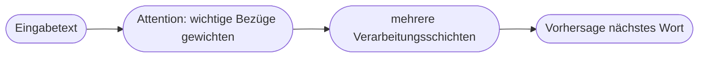
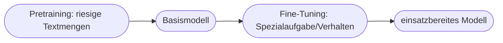

# Kapitel 16 – Generative Pre-trained Transformers (GPT)

{{ progress(16) }}

<div class="lernziele" markdown>
<h3>Was du in diesem Kapitel lernst</h3>

- Was die Abkürzung **GPT** bedeutet
- Was die **Transformer-Architektur** besonders macht (Stichwort *Attention*)
- Der Unterschied zwischen **Pretraining** und **Fine-Tuning**
- Welche Grenzen GPT-Modelle haben
</div>

---

## 16.1 Was bedeutet GPT?

**GPT** steht für **Generative Pre-trained Transformer**:

| Teil | Bedeutung |
|---|---|
| **Generative** | erzeugt neue Inhalte (Text) |
| **Pre-trained** | vorab auf riesigen Textmengen trainiert |
| **Transformer** | die zugrunde liegende Netzwerk-Architektur |

Copilot nutzt GPT-Modelle von OpenAI.

---

## 16.2 Die Transformer-Architektur

Die **Transformer**-Architektur (2017) war der Durchbruch für moderne Sprachmodelle. Ihr Kernstück ist der **Attention-Mechanismus**:

!!! info "Attention – einfach erklärt"
    „Attention" (Aufmerksamkeit) erlaubt dem Modell, bei jedem Wort zu gewichten, **welche anderen Wörter im Satz wichtig** sind. So versteht es Bezüge: In „Die Katze jagt die Maus, weil **sie** hungrig ist" erkennt das Modell, dass „sie" die Katze meint.



Vorteil gegenüber älteren Ansätzen: Transformer verarbeiten Text **parallel** und erfassen auch **weit entfernte** Bezüge – das macht sie schnell und leistungsstark.

---

## 16.3 Pretraining und Fine-Tuning



| Phase | Was passiert | Beispiel |
|---|---|---|
| Pretraining | allgemeines Sprachwissen aus dem Internet | „Weltwissen", Grammatik |
| Fine-Tuning | Feinschliff für Aufgaben/Verhalten | hilfreiches, sicheres Antworten |

---

## 16.4 Grenzen von GPT-Modellen

!!! warning "Wichtige Grenzen"
    - **Wissensstand:** Das Modell kennt nur, was bis zum Trainingsende bekannt war (sofern es nicht auf aktuelle Daten zugreift).
    - **Halluzinationen:** überzeugend formulierte, aber falsche Aussagen.
    - **Kein echtes Verständnis:** es rechnet Wahrscheinlichkeiten, „denkt" nicht.
    - **Bias:** Verzerrungen aus den Trainingsdaten können sich fortsetzen (siehe Kapitel 31).

**Copilot-Prompt zum Ausprobieren:**

```text
Erkläre in einfachen Worten, was der Attention-Mechanismus in einem Transformer
macht. Nutze ein Beispiel mit einem mehrdeutigen Satz.
```

---

## Kurzübungen

{{ task(file="tasks/k16_01.yaml") }}

{{ task(file="tasks/k16_02.yaml") }}

---

## Workshop

{{ task(file="tasks/workshop_k16.yaml") }}
