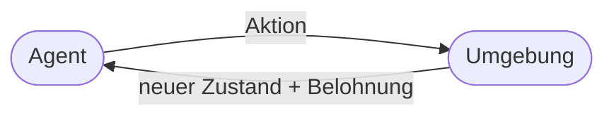
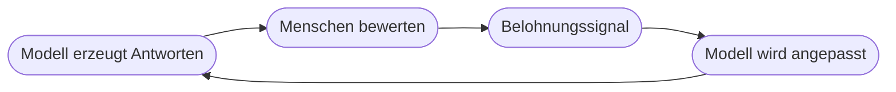

# Kapitel 17 – Reinforcement Learning

{{ progress(17) }}

<div class="lernziele" markdown>
<h3>Was du in diesem Kapitel lernst</h3>

- Das Grundprinzip des **verstärkenden Lernens** (Reinforcement Learning, RL)
- Die Begriffe **Agent, Umgebung, Aktion, Belohnung**
- Typische Anwendungen von RL
- Was **RLHF** ist – und warum es Copilot & ChatGPT hilfreich macht
</div>

---

## 17.1 Das Grundprinzip

Beim **Reinforcement Learning** lernt ein **Agent** durch **Ausprobieren**: Für gute Aktionen gibt es **Belohnung**, für schlechte nicht (oder Bestrafung). Über viele Versuche entwickelt der Agent eine **Strategie (Policy)**.



| Begriff | Bedeutung |
|---|---|
| Agent | der Lernende (Programm) |
| Umgebung | die Welt, in der er handelt |
| Aktion | ein möglicher Zug/Schritt |
| Belohnung | Rückmeldung über Erfolg |
| Policy | die gelernte Strategie |

---

## 17.2 Typische Anwendungen

- **Spiele:** Schach, Go (AlphaGo)
- **Robotik:** Bewegungen lernen
- **Steuerung:** Energie-, Verkehrs-, Lageroptimierung
- **Empfehlungen:** Reihenfolgen optimieren

!!! info "Warum RL besonders ist"
    Anders als beim überwachten Lernen gibt es **keine** vorgegebenen „richtigen Antworten". Der Agent lernt allein aus den **Folgen** seiner Handlungen – ähnlich wie ein Mensch durch Erfahrung.

---

## 17.3 RLHF: der Feinschliff für Sprachmodelle

**RLHF** = *Reinforcement Learning from Human Feedback*. Menschen bewerten Antworten des Modells; das Modell lernt, **bevorzugte** Antworten zu geben.



Genau dieser Schritt macht aus einem reinen „Textvorhersager" einen **hilfreichen, höflichen Assistenten** wie Copilot.

---

## 17.4 Grenzen

!!! warning "Nicht für alles geeignet"
    RL braucht viele Versuche und eine gut definierte **Belohnung**. Eine schlecht gewählte Belohnung führt zu unerwünschtem Verhalten („belohnt wird das Falsche"). In der Praxis ist RL aufwendig und wird gezielt eingesetzt.

**Copilot-Prompt zum Ausprobieren:**

```text
Erkläre Reinforcement Learning mit dem Beispiel, wie ein Hund ein Kunststück lernt.
Ordne die Begriffe Agent, Umgebung, Aktion und Belohnung dem Beispiel zu.
```

---

## Kurzübungen

{{ task(file="tasks/k17_01.yaml") }}

{{ task(file="tasks/k17_02.yaml") }}

---

## Workshop

{{ task(file="tasks/workshop_k17.yaml") }}
