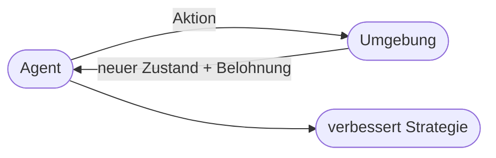
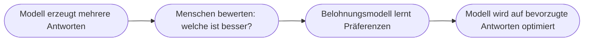

# Kapitel 17 – Reinforcement Learning

{{ progress(17) }}

<div class="lernziele" markdown>
<h3>Was du in diesem Kapitel lernst</h3>

- Was **Reinforcement Learning (RL)** – bestärkendes Lernen – ist
- Die zentralen Begriffe: **Agent, Umgebung, Aktion, Belohnung, Strategie**
- Der Unterschied zwischen **Exploration** (Ausprobieren) und **Exploitation** (Ausnutzen)
- Wo RL in der Praxis eingesetzt wird – und wie es hinter Copilot steckt (**RLHF**)
- Welche **Grenzen und Risiken** RL hat
</div>

---

## 17.1 Was ist Reinforcement Learning?

**Reinforcement Learning** ist die dritte große Lernart (neben überwachtem und unüberwachtem Lernen, Kap. 12). Hier lernt ein System durch **Ausprobieren und Rückmeldung**: Gute Aktionen werden **belohnt**, schlechte **bestraft**. Über viele Versuche entwickelt es eine **Strategie**, die die Belohnung maximiert.

!!! example "Wie beim Dressieren – oder Videospielen"
    Ein Kind lernt Fahrradfahren nicht durch eine Regel, sondern durch **Versuch und Irrtum**: Stürzt es, war die Aktion schlecht; hält es die Balance, war sie gut. Genauso lernt ein RL-System – nur millionenfach schneller und in einer simulierten Umgebung.

---

## 17.2 Die Grundelemente



| Begriff | Bedeutung | Beispiel (selbstfahrendes Lager-Roboter) |
|---|---|---|
| **Agent** | der Lernende | der Roboter |
| **Umgebung** | die Welt, in der er handelt | das Lager |
| **Zustand** | aktuelle Lage | Position, Hindernisse |
| **Aktion** | mögliche Handlung | vor, zurück, drehen |
| **Belohnung** | Bewertung der Aktion | +1 Ziel erreicht, −1 Kollision |
| **Strategie (Policy)** | gelernte Handlungsregel | „in Situation X tue Y" |

Der Kreislauf: Der Agent führt eine **Aktion** aus, die **Umgebung** antwortet mit neuem Zustand und **Belohnung**, der Agent passt seine **Strategie** an – und das millionenfach.

!!! info "Der Unterschied zum überwachten Lernen"
    Beim überwachten Lernen sagt man dem System bei **jedem** Beispiel die richtige Antwort. Bei RL gibt es **keine** vorgegebene richtige Aktion – nur eine **Belohnung** als Feedback. Das System muss selbst herausfinden, welche Handlungsfolge langfristig die meiste Belohnung bringt. Das ist schwieriger, aber sehr mächtig für **Entscheidungsketten**.

---

## 17.3 Exploration vs. Exploitation

Ein RL-Agent steht vor einem Dilemma:

- **Exploitation (Ausnutzen):** das tun, was bisher am besten funktioniert hat.
- **Exploration (Erkunden):** Neues ausprobieren, das vielleicht noch besser ist.

!!! example "Das Restaurant-Dilemma"
    Gehst du immer in dein **Lieblingsrestaurant** (Exploitation) oder probierst du ein **neues** (Exploration), das eventuell besser ist? Zu viel Exploitation → du verpasst Besseres. Zu viel Exploration → du landest oft bei Schlechtem. Ein gutes RL-System **balanciert** beides.

Diese Balance ist eine Kernherausforderung von RL: Ohne Erkundung bleibt der Agent in mittelmäßigen Lösungen stecken; mit zu viel Erkundung lernt er nie eine stabile Strategie.

---

## 17.4 Anwendungen von RL

| Bereich | Anwendung |
|---|---|
| Spiele | AlphaGo, Schach, Videospiele (übermenschlich) |
| Robotik | Greifen, Laufen, Navigation |
| Logistik | Routen- und Lageroptimierung |
| Energie | Steuerung von Kühlung/Netzen |
| Finanzen | Handelsstrategien (mit Vorsicht) |
| **Sprach-KI** | **RLHF** – siehe unten |

RL glänzt überall dort, wo eine **Folge von Entscheidungen** über den Erfolg entscheidet und man einen klaren Belohnungsbegriff definieren kann.

---

## 17.5 RLHF: RL hinter Copilot

Der für uns wichtigste RL-Einsatz ist **RLHF** (*Reinforcement Learning from Human Feedback*) – die Methode, mit der Sprachmodelle wie hinter Copilot „höflich und hilfreich" gemacht werden (Kap. 16).



Hier ist die **Belohnung** die **menschliche Bewertung**: Menschen sagen, welche von mehreren Antworten sie besser finden, und das Modell lernt, solche Antworten häufiger zu geben. So wird aus einem rohen Sprachvorhersager ein nützlicher Assistent.

!!! warning "Grenzen und Risiken von RL"
    - **Belohnungsdesign ist heikel:** Ein schlecht gewähltes Belohnungssignal führt zu unerwünschtem Verhalten („Reward Hacking" – der Agent findet einen Schummelweg zur Belohnung).
    - **RLHF spiegelt menschliche Bewertungen** – inklusive deren Verzerrungen (Bias, Kap. 31).
    - RL braucht **sehr viele** Versuche; in der echten Welt (statt Simulation) ist das oft teuer oder gefährlich.

**Copilot-Prompt zum Ausprobieren:**

```text
Erkläre Reinforcement Learning an einem Alltagsbeispiel und beschreibe dann,
was Exploration und Exploitation bedeuten. Nenne einen Fall, in dem eine
schlecht gewählte Belohnung zu unerwünschtem Verhalten führen könnte.
```

---

## Zusammenfassung

- **Reinforcement Learning** lernt durch **Ausprobieren und Belohnung** – ohne vorgegebene richtige Antworten.
- Grundelemente: **Agent, Umgebung, Zustand, Aktion, Belohnung, Strategie**.
- Kernabwägung: **Exploration** (Neues erkunden) vs. **Exploitation** (Bewährtes nutzen).
- **RLHF** macht Sprachmodelle wie Copilot hilfreich und sicher – die „Belohnung" ist menschliches Feedback.
- Risiken: schwieriges **Belohnungsdesign**, übernommene **Verzerrungen**, hoher Versuchsaufwand.

---

## Kurzübungen

{{ task(file="tasks/k17_01.yaml") }}

{{ task(file="tasks/k17_02.yaml") }}

---

## Workshop

{{ task(file="tasks/workshop_k17.yaml") }}
