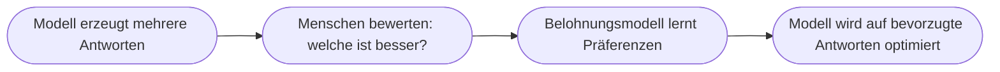

# Kapitel 17 – Reinforcement Learning

{{ progress(17) }}

<div class="lernziele" markdown>
<h3>Was du in diesem Kapitel lernst</h3>

- Was **Reinforcement Learning (RL)** – bestärkendes Lernen – ist
- Die zentralen Begriffe: **Agent, Umgebung, Aktion, Belohnung, Strategie**
- Der Unterschied zwischen **Exploration** (Ausprobieren) und **Exploitation** (Ausnutzen)
- Warum in RL der **Zeithorizont** zählt (verzögerte Belohnung, Diskontierung)
- Wo RL in der Praxis eingesetzt wird – und wie es hinter Copilot steckt (**RLHF**)
- Welche **Grenzen und Risiken** RL hat
</div>

---

## 17.1 Was ist Reinforcement Learning?

**Reinforcement Learning** ist die dritte große Lernart (neben überwachtem und unüberwachtem Lernen, Kap. 12). Hier lernt ein System durch **Ausprobieren und Rückmeldung**: Gute Aktionen werden **belohnt**, schlechte **bestraft**. Über viele Versuche entwickelt es eine **Strategie**, die die Belohnung maximiert.

!!! example "Wie beim Dressieren – oder Videospielen"
    Ein Kind lernt Fahrradfahren nicht durch eine Regel, sondern durch **Versuch und Irrtum**: Stürzt es, war die Aktion schlecht; hält es die Balance, war sie gut. Genauso lernt ein RL-System – nur millionenfach schneller und in einer simulierten Umgebung.

---

## 17.2 Die Grundelemente


| Begriff | Bedeutung | Beispiel (selbstfahrendes Lager-Roboter) |
|---|---|---|
| **Agent** | der Lernende | der Roboter |
| **Umgebung** | die Welt, in der er handelt | das Lager |
| **Zustand** | aktuelle Lage | Position, Hindernisse |
| **Aktion** | mögliche Handlung | vor, zurück, drehen |
| **Belohnung** | Bewertung der Aktion | +1 Ziel erreicht, −1 Kollision |
| **Strategie (Policy)** | gelernte Handlungsregel | „in Situation X tue Y" |

Der Kreislauf: Der Agent führt eine **Aktion** aus, die **Umgebung** antwortet mit neuem Zustand und **Belohnung**, der Agent passt seine **Strategie** an – und das millionenfach.

!!! info "Der Unterschied zum überwachten Lernen"
    Beim überwachten Lernen sagt man dem System bei **jedem** Beispiel die richtige Antwort. Bei RL gibt es **keine** vorgegebene richtige Aktion – nur eine **Belohnung** als Feedback. Das System muss selbst herausfinden, welche Handlungsfolge langfristig die meiste Belohnung bringt. Das ist schwieriger, aber sehr mächtig für **Entscheidungsketten**.

---

## 17.3 Exploration vs. Exploitation

Ein RL-Agent steht vor einem Dilemma:

- **Exploitation (Ausnutzen):** das tun, was bisher am besten funktioniert hat.
- **Exploration (Erkunden):** Neues ausprobieren, das vielleicht noch besser ist.

!!! example "Das Restaurant-Dilemma"
    Gehst du immer in dein **Lieblingsrestaurant** (Exploitation) oder probierst du ein **neues** (Exploration), das eventuell besser ist? Zu viel Exploitation → du verpasst Besseres. Zu viel Exploration → du landest oft bei Schlechtem. Ein gutes RL-System **balanciert** beides.

Diese Balance ist eine Kernherausforderung von RL: Ohne Erkundung bleibt der Agent in mittelmäßigen Lösungen stecken; mit zu viel Erkundung lernt er nie eine stabile Strategie.

---

## 17.4 Anwendungen von RL

| Bereich | Anwendung |
|---|---|
| Spiele | AlphaGo, Schach, Videospiele (übermenschlich) |
| Robotik | Greifen, Laufen, Navigation |
| Logistik | Routen- und Lageroptimierung |
| Energie | Steuerung von Kühlung/Netzen |
| Finanzen | Handelsstrategien (mit Vorsicht) |
| **Sprach-KI** | **RLHF** – siehe unten |

RL glänzt überall dort, wo eine **Folge von Entscheidungen** über den Erfolg entscheidet und man einen klaren Belohnungsbegriff definieren kann.

---

## 17.5 RLHF: RL hinter Copilot

Der für uns wichtigste RL-Einsatz ist **RLHF** (*Reinforcement Learning from Human Feedback*) – die Methode, mit der Sprachmodelle wie hinter Copilot „höflich und hilfreich" gemacht werden (Kap. 16).



Hier ist die **Belohnung** die **menschliche Bewertung**: Menschen sagen, welche von mehreren Antworten sie besser finden, und das Modell lernt, solche Antworten häufiger zu geben. So wird aus einem rohen Sprachvorhersager ein nützlicher Assistent.

!!! warning "Grenzen und Risiken von RL"
    - **Belohnungsdesign ist heikel:** Ein schlecht gewähltes Belohnungssignal führt zu unerwünschtem Verhalten („Reward Hacking" – der Agent findet einen Schummelweg zur Belohnung).
    - **RLHF spiegelt menschliche Bewertungen** – inklusive deren Verzerrungen (Bias, Kap. 31).
    - RL braucht **sehr viele** Versuche; in der echten Welt (statt Simulation) ist das oft teuer oder gefährlich.

**Copilot-Prompt zum Ausprobieren:**

```text
Erkläre Reinforcement Learning an einem Alltagsbeispiel und beschreibe dann,
was Exploration und Exploitation bedeuten. Nenne einen Fall, in dem eine
schlecht gewählte Belohnung zu unerwünschtem Verhalten führen könnte.
```

---

## 17.6 Der Zeithorizont: warum RL vorausschauend denkt

Der Kern, der RL von einfachem „Belohne die letzte Aktion" unterscheidet, ist der **Zeithorizont**. Der Agent bewertet eine Aktion nicht nach der Belohnung, die sofort folgt, sondern nach der **gesamten Belohnung, die er danach noch erwarten kann**. Genau das macht RL schwierig – und mächtig: Eine Aktion kann sich kurzfristig schlecht anfühlen und trotzdem der beste Zug sein.

!!! example "Der geopferte Zug im Schach"
    Ein RL-Agent gibt im Schach freiwillig eine Figur auf (kurzfristig „−1"), weil er drei Züge später Matt setzt (langfristig „+100"). Ein System, das nur die **nächste** Belohnung optimiert, würde diesen Zug nie wählen. RL lernt, **Umwege** zu gehen, wenn sie am Ende den größeren Gewinn bringen.

Damit verbunden ist das sogenannte **Credit-Assignment-Problem**: Wenn der Erfolg (oder Misserfolg) erst am Ende einer langen Handlungskette steht – welche der vielen Aktionen war eigentlich dafür verantwortlich? Der Agent muss lernen, die Belohnung rückwirkend den richtigen Entscheidungen zuzuordnen.

!!! info "Vertiefung: Der Diskontierungsfaktor"
    Um kurzfristige und langfristige Belohnung gegeneinander abzuwägen, nutzt RL einen **Diskontierungsfaktor** (meist als Zahl zwischen 0 und 1). Er legt fest, wie stark zukünftige Belohnungen gegenüber sofortigen zählen. Ein Wert nahe 0 macht den Agenten „kurzsichtig" (nur das Jetzt zählt), ein Wert nahe 1 „weitsichtig" (die ferne Zukunft zählt fast genauso viel). Das ist dieselbe Idee wie in der Betriebswirtschaft, wo künftige Einnahmen abgezinst werden – ein Euro heute ist mehr wert als ein Euro in zehn Jahren.

---

## 17.7 RL im Vergleich zu den anderen Lernarten

RL ist die dritte Lernart aus Kapitel 12 (Machine Learning). Der entscheidende Unterschied liegt in der **Art der Rückmeldung**, die das System bekommt:

| Lernart | Rückmeldung | Frage, die es beantwortet | Bezug |
|---|---|---|---|
| Überwacht | die **richtige** Antwort je Beispiel | „Was ist das?" | Kap. 12 |
| Unüberwacht | **keine** Antwort, nur die Daten | „Welche Struktur steckt drin?" | Kap. 12 |
| Bestärkend (RL) | nur eine **Belohnung** nach Aktionen | „Was soll ich tun?" | dieses Kapitel |

Der Merksatz: Überwachtes Lernen bekommt gesagt, **was richtig ist**; RL muss durch Ausprobieren erst herausfinden, **was sich lohnt**. Deshalb eignet sich RL besonders für **Entscheidungsketten** – also überall dort, wo nicht ein einzelnes Etikett, sondern eine kluge **Handlungsstrategie** gefragt ist.

!!! example "Copilot-Dialog: RL greifbar machen"
    **Prompt:**
    ```text
    Erfinde ein einfaches Lager mit 4 Feldern in einer Reihe. Der Roboter startet
    links, das Ziel ist rechts. Beschreibe kurz, welche Belohnung er in jedem
    Schritt bekommt und welche Strategie er nach vielen Versuchen lernt.
    ```
    **Beispiel-Output (gekürzt):**
    ```text
    Felder: [Start] [A] [B] [Ziel]
    Belohnung: jeder Schritt -1 (Zeitkosten), Ziel erreichen +10, gegen die Wand -5.
    Anfangs läuft der Roboter zufällig, stößt an die Wand (-5) und trödelt (-1 je Schritt).
    Nach vielen Durchläufen lernt er die Strategie: "immer nach rechts" –
    sie sammelt die -1 nur dreimal ein und kassiert schnell die +10.
    ```
    Das zeigt in Miniatur, wie aus Belohnungssignalen eine sinnvolle **Strategie** wird – ganz ohne dass jemand die Regel „geh nach rechts" vorgegeben hätte.

!!! warning "Häufiges Missverständnis: RL heißt nicht ‚lernt einfach von allein'"
    Man hört oft, RL-Systeme „lernen ganz von selbst". Das stimmt nur halb: Ein Mensch muss die **Belohnung sorgfältig definieren** – und schon kleine Fehler dabei führen zu absurdem Verhalten (Reward Hacking). Zweites Missverständnis: RLHF bedeutet **nicht**, dass Copilot live aus deinen Chats mitlernt. Das Feedback fließt in ein **vorheriges Training** ein; das ausgelieferte Modell verändert sich durch dein einzelnes Gespräch nicht (mehr zu diesen Grenzen in Kap. 34 – Explainable AI).

---

## Zusammenfassung

- **Reinforcement Learning** lernt durch **Ausprobieren und Belohnung** – ohne vorgegebene richtige Antworten.
- Grundelemente: **Agent, Umgebung, Zustand, Aktion, Belohnung, Strategie**.
- Kernabwägung: **Exploration** (Neues erkunden) vs. **Exploitation** (Bewährtes nutzen).
- RL denkt über den **Zeithorizont**: Nicht die sofortige, sondern die **gesamte** erwartete Belohnung zählt (Diskontierung, Credit Assignment).
- **RLHF** macht Sprachmodelle wie Copilot hilfreich und sicher – die „Belohnung" ist menschliches Feedback; das ausgelieferte Modell lernt aber nicht live aus deinen Chats.
- Risiken: schwieriges **Belohnungsdesign**, übernommene **Verzerrungen**, hoher Versuchsaufwand.

---

## Kurzübungen

{{ task(file="tasks/k17_01.yaml") }}

{{ task(file="tasks/k17_02.yaml") }}

{{ task(file="tasks/k17_03.yaml") }}

---

## Workshop

{{ task(file="tasks/workshop_k17.yaml") }}
