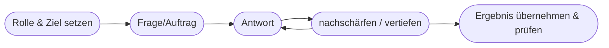

# Kapitel 18 – Chatbots und Prompt Engineering für die Dialogführung

{{ progress(18) }}

<div class="lernziele" markdown>
<h3>Was du in diesem Kapitel lernst</h3>

- Wie **Chatbots** funktionieren und wie sich regelbasierte von KI-Chatbots unterscheiden
- Was einen **guten Dialog** ausmacht und wie du Copilot als Gesprächspartner steuerst
- Die Rolle des **System-Prompts / der Rolle** für konsistentes Verhalten
- Wie du **mehrstufige Gespräche** führst und Kontext aufbaust
- Wo Chatbots im Kundenservice **Grenzen** haben
</div>

---

## 18.1 Wie Chatbots funktionieren

Ein **Chatbot** ist ein Programm, das in natürlicher Sprache mit Menschen kommuniziert. Es gibt zwei grundlegend verschiedene Generationen:

| | Regelbasierter Chatbot | KI-Chatbot (LLM) |
|---|---|---|
| Grundlage | feste Skripte, Schlüsselwörter | Sprachmodell (Kap. 15) |
| Flexibilität | gering – nur vorgesehene Wege | hoch – versteht freie Formulierungen |
| Pflege | jede Antwort von Hand | lernt aus Sprache, per Prompt steuerbar |
| Fehlerbild | „Das habe ich nicht verstanden" | flüssig, aber ggf. falsch |
| Beispiel | Telefon-Menü, FAQ-Bot | Copilot, ChatGPT |

!!! info "Der Sprung"
    Regelbasierte Bots scheitern, sobald der Nutzer „vom Skript abweicht". KI-Chatbots verstehen auch ungewöhnliche Formulierungen – dafür können sie **überzeugend falsch** liegen. Der Fehler verlagert sich von „versteht nicht" zu „versteht, aber erfindet". Das verändert, worauf man achten muss.

---

## 18.2 Was einen guten Dialog ausmacht

Ein Gespräch mit Copilot ist kein einmaliger Befehl, sondern ein **Dialog**, den du aktiv führst:



| Prinzip | Umsetzung |
|---|---|
| Rolle klären | „Du bist Support-Mitarbeiter:in für Software X." |
| schrittweise vertiefen | erst grob, dann Details nachfragen |
| Kontext aufbauen | Copilot merkt sich den bisherigen Verlauf |
| korrigieren | „Das war zu technisch, formuliere es einfacher." |

---

## 18.3 Der System-Prompt: konsistentes Verhalten

Damit ein Chatbot **durchgängig** eine bestimmte Rolle und Regeln einhält, gibt man ihm zu Beginn eine feste Anweisung – den **System-Prompt**. Er legt Persönlichkeit, Tonfall und Grenzen fest.

!!! example "Beispiel eines System-Prompts"
    ```text
    Du bist der Kundenservice-Assistent der Firma Mustertech. Antworte immer
    freundlich, in der Sie-Form und in maximal 5 Sätzen. Wenn du eine Antwort
    nicht sicher weißt, sage das ehrlich und verweise an support@mustertech.de.
    Gib niemals Rabatte oder Zusagen zu Lieferterminen.
    ```
    Solche Leitplanken verhindern, dass der Bot Dinge zusagt, die er nicht darf – ein häufiges Praxisproblem. In **Copilot Studio** (Kap. 30) lassen sich solche Assistenten ohne Programmierung bauen.

---

## 18.4 Mehrstufige Gespräche führen

Der große Vorteil von KI-Chatbots: Sie **behalten den Kontext** des Gesprächs. Du kannst aufeinander aufbauen, ohne alles zu wiederholen.

**Beispiel-Dialog (Kundenservice-Entwurf mit Copilot):**

```text
1) Du bist Kundenservice-Profi. Ein Kunde beschwert sich, dass seine
   Lieferung 5 Tage zu spät ist. Entwirf eine erste, empathische Antwort.

2) Gut. Der Kunde ist Stammkunde – ergänze eine Wertschätzung dafür.

3) Biete als Entschädigung einen 10%-Gutschein an und formuliere höflich,
   dass wir das Problem intern prüfen.
```

Jeder Schritt verfeinert das Ergebnis. Du musst den Sachverhalt nur **einmal** schildern.

!!! tip "Kontext gezielt zurücksetzen"
    Wenn du das Thema wechselst, beginne bewusst neu („Vergiss den vorherigen Fall. Neue Aufgabe: …") – sonst vermischt der Bot alten und neuen Kontext.

---

## 18.5 Grenzen von Chatbots im Kundenservice

!!! warning "Wo Menschen unverzichtbar bleiben"
    - **Verbindliche Zusagen** (Preise, Fristen, Verträge) gehören zum Menschen.
    - **Emotionale Eskalationen** (verärgerte Kunden, Beschwerden) brauchen Fingerspitzengefühl und Entscheidungsspielraum.
    - **Rechtlich relevante Auskünfte** dürfen nicht dem Bot überlassen werden.
    - **Halluzinationen** (Kap. 15): Ein Bot kann falsche Auskünfte selbstbewusst geben – im Kundenkontakt heikel.

Gutes Design nutzt deshalb ein **Eskalationsprinzip**: Der Bot erledigt Standardfälle und **übergibt** klar an einen Menschen, sobald es kritisch wird.

**Copilot-Prompt zum Ausprobieren:**

```text
Formuliere einen System-Prompt für einen Chatbot, der Terminanfragen für eine
Zahnarztpraxis entgegennimmt. Er soll freundlich sein, nach Name und Wunschtermin
fragen, keine medizinischen Auskünfte geben und bei Notfällen sofort auf die
Notfallnummer verweisen.
```

---

## Zusammenfassung

- **KI-Chatbots** verstehen freie Sprache (anders als regelbasierte), können aber überzeugend **falsch** liegen.
- Gute Dialoge führst du aktiv: **Rolle setzen, schrittweise vertiefen, korrigieren**.
- Der **System-Prompt** legt Rolle, Ton und Leitplanken fest – wichtig für konsistentes Verhalten.
- KI-Chatbots **behalten Kontext** – nutze das für mehrstufige Gespräche, setze bei Themenwechsel bewusst zurück.
- Grenzen: verbindliche Zusagen, Eskalationen und rechtliche Auskünfte gehören zum **Menschen**.

---

## Kurzübungen

{{ task(file="tasks/k18_01.yaml") }}

{{ task(file="tasks/k18_02.yaml") }}

---

## Workshop

{{ task(file="tasks/workshop_k18.yaml") }}
