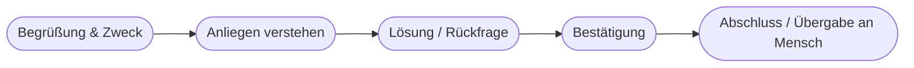

# Kapitel 18 – Chatbots und Prompt Engineering für die Dialogführung

{{ progress(18) }}

<div class="lernziele" markdown>
<h3>Was du in diesem Kapitel lernst</h3>

- Wie moderne **Chatbots** funktionieren und wo sie eingesetzt werden
- Was gutes **Dialogdesign** ausmacht
- Wie du mit **Prompt Engineering** einen Chatbot-Charakter definierst
- **Praxisbeispiel:** KI-Chatbot in der Kundenkommunikation
</div>

---

## 18.1 Was ist ein Chatbot?

Ein **Chatbot** führt einen textbasierten Dialog mit Menschen. Man unterscheidet:

| Typ | Prinzip | Eigenschaft |
|---|---|---|
| Regelbasiert | feste Entscheidungsbäume | vorhersehbar, aber starr |
| KI-basiert (LLM) | versteht freie Sprache | flexibel, natürlich |

Heutige Chatbots (z. B. auf Copilot-Basis) sind **LLM-gestützt** und verstehen Anliegen auch, wenn sie frei formuliert sind.

---

## 18.2 Gutes Dialogdesign



**Prinzipien:**

- **Klarheit:** Was kann der Bot, was nicht?
- **Rückfragen:** bei Unklarheit nachfragen statt raten
- **Eskalation:** rechtzeitig an einen Menschen übergeben
- **Ton:** zur Marke passend, freundlich, knapp

---

## 18.3 Einen Chatbot per Prompt definieren

Mit einem **System-Prompt** legst du Rolle, Wissen, Ton und Grenzen fest.

```text
Du bist der Kundenservice-Assistent der Firma Musterstrom. Du beantwortest Fragen
zu Tarifen, Rechnungen und Zählerständen. Regeln:
- Antworte höflich, in der Sie-Form, in maximal 4 Sätzen.
- Wenn du etwas nicht sicher weißt, biete die Weiterleitung an einen Mitarbeiter an.
- Frage bei fehlenden Angaben (z. B. Kundennummer) freundlich nach.
```

---

## 18.4 Praxisbeispiel: Chatbot in der Kundenkommunikation

!!! info "Fallbeispiel Energieversorger"
    Ein Energieversorger führt einen KI-Chatbot ein, der Standardfragen (Zählerstand, Tarifwechsel, Rechnungserklärung) rund um die Uhr beantwortet.

    **Nutzen:** kürzere Wartezeiten, Entlastung der Hotline, 24/7-Erreichbarkeit.
    **Grenzen:** komplexe Beschwerden gehen an Menschen; Datenschutz bei Kundendaten beachten.

**Copilot-Prompt zum Ausprobieren:**

```text
Entwirf einen Beispiel-Dialog (5 Nachrichten) zwischen einem Kunden und einem
Service-Chatbot eines Energieversorgers zum Thema "Rechnung zu hoch". Zeige, wo
der Bot nachfragt und wann er an einen Mitarbeiter übergibt.
```

---

## Kurzübungen

{{ task(file="tasks/k18_01.yaml") }}

{{ task(file="tasks/k18_02.yaml") }}

---

## Workshop

{{ task(file="tasks/workshop_k18.yaml") }}
