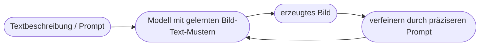

# Kapitel 19 – Medienerstellung mit KI

{{ progress(19) }}

<div class="lernziele" markdown>
<h3>Was du in diesem Kapitel lernst</h3>

- Welche **Medienarten** KI heute erzeugen kann: Text, Bild, Audio, Video, Präsentationen
- Wie **Bildgeneratoren** grundsätzlich funktionieren und wie man sie promptet
- Wie du mit **Copilot** Präsentationen, Texte und Bildideen erstellst
- Welche **rechtlichen Fragen** (Urheberrecht, Kennzeichnung) zu beachten sind
- Wie du KI-Medien **qualitätssicher** und verantwortungsvoll einsetzt
</div>

---

## 19.1 Was KI heute erzeugen kann

**Generative KI** beschränkt sich längst nicht auf Text. Sie erstellt Inhalte in vielen Formaten:

| Medienart | Beispiel | Werkzeug (Beispiel) |
|---|---|---|
| Text | Berichte, E-Mails, Slogans | Copilot, ChatGPT |
| Bild | Illustrationen, Konzeptgrafiken | Copilot/Designer (DALL·E) |
| Präsentation | Foliensätze aus Text | Copilot in PowerPoint |
| Audio | Sprachausgabe, Musik | spezialisierte Tools |
| Video | Clips, Avatare | spezialisierte Tools |

Für den Büroalltag am relevantesten sind **Text, Präsentationen und Bilder** – alle direkt über Copilot bzw. den Microsoft Designer erreichbar.

---

## 19.2 Wie Bildgeneratoren funktionieren

Bild-KI (z. B. DALL·E, das in Microsoft-Produkten steckt) erzeugt Bilder aus einer **Textbeschreibung**. Vereinfacht: Das Modell hat aus Millionen **Bild-Text-Paaren** gelernt, wie Beschreibungen und Bildinhalte zusammenhängen, und setzt aus einem „Rauschen" schrittweise ein passendes Bild zusammen.



**Ein guter Bild-Prompt beschreibt:**

| Element | Beispiel |
|---|---|
| Motiv | „ein moderner Büroarbeitsplatz" |
| Stil | „fotorealistisch" / „Flat-Illustration" |
| Stimmung/Licht | „hell, freundlich, Morgenlicht" |
| Perspektive | „Vogelperspektive", „Nahaufnahme" |
| Format | „Querformat, viel Freiraum links für Text" |

!!! example "Vom vagen zum präzisen Bild-Prompt"
    **Vage:** „ein Büro"
    **Präzise:** „Ein moderner, heller Büroarbeitsplatz mit Laptop und Pflanze, fotorealistisch, Morgenlicht, Querformat, ruhige Farben, viel Freiraum oben für eine Überschrift."
    Je konkreter Motiv, Stil und Bildaufbau, desto brauchbarer das Ergebnis.

---

## 19.3 Medien erstellen mit Copilot

**Präsentation aus Text (PowerPoint):**

```text
Erstelle eine Präsentation mit 7 Folien zum Thema "KI im Kundenservice".
Struktur: Titel, Problem, Lösung, 3 Vorteile, Beispiel, Fazit.
Pro Folie max. 4 Stichpunkte und ein Vorschlag für ein passendes Bildmotiv.
```

**Text mit passendem Stil:**

```text
Schreibe einen LinkedIn-Post (max. 120 Wörter), der unser neues KI-Projekt
vorstellt. Ton: professionell, aber begeistert. Ende mit einer Frage an die
Leser:innen.
```

**Bildidee entwickeln:**

```text
Ich brauche ein Titelbild für eine Schulung über Prompt Engineering.
Beschreibe 3 verschiedene Bildkonzepte, die ich in einem Bildgenerator
verwenden könnte – jeweils mit Stil, Motiv und Stimmung.
```

!!! tip "KI liefert den Rohentwurf, du den Feinschliff"
    KI-Medien sind selten sofort perfekt. Nutze sie als **schnellen ersten Entwurf** (Struktur der Folien, Bildidee, Textgerüst) und verfeinere gezielt. Das spart die mühsame „weiße Blatt"-Phase.

---

## 19.4 Recht und Kennzeichnung

!!! warning "Wichtige rechtliche Punkte"
    - **Urheberrecht der Eingaben:** Lade keine fremden, geschützten Bilder/Texte hoch, um sie „nachmachen" zu lassen.
    - **Rechte an den Ausgaben:** Die Rechtslage zu KI-generierten Werken ist teils ungeklärt und je nach Land unterschiedlich – für kommerzielle Nutzung genau prüfen.
    - **Kennzeichnungspflicht:** Der **EU AI Act** verlangt zunehmend, KI-generierte oder -manipulierte Inhalte **zu kennzeichnen** (Kap. 32).
    - **Persönlichkeitsrechte:** Keine realen Personen ohne Einwilligung darstellen (Deepfake-Problematik).

---

## 19.5 Qualität und Verantwortung

Bei KI-Medien sind typische Fehlerquellen zu beachten:

| Risiko | Beispiel | Gegenmittel |
|---|---|---|
| faktische Fehler im Text | falsche Zahl in Folie | gegenprüfen |
| unrealistische Bilddetails | „sechs Finger", falsche Logos | genau anschauen |
| Verzerrungen (Bias) | einseitige Darstellungen | bewusst gegensteuern (Kap. 31) |
| Marken-/Stilklau | fremder Look nachgeahmt | eigene Vorgaben nutzen |

**Copilot-Prompt zum Ausprobieren:**

```text
Erstelle die Gliederung (8 Folien) für eine Kundenpräsentation zu unserem
neuen Service. Markiere je Folie, welche Angabe ich unbedingt selbst auf
Richtigkeit prüfen muss.
```

---

## Zusammenfassung

- Generative KI erstellt **Text, Bild, Präsentation, Audio, Video** – im Büro v. a. Text, Folien, Bilder.
- **Bildgeneratoren** brauchen präzise Prompts (Motiv, Stil, Stimmung, Perspektive, Format).
- **Copilot** liefert schnelle Rohentwürfe – der Feinschliff und die Faktenprüfung bleiben bei dir.
- Beachte **Urheberrecht, Kennzeichnungspflicht (EU AI Act) und Persönlichkeitsrechte**.

---

## Kurzübungen

{{ task(file="tasks/k19_01.yaml") }}

{{ task(file="tasks/k19_02.yaml") }}

---

## Workshop

{{ task(file="tasks/workshop_k19.yaml") }}
