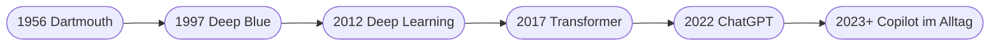

# Kapitel 2 – Herkunft und Entwicklung der KI

{{ progress(2) }}

<div class="lernziele" markdown>
<h3>Was du in diesem Kapitel lernst</h3>

- Wo die Idee der Künstlichen Intelligenz **historisch** herkommt
- Die wichtigsten **Meilensteine** von den 1950ern bis zur generativen KI heute
- Die **zwei großen Denkschulen**: symbolische KI vs. lernende Systeme
- Was mit den **„KI-Wintern"** gemeint ist, warum es sie gab und was wir daraus lernen
- Warum ausgerechnet ab ca. 2012 (und dann 2022) so viel passiert ist – die **drei Treiber**
</div>

---

## 2.1 Die Anfänge: eine Idee wird geboren

Die KI ist keine Erfindung der letzten Jahre. Ihre Wurzeln reichen in die **1950er Jahre** – lange vor leistungsfähigen Computern.

- **1943** – erste mathematische Modelle künstlicher Neuronen (McCulloch & Pitts).
- **1950** – Alan Turing stellt in seinem Aufsatz *„Computing Machinery and Intelligence"* die Frage „Können Maschinen denken?" und beschreibt den **Turing-Test**.
- **1956** – Auf der **Dartmouth-Konferenz** prägen John McCarthy und Kollegen den Begriff *Artificial Intelligence*. Das gilt als Geburtsstunde der Disziplin. Die Erwartung damals: Ein „denkender" Computer sei in wenigen Jahrzehnten möglich.

!!! info "Der Turing-Test – und seine Grenzen"
    Beim Turing-Test kommuniziert ein Mensch per Text mit einem unbekannten Gegenüber. Kann er nicht zuverlässig unterscheiden, ob er mit einem Menschen oder einer Maschine schreibt, hat die Maschine den Test „bestanden".

    Moderne Chatbots wirken oft täuschend menschlich – doch der Test misst nur die **Nachahmung von Sprache**, nicht echtes Verstehen. Ein System kann den Test „bestehen" und trotzdem inhaltlichen Unsinn erzeugen. Deshalb gilt der Turing-Test heute eher als historischer Meilenstein denn als ernsthaftes Maß für Intelligenz.

---

## 2.2 Zwei Denkschulen: symbolische vs. lernende KI

Die Geschichte der KI ist ein Ringen zwischen zwei Grundideen:

| | Symbolische KI („GOFAI") | Lernende Systeme (ML) |
|---|---|---|
| Grundidee | Wissen als **Regeln & Logik** darstellen | Muster aus **Daten** lernen |
| Beispiel | Expertensystem für Diagnosen | neuronales Netz für Bilderkennung |
| Stärke | nachvollziehbar, erklärbar | flexibel, skaliert mit Daten |
| Schwäche | starr, „Wissenserfassungs-Engpass" | Datenhunger, oft Black Box |
| Blütezeit | 1970er–1980er | ab 2000ern, dominant seit 2012 |

In den 1980ern setzten Unternehmen große Hoffnungen in **Expertensysteme**: Fachwissen wurde mühsam in tausende „wenn-dann"-Regeln übersetzt. Das Problem: Die Regeln zu pflegen war extrem aufwendig, und die Systeme scheiterten an allem, was nicht explizit erfasst war. Der heutige Erfolg beruht dagegen fast vollständig auf **lernenden Systemen**.

---

## 2.3 Die großen Entwicklungswellen



| Phase | Zeitraum | Kennzeichen | Technik |
|---|---|---|---|
| Symbolische KI | 1956–1980er | Regeln, Logik, „wenn-dann" | Expertensysteme |
| Statistisches Lernen | 1990er–2000er | Lernen aus Daten | klassisches Machine Learning |
| Deep Learning | ab 2012 | tiefe neuronale Netze, viele Daten | Bild-/Spracherkennung |
| Generative KI | ab 2022 | Erzeugen von Inhalten in Sprache | LLMs, Transformer |

**Schlüsselmomente zum Merken:**

- **1997 – Deep Blue** schlägt Schachweltmeister Kasparow. Meilenstein, aber noch klassische Rechenkraft, kein „Lernen".
- **2012 – ImageNet-Durchbruch:** Ein tiefes neuronales Netz erkennt Bilder plötzlich viel besser als alle bisherigen Verfahren. Der Startschuss der **Deep-Learning-Ära**.
- **2016 – AlphaGo** schlägt den weltbesten Go-Spieler – ein Spiel, das als „zu komplex für Computer" galt. Hier lernte das System **selbst** durch Spielen (Reinforcement Learning, Kapitel 17).
- **2017 – Transformer:** Die Architektur hinter allen heutigen Sprachmodellen (Kapitel 16).
- **2022 – ChatGPT:** generative KI wird für Millionen Menschen nutzbar – der Auslöser des aktuellen Booms.

---

## 2.4 Die „KI-Winter"

Zweimal folgte auf große Erwartungen große Ernüchterung: Ende der 1970er und Ende der 1980er. Die Technik konnte die Versprechen nicht halten, Fördergelder und Investitionen wurden gestrichen. Diese Phasen heißen **KI-Winter**.

**Warum kam es dazu?**

- **Rechenleistung** war um Größenordnungen zu gering.
- Es gab kaum **digitale Daten** zum Lernen.
- Die **Erwartungen** waren maßlos überzogen (Hype) – man versprach „denkende Maschinen in 10 Jahren".
- Expertensysteme waren zu teuer in der Pflege und zu unflexibel.


!!! warning "Lehre für heute"
    Auch die aktuelle KI-Welle wird von viel Hype begleitet. Ein realistischer Blick auf **Nutzen und Grenzen** – statt Übererwartung – schützt vor Enttäuschung und Fehlinvestitionen. Dieser nüchterne Blick zieht sich durch den ganzen Kurs (besonders Block 4 und 5).

---

## 2.5 Warum jetzt alles so schnell geht: die drei Treiber

Drei Entwicklungen kamen zusammen und beendeten den letzten KI-Winter:

| Treiber | Was sich änderte | Wirkung |
|---|---|---|
| **Daten** | Internet, Sensoren, Digitalisierung erzeugen riesige Mengen | Lernmaterial im Überfluss |
| **Rechenleistung** | Grafikkarten (GPUs) und Cloud | Training großer Modelle wird bezahlbar |
| **Algorithmen** | Transformer-Architektur (2017) | ermöglicht heutige Sprachmodelle |

Fällt einer dieser Treiber weg, funktioniert der Rest nicht: Ohne Daten kein Lernen, ohne Rechenleistung kein Training, ohne die passenden Algorithmen keine Sprachfähigkeit. Erst das **Zusammenspiel** brachte den Durchbruch.

Das Ergebnis: Werkzeuge wie **ChatGPT** und **Microsoft Copilot**, die generative KI für jeden nutzbar machen – ohne Programmierkenntnisse, allein über **Sprache (Prompts)**.

**Copilot-Prompt zum Ausprobieren:**

```text
Erstelle einen kompakten Zeitstrahl der KI-Geschichte mit 6 Meilensteinen.
Formuliere jeden Meilenstein in einem Satz und erkläre, warum er wichtig war.
```

Prüfe die Ausgabe kritisch: Stimmen die Jahreszahlen? LLMs verwechseln gelegentlich Daten – ein guter Anlass, das aus Kapitel 1 Gelernte anzuwenden (KI liefert Entwürfe, keine geprüften Fakten).

---

## Zusammenfassung

- Die KI-Idee ist über **70 Jahre alt** (Turing 1950, Dartmouth 1956).
- Zwei Denkschulen: **symbolische KI** (Regeln) vs. **lernende Systeme** (Daten) – heute dominieren lernende Systeme.
- **KI-Winter** entstanden durch Übererwartung bei fehlenden technischen Voraussetzungen.
- Der aktuelle Boom beruht auf drei Treibern zugleich: **Daten, Rechenleistung, Algorithmen (Transformer)**.

---

## Kurzübungen

{{ task(file="tasks/k02_01.yaml") }}

{{ task(file="tasks/k02_02.yaml") }}

{{ task(file="tasks/k02_03.yaml") }}

---

## Workshop

{{ task(file="tasks/workshop_k02.yaml") }}
