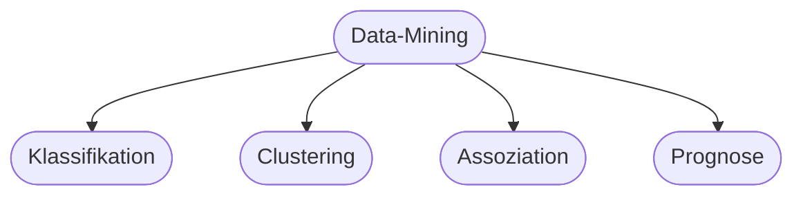

# Kapitel 20 – Data-Mining

{{ progress(20) }}

<div class="lernziele" markdown>
<h3>Was du in diesem Kapitel lernst</h3>

- Was **Data-Mining** ist und welche Aufgaben es löst
- Zentrale Methoden: **Klassifikation, Clustering, Assoziation, Prognose**
- Wie du mit Copilot in Excel Daten erkundest
- **Praxisbeispiel:** KI im Marketing
</div>

---

## 20.1 Was ist Data-Mining?

**Data-Mining** bedeutet, in großen Datenmengen **verborgene Muster und Zusammenhänge** zu finden, die geschäftlich nützlich sind – z. B. „Welche Kunden kündigen bald?".

---

## 20.2 Methoden des Data-Mining



| Methode | Frage | Beispiel |
|---|---|---|
| Klassifikation | In welche Kategorie? | Kunde kündigt: ja/nein |
| Clustering | Welche Gruppen? | Kundensegmente |
| Assoziation | Was tritt gemeinsam auf? | „Wer A kauft, kauft auch B" |
| Prognose | Wie entwickelt sich X? | Umsatz nächsten Monat |

!!! info "Warenkorbanalyse"
    Der Klassiker der Assoziationsanalyse: Supermärkte erkennen, welche Produkte oft zusammen gekauft werden, und platzieren sie clever oder bündeln Angebote.

---

## 20.3 Daten erkunden mit Copilot

Copilot in Excel hilft, erste Muster zu finden – auch ohne Statistikkenntnisse.

**Copilot-Prompt (Excel):**

```text
Analysiere diese Verkaufsdaten: Nenne die 3 auffälligsten Muster oder Trends,
identifiziere die umsatzstärkste Kundengruppe und schlage eine weiterführende
Auswertung vor.
```

---

## 20.4 Praxisbeispiel: KI im Marketing

!!! info "Fallbeispiel Onlinehandel"
    Ein Onlinehändler nutzt Data-Mining, um Kunden in **Segmente** zu clustern und **abwanderungsgefährdete** Kunden (Churn) frühzeitig zu erkennen.

    **Nutzen:** gezielte Kampagnen, höhere Conversion, weniger Streuverlust.
    **Voraussetzung:** saubere Daten und Beachtung des Datenschutzes (Kapitel 33).

**Copilot-Prompt zum Ausprobieren:**

```text
Ich habe Kundendaten mit Kaufhäufigkeit, letztem Kauf und Umsatz. Erkläre, wie
ich damit eine einfache Kundensegmentierung (z. B. RFM-Analyse) durchführe und
welche Marketingmaßnahme je Segment sinnvoll ist.
```

---

## Kurzübungen

{{ task(file="tasks/k20_01.yaml") }}

{{ task(file="tasks/k20_02.yaml") }}

---

## Workshop

{{ task(file="tasks/workshop_k20.yaml") }}
