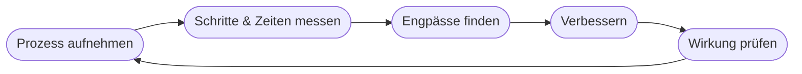

# Kapitel 21 – Prozessoptimierung

{{ progress(21) }}

<div class="lernziele" markdown>
<h3>Was du in diesem Kapitel lernst</h3>

- Was **Prozessoptimierung** bedeutet und warum sie ein Top-Einsatzfeld für KI ist
- Wie du einen Prozess **analysierst** und **Engpässe** findest
- Welche **Hebel** KI bietet: automatisieren, beschleunigen, Fehler senken
- Welche **Automatisierungsgrade** es gibt – von Assistenz bis autonom
- Wie du Maßnahmen nach **Aufwand und Nutzen** priorisierst
- Was **Process Mining** ist – Prozesse aus Daten sichtbar machen
- Wie du mit **Copilot** Prozesse dokumentierst, analysierst und verbesserst
</div>

---

## 21.1 Was ist Prozessoptimierung?

Ein **Prozess** ist eine wiederkehrende Abfolge von Tätigkeiten mit einem Ergebnis (z. B. „Angebot erstellen", „Rechnung bearbeiten"). **Prozessoptimierung** macht solche Abläufe **schneller, günstiger, fehlerärmer oder angenehmer**.

!!! info "Warum gerade hier KI wirkt"
    Viele Prozesse enthalten **repetitive, textlastige Schritte**: Daten übertragen, Dokumente lesen, Standardmails schreiben, zusammenfassen. Genau das kann KI (und speziell Copilot) übernehmen oder beschleunigen. Prozessoptimierung ist deshalb eines der **wirkungsvollsten und schnellsten** KI-Einsatzfelder – oft ein Quick Win (Kap. 4).

---

## 21.2 Prozesse analysieren und Engpässe finden

Bevor man optimiert, muss man den Prozess **verstehen**. Ein einfaches Vorgehen:



| Frage | Ziel |
|---|---|
| Welche Schritte gibt es? | Überblick schaffen |
| Wo dauert es lange / staut es sich? | **Engpass (Bottleneck)** finden |
| Wo entstehen Fehler / Nacharbeit? | Qualitätsprobleme finden |
| Welche Schritte sind reine Routine? | Automatisierungskandidaten finden |

!!! tip "Am Engpass ansetzen"
    Eine Kette ist nur so schnell wie ihr langsamstes Glied. Es bringt wenig, einen Schritt zu beschleunigen, der gar nicht der Engpass ist. Finde zuerst den **echten Flaschenhals** – oft ist es ein manueller, textlastiger Schritt, den KI entlasten kann.

---

## 21.3 KI-Hebel in Prozessen

| Hebel | Was passiert | Beispiel mit Copilot |
|---|---|---|
| **Automatisieren** | Routineschritt ganz übernehmen | Standardantworten entwerfen |
| **Beschleunigen** | Menschen schneller machen | Zusammenfassungen, Vorlagen |
| **Fehler senken** | Prüfen, Vollständigkeit sichern | „Fehlt in diesem Antrag etwas?" |
| **Wissen bereitstellen** | schneller die richtige Info finden | interne Doku durchsuchen (RAG) |

---

## 21.4 Process Mining: Prozesse aus Daten sichtbar machen

**Process Mining** rekonstruiert den **tatsächlichen** Prozessablauf aus den digitalen Spuren in IT-Systemen (z. B. Zeitstempel im ERP). So sieht man, wie ein Prozess **wirklich** läuft – nicht wie er im Handbuch stehen sollte.

!!! example "Soll vs. Ist"
    Im Handbuch: „Bestellung → Freigabe → Versand." In den echten Daten zeigt Process Mining vielleicht: In 30 % der Fälle geht es „Bestellung → Versand → nachträgliche Freigabe" – ein Kontrollrisiko, das vorher niemand sah. Solche Abweichungen (**Varianten**) sind der Startpunkt für Verbesserungen.

Process Mining ist meist Aufgabe spezialisierter Tools; Copilot hilft bei der **Interpretation** und **Dokumentation** der Ergebnisse.

---

## 21.5 Automatisierungsgrade: nicht alles oder nichts

„Automatisieren" ist keine Ja/Nein-Frage, sondern eine **Skala**. Für jeden Schritt kannst du entscheiden, **wie viel** die KI übernimmt und wie viel beim Menschen bleibt:

| Grad | Wer entscheidet? | Rolle der KI | Beispiel |
|---|---|---|---|
| Assistenz | Mensch | schlägt vor, Mensch wählt | Copilot entwirft die Mail, du sendest |
| Teilautomatik | Mensch prüft | KI erledigt, Mensch gibt frei | Rechnung wird vorbefüllt, Freigabe per Klick |
| Überwachte Automatik | KI, Mensch kontrolliert Stichproben | KI läuft selbstständig | Standardanfragen automatisch beantwortet |
| Autonom | KI | kein Eingriff im Normalfall | Routing im Lager ohne Zutun |

Für Copilot im Büroalltag ist meist die Stufe **Assistenz** oder **Teilautomatik** realistisch und sinnvoll: Die KI nimmt die Fleißarbeit ab, die Verantwortung bleibt beim Menschen. Höhere Grade lohnen sich nur bei klar geregelten, risikoarmen Routineschritten.

!!! info "Vertiefung: Human-in-the-loop"
    Der Fachbegriff für „Mensch prüft, bevor es zählt" ist **Human-in-the-loop**. Er ist mehr als Vorsicht: Er hält Verantwortung, Haftung und Lernschleife beim Menschen. Gerade bei kundenwirksamen oder rechtlich relevanten Schritten (Kap. 32) ist eine bewusste Freigabestufe Pflicht – nicht Kür. Faustregel: Je größer der mögliche Schaden eines Fehlers, desto niedriger der sinnvolle Automatisierungsgrad.

---

## 21.6 Aufwand und Nutzen: welchen Schritt zuerst?

Nicht jede Verbesserung lohnt sich gleich. Bewährt ist eine einfache Einordnung in eine **Aufwand-Nutzen-Matrix**:

| | Geringer Aufwand | Hoher Aufwand |
|---|---|---|
| **Hoher Nutzen** | Quick Wins – sofort angehen | Großprojekte – planen |
| **Geringer Nutzen** | Nebenbei erledigen | meiden |

Starte mit den **Quick Wins** (hoher Nutzen, geringer Aufwand) – häufig sind das genau die textlastigen Routineschritte, bei denen Copilot ohne Systemumbau hilft. So entstehen schnelle, sichtbare Erfolge, die Akzeptanz schaffen (Change Management, Kap. 37).

!!! warning "Häufiges Missverständnis: erst automatisieren, dann nachdenken"
    Ein verbreiteter Fehler: einen **schlechten Prozess automatisieren**. Dann läuft der Unsinn nur schneller und in größerer Zahl. Erst **vereinfachen und aufräumen**, dann automatisieren. Und: Automatisierung, die niemand versteht oder der niemand vertraut, wird umgangen. Beziehe die Betroffenen früh ein – sonst scheitert die beste Technik an der Praxis.

---

## 21.7 Prozessarbeit mit Copilot

Alle Prompts sind **selbsttragend** – Copilot erzeugt den Beispielprozess zuerst selbst, du brauchst keine echten Unterlagen.

**Prozess dokumentieren:**

```text
Erfinde einen typischen Angebotsprozess in Stichworten. Erstelle daraus eine klare,
nummerierte Prozessbeschreibung und markiere Schritte, die reine Routine sind und
sich automatisieren ließen.
```

**Engpässe und Ideen finden:**

```text
Erfinde einen Prozess zur Rechnungsbearbeitung mit typischen Verzögerungen.
Analysiere ihn: Wo liegen wahrscheinlich Engpässe und Fehlerquellen? Schlage
5 konkrete Verbesserungen vor und ordne sie nach Aufwand/Nutzen.
```

**Prozess visualisieren:**

```text
Wandle diese Prozessbeschreibung in eine übersichtliche Schritt-für-Schritt-
Liste mit Verantwortlichkeiten (Rolle je Schritt) um.
```

!!! example "So sieht eine Copilot-Analyse aus (gekürzt)"
    Auf den zweiten Prompt (Rechnungsbearbeitung) liefert Copilot etwa:
    ```text
    Engpässe:
    - Manuelle Prüfung wartet oft auf Rückfragen per Mail (Liegezeit).
    - Freigabe hängt an einer einzelnen Person (Urlaub = Stau).
    Verbesserungen (nach Aufwand/Nutzen):
    1. Standardrechnungen automatisch vorprüfen  (Nutzen hoch / Aufwand gering)
    2. Vertretungsregel für Freigaben           (Nutzen hoch / Aufwand gering)
    3. Rückfragen per Vorlage bündeln            (Nutzen mittel / Aufwand gering)
    ...
    ```
    Beachte: Copilot ordnet die Vorschläge bereits nach Aufwand/Nutzen (Abschnitt 21.6) – die fachliche Bewertung triffst aber du.

!!! warning "Copilot kennt euren Prozess nicht von allein"
    Copilot kann nur mit den Informationen arbeiten, die du ihm gibst (oder die es via M365-Daten findet). Beschreibe den Prozess **konkret** – je genauer die Eingabe, desto brauchbarer die Analyse. Und: Vorschläge sind Ideen, keine geprüften Maßnahmen. Die fachliche Bewertung bleibt bei dir und den Beteiligten.

---

## Zusammenfassung

- **Prozessoptimierung** macht wiederkehrende Abläufe besser – ein Top-Einsatzfeld für KI/Copilot.
- Erst **analysieren** und **Engpässe** finden, dann gezielt am Flaschenhals ansetzen.
- KI-Hebel: **automatisieren, beschleunigen, Fehler senken, Wissen bereitstellen**.
- Automatisierung ist eine **Skala** (Assistenz bis autonom); im Büro passt meist **Human-in-the-loop**.
- Nach **Aufwand/Nutzen** priorisieren, mit **Quick Wins** starten – und keinen schlechten Prozess automatisieren.
- **Process Mining** zeigt den **tatsächlichen** Ablauf aus Daten (Soll vs. Ist).
- **Copilot** hilft beim Dokumentieren, Analysieren und Ideenfinden – konkrete Eingaben sind entscheidend.

---

## Kurzübungen

{{ task(file="tasks/k21_01.yaml") }}

{{ task(file="tasks/k21_02.yaml") }}

{{ task(file="tasks/k21_03.yaml") }}

---

## Workshop

{{ task(file="tasks/workshop_k21.yaml") }}
