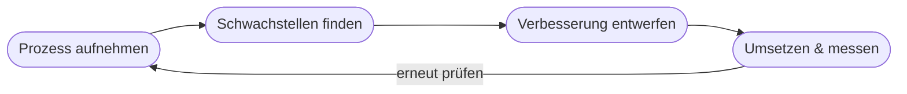

# Kapitel 21 – Prozessoptimierung

{{ progress(21) }}

<div class="lernziele" markdown>
<h3>Was du in diesem Kapitel lernst</h3>

- Was **Prozessoptimierung** ist und wie KI dabei hilft
- Wie man einen Prozess **analysiert** und Schwachstellen findet
- Der Unterschied zwischen **Assistenz**, **Teil-** und **Vollautomatisierung**
- Wie Copilot bei der Prozessanalyse unterstützt
</div>

---

## 21.1 Was ist Prozessoptimierung?

Ein **Prozess** ist eine Abfolge von Schritten, die aus einem Input einen Output macht (z. B. „Bestellung → Lieferung"). **Optimierung** bedeutet: schneller, günstiger, fehlerärmer oder kundenfreundlicher werden.

---

## 21.2 Prozesse analysieren



**Typische Schwachstellen:** Wartezeiten, Medienbrüche (z. B. Papier ↔ digital), Doppelarbeit, manuelle Routineschritte.

!!! info "Erst verstehen, dann automatisieren"
    Ein schlechter Prozess wird durch Automatisierung nur **schneller schlecht**. Deshalb zuerst analysieren und vereinfachen, dann KI/Automatisierung einsetzen.

---

## 21.3 Automatisierungsgrade

| Grad | Beschreibung | Beispiel mit KI |
|---|---|---|
| Assistenz | Mensch entscheidet, KI unterstützt | Copilot schlägt Antwort vor |
| Teilautomatisierung | KI übernimmt Teilschritte | Rechnung wird ausgelesen, Mensch prüft |
| Vollautomatisierung | KI übernimmt Ende-zu-Ende | Standardbestellung ohne Eingriff |

---

## 21.4 Prozessanalyse mit Copilot

**Copilot-Prompt zum Ausprobieren:**

```text
Ich beschreibe dir einen Arbeitsprozess. Identifiziere Schwachstellen
(Wartezeiten, Medienbrüche, Doppelarbeit) und schlage 3 Verbesserungen vor,
davon mindestens eine mit KI-Unterstützung.
Prozess: [Schritte auflisten]
```

!!! warning "Menschen mitnehmen"
    Prozessänderungen betreffen Menschen und ihre Arbeit. Ohne Einbindung der Betroffenen scheitert die Umsetzung oft (siehe Change Management, Kapitel 37).

---

## Kurzübungen

{{ task(file="tasks/k21_01.yaml") }}

{{ task(file="tasks/k21_02.yaml") }}

---

## Workshop

{{ task(file="tasks/workshop_k21.yaml") }}
