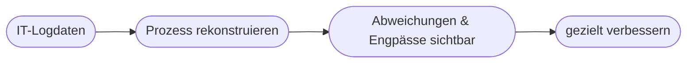

# Kapitel 22 – Praxis: KI in der Geschäftsprozessoptimierung

{{ progress(22) }}

<div class="lernziele" markdown>
<h3>Was du in diesem Kapitel lernst</h3>

- Wie **KI konkret** in der Geschäftsprozessoptimierung (BPM) wirkt
- Was **Process Mining** ist
- Wie **RPA** (Software-Roboter) und KI zusammenspielen
- Ein durchgängiges **Praxisbeispiel** aus der Verwaltung
</div>

---

## 22.1 KI im Geschäftsprozessmanagement

**Geschäftsprozessmanagement (BPM)** kümmert sich um das systematische Gestalten und Verbessern von Prozessen. KI setzt an drei Stellen an:

| Ansatz | Was passiert |
|---|---|
| **Process Mining** | Prozesse aus IT-Logdaten automatisch rekonstruieren und analysieren |
| **RPA + KI** | Software-Roboter erledigen Routine, KI trifft „weiche" Entscheidungen |
| **Assistenz** | Copilot unterstützt bei Dokumentation, Kommunikation, Auswertung |

---

## 22.2 Process Mining kurz erklärt

Jede Aktion in ERP/CRM hinterlässt Spuren (Logs). **Process Mining** liest diese Spuren und zeigt, **wie der Prozess wirklich läuft** – oft anders als gedacht.



!!! info "RPA vs. KI"
    **RPA** (Robotic Process Automation) automatisiert **feste, regelbasierte** Klickabläufe. **KI** ergänzt dort, wo Verstehen oder Entscheiden nötig ist (z. B. unstrukturierte E-Mails einordnen).

---

## 22.3 Praxisbeispiel: Rechnungseingang in der Verwaltung

!!! info "Fallbeispiel"
    Eine Verwaltung optimiert den **Rechnungseingang**:

    1. Rechnung kommt per E-Mail/Papier
    2. KI liest Daten aus (Lieferant, Betrag, Datum)
    3. RPA legt den Vorgang im System an
    4. Copilot formuliert Rückfragen bei Unstimmigkeiten
    5. Ein Mensch gibt frei

    **Nutzen:** schnellere Durchlaufzeit, weniger Tippfehler, klare Nachverfolgung.

**Copilot-Prompt zum Ausprobieren:**

```text
Beschreibe für den Prozess "Rechnungseingang" (E-Mail bis Freigabe), an welchen
Schritten KI, RPA und menschliche Kontrolle jeweils sinnvoll sind. Nenne je
Schritt ein Risiko.
```

---

## Kurzübungen

{{ task(file="tasks/k22_01.yaml") }}

{{ task(file="tasks/k22_02.yaml") }}

---

## Workshop

{{ task(file="tasks/workshop_k22.yaml") }}
