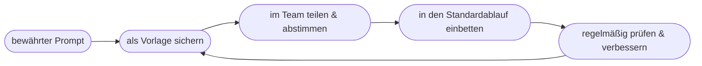

# Kapitel 22 – Praxis: KI in der Geschäftsprozessoptimierung

{{ progress(22) }}

<div class="lernziele" markdown>
<h3>Was du in diesem Kapitel lernst</h3>

- Wie du KI **praktisch** in einen konkreten Geschäftsprozess einbindest
- Ein durchgängiges **Fallbeispiel**: der Angebots-/Bestellprozess
- Wie du Schritte in **Mensch** und **KI/Automatik** aufteilst
- Wie **Copilot** in verschiedenen Prozessschritten konkret hilft
- Wie du den Erfolg mit **Kennzahlen** misst
- Wie du einen einfachen **Business Case** aufstellst (durchgerechnet)
- Wie aus einer Insellösung ein **wiederholbarer Standard** wird
</div>

---

## 22.1 Vom Prinzip zur Praxis

In Kapitel 21 ging es um die **Prinzipien** der Prozessoptimierung. Jetzt spielen wir sie an einem **durchgängigen Beispiel** durch: dem Weg von der Kundenanfrage bis zur Rechnung. Ziel ist, zu zeigen, **wo genau** KI im Alltag ansetzt – Schritt für Schritt.

---

## 22.2 Das Fallbeispiel: Angebot bis Rechnung


Für jeden Schritt fragen wir: Was ist **Routine** (KI-tauglich) und was braucht **menschliche Entscheidung**?

| Schritt | Routineanteil | Menschliche Entscheidung |
|---|---|---|
| Anfrage verstehen | Kernpunkte extrahieren | fachliche Machbarkeit |
| Angebot erstellen | Textbausteine, Formulierung | Preis, Konditionen |
| Nachfassen | Erinnerungsmail entwerfen | Timing, Beziehung |
| Bestätigung | Standardmail | Sonderfälle |
| Rechnung & Ablage | Zusammenfassung, Ablagevorschlag | Freigabe |

---

## 22.3 Copilot in jedem Schritt

Probiere die Kette direkt aus. Damit du keine echten Kundendaten brauchst, lässt du Copilot die Anfrage **zuerst selbst erfinden**:

**Schritt 0 – Beispielanfrage erzeugen:**

```text
Erfinde eine realistische Kundenanfrage per E-Mail für eine Sonderanfertigung,
in der bewusst eine wichtige Angabe (z. B. der Liefertermin) fehlt.
```

**Schritt 1 – Anfrage verstehen:**

```text
Fasse diese Kundenanfrage in Stichpunkten zusammen: Was genau wird gewünscht,
welche Mengen/Termine werden genannt, und welche Angaben fehlen noch, um ein
Angebot zu erstellen?
```

**Schritt 2 – Angebot entwerfen:**

```text
Entwirf ein Angebotsschreiben (Sie-Form, freundlich, max. 200 Wörter) auf Basis
der Anfrage. Lasse den Endpreis als Platzhalter [PREIS], den ich selbst einsetze.
```

**Schritt 3 – Nachfassen:**

```text
Der Kunde hat auf mein Angebot vom [Datum] noch nicht reagiert. Formuliere eine
höfliche, kurze Erinnerung, die nicht aufdringlich wirkt und eine konkrete
Rückfrage enthält.
```

!!! tip "Der Mensch bleibt am Steuer"
    Beachte: Preise, Konditionen und Freigaben bleiben in den Beispielen **beim Menschen** (Platzhalter [PREIS]). Copilot übernimmt die **zeitraubende Formulierungsarbeit**, nicht die **Entscheidung**. Genau diese Aufteilung macht den Einsatz sicher und akzeptiert.

---

## 22.4 Erfolg messen

Ohne Kennzahlen weiß niemand, ob die Optimierung gewirkt hat. Lege **vorher** fest, was du misst:

| Kennzahl | Vorher | Ziel |
|---|---|---|
| Durchlaufzeit je Angebot | z. B. 45 min | −40 % |
| Zahl der Angebote pro Tag | z. B. 6 | +50 % |
| Fehler-/Nacharbeitsquote | z. B. 12 % | < 5 % |
| Reaktionszeit auf Anfragen | z. B. 2 Tage | < 1 Tag |

!!! example "Realistischer Effekt"
    Angenommen, das Formulieren eines Angebots dauert statt 45 nur 25 Minuten – bei 6 Angeboten pro Tag sind das **2 Stunden** gewonnene Zeit täglich, die in Beratung oder Nachfassen fließen kann. Solche Rechnungen machen den Nutzen greifbar und rechtfertigen die Einführung (Business Case, Kap. 26/38).

---

## 22.5 Der Business Case: die Rechnung dahinter

Kennzahlen zeigen die Wirkung – ein **Business Case** übersetzt sie in Euro und macht die Einführung entscheidungsreif. Rechnen wir das Angebotsbeispiel durch:

| Größe | Annahme |
|---|---|
| Zeitersparnis je Angebot | 20 Minuten (45 → 25 min) |
| Angebote pro Tag | 6 |
| Arbeitstage pro Monat | 20 |
| interner Stundensatz | 40 € |
| Lizenzkosten je Nutzer/Monat | ca. 30 € |

Daraus ergibt sich: 20 min × 6 = **120 min/Tag** ≈ 2 Stunden. Über 20 Tage sind das **40 Stunden im Monat**. Bei 40 € entspricht das **1.600 € gewonnener Kapazität** pro Monat – dem stehen rund **30 € Lizenzkosten** gegenüber. Selbst mit großzügigem Puffer für Einarbeitung und Prüfaufwand bleibt der Nutzen klar positiv.

!!! info "Vertiefung: harter und weicher Nutzen"
    Nicht jeder Vorteil steht in der Tabelle. **Harter Nutzen** ist messbar (Zeit, Kosten, Fehlerquote). **Weicher Nutzen** wirkt indirekt: schnellere Reaktion auf Kunden, weniger Frust bei Routinearbeit, mehr Zeit für Beratung. Beides gehört in einen ehrlichen Business Case – der harte Teil überzeugt das Controlling, der weiche erklärt, warum das Team mitzieht (siehe auch Kap. 26 und Kap. 38 – Geschäftsmodelle).

!!! warning "Häufiges Missverständnis: gesparte Minuten sind noch kein Geld"
    Die Rechnung oben ist eine **Potenzialrechnung**. Gesparte Minuten werden erst zu Wert, wenn die frei werdende Zeit **sinnvoll genutzt** wird – für mehr Angebote, bessere Beratung oder Abbau von Rückstand. Verpufft die Zeit in Leerlauf, gibt es keinen echten Gewinn. Formuliere deshalb immer, **wofür** die gewonnene Kapazität eingesetzt wird – sonst bleibt der Business Case eine Milchmädchenrechnung.

---

## 22.6 Von der Insellösung zum wiederholbaren Standard

Ein einzelner gut formulierter Prompt hilft einer Person einmal. Wirkung im Unternehmen entsteht erst, wenn gute Lösungen **wiederholbar** werden. Der Weg dahin:



Konkret heißt das: die besten Prompts als **Vorlagen** sammeln (z. B. in OneNote oder einer geteilten Bibliothek, Kap. 14), sie im Team abstimmen und in den offiziellen Prozess aufnehmen. So wird aus dem Können Einzelner eine **organisationale Fähigkeit** – der rote Faden zu Kap. 30 (Low-Code/Citizen Development) und Kap. 40 (Prompt Engineering als Schlüsselkompetenz). Wichtig bleibt die regelmäßige Prüfung: Vorlagen veralten, Prozesse ändern sich.

---

## 22.7 Stolpersteine in der Praxis

!!! warning "Worauf du achten musst"
    - **Vertrauliche Kundendaten** nur in der freigegebenen M365-Umgebung verarbeiten (Kap. 33).
    - **Copilot-Entwürfe immer gegenlesen** – falscher Ton oder falsche Zahl fällt sonst dem Kunden auf.
    - **Nicht alles automatisieren wollen:** Beziehungspflege und Sonderfälle bleiben menschlich.
    - **Team mitnehmen:** Wenn Kolleg:innen den Nutzen nicht sehen, wird das Werkzeug nicht genutzt (Change, Kap. 37).

**Copilot-Prompt zum Ausprobieren:**

```text
Analysiere unseren Angebotsprozess (Anfrage bis Rechnung). Schlage für jeden
Schritt vor, ob und wie KI helfen kann, und markiere klar, welche Schritte
zwingend eine menschliche Entscheidung brauchen.
```

---

## Zusammenfassung

- KI-Prozessoptimierung wird konkret, wenn man einen realen Prozess **Schritt für Schritt** durchgeht.
- Jeden Schritt in **Routine** (KI) und **Entscheidung** (Mensch) aufteilen – Preise/Freigaben bleiben menschlich.
- **Copilot** übernimmt die zeitraubende Formulierungs- und Zusammenfassungsarbeit.
- Erfolg mit **Kennzahlen** (Durchlaufzeit, Menge, Fehlerquote) messbar machen.
- Ein **Business Case** übersetzt Zeitersparnis in Euro – gesparte Minuten zählen aber erst, wenn die Zeit sinnvoll genutzt wird.
- Aus Einzellösungen einen **wiederholbaren Standard** machen (Vorlagen sichern, teilen, einbetten, prüfen).
- Stolpersteine: Datenschutz, ungeprüfte Entwürfe, Über-Automatisierung, fehlende Akzeptanz.

---

## Kurzübungen

{{ task(file="tasks/k22_01.yaml") }}

{{ task(file="tasks/k22_02.yaml") }}

{{ task(file="tasks/k22_03.yaml") }}

---

## Workshop

{{ task(file="tasks/workshop_k22.yaml") }}
