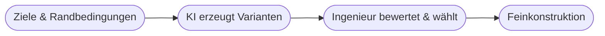

# Kapitel 23 – Praxis: KI in der Konstruktion

{{ progress(23) }}

<div class="lernziele" markdown>
<h3>Was du in diesem Kapitel lernst</h3>

- Wie KI in **Konstruktion und Engineering** eingesetzt wird
- Was **generatives Design** ist
- Wie KI den **Entwicklungsprozess** beschleunigt
- Ein **Praxisbeispiel** aus der Produktentwicklung
</div>

---

## 23.1 KI im Engineering

In der **Konstruktion** (CAD/CAE) unterstützt KI bei Entwurf, Simulation und Dokumentation:

| Einsatz | Nutzen |
|---|---|
| Generatives Design | viele Entwurfsvarianten automatisch erzeugen |
| Simulation beschleunigen | Ergebnisse schneller abschätzen |
| Wissenszugriff | Normen, Datenblätter, frühere Projekte durchsuchen |
| Dokumentation | Berichte, Stücklisten, Anleitungen erstellen |

---

## 23.2 Generatives Design

Beim **generativen Design** gibst du **Ziele und Randbedingungen** vor (z. B. „so leicht wie möglich, muss 500 N tragen, aus Aluminium"). Die KI erzeugt daraus zahlreiche optimierte Entwürfe.



!!! info "Mensch bleibt Entscheider"
    Die KI liefert **Optionen** – Auswahl, Prüfung und Verantwortung liegen bei den Fachleuten. KI erweitert den Lösungsraum, ersetzt aber kein Ingenieurwissen.

---

## 23.3 Praxisbeispiel: Halterung optimieren

!!! info "Fallbeispiel Maschinenbau"
    Ein Hersteller lässt für eine Bauteil-Halterung per generativem Design Varianten erzeugen.

    **Ergebnis:** ~30 % Gewichtsersparnis bei gleicher Festigkeit, weniger Materialverbrauch.
    **Grenze:** Fertigbarkeit (z. B. nur mit 3D-Druck) und Kosten müssen geprüft werden.

**Copilot-Prompt zum Ausprobieren:**

```text
Ich konstruiere eine Halterung. Erstelle eine strukturierte Anforderungsliste
(Lasten, Material, Bauraum, Fertigungsverfahren, Normen), die ich vor einem
generativen Design klären muss.
```

Copilot ist hier vor allem für **Anforderungsklärung, Recherche und Dokumentation** stark – die eigentliche Geometrie erzeugen spezialisierte CAD-Werkzeuge.

---

## Kurzübungen

{{ task(file="tasks/k23_01.yaml") }}

{{ task(file="tasks/k23_02.yaml") }}

---

## Workshop

{{ task(file="tasks/workshop_k23.yaml") }}
