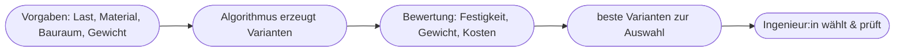
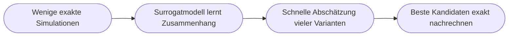

# Kapitel 23 – Praxis: KI in der Konstruktion

{{ progress(23) }}

<div class="lernziele" markdown>
<h3>Was du in diesem Kapitel lernst</h3>

- Wie KI in **Konstruktion und Produktentwicklung** (CAD/Engineering) eingesetzt wird
- Was **generatives Design** ist und wie es sich vom klassischen Konstruieren unterscheidet
- Wie KI bei **Simulation, Varianten und Dokumentation** hilft
- Wie **Surrogatmodelle** Simulationen beschleunigen und was **Topologieoptimierung** ist
- Wo **Copilot** Konstrukteur:innen im Alltag unterstützt (Doku, Recherche, Kommunikation)
- Welche **Grenzen** (Sicherheit, Haftung, Prüfung) unbedingt gelten
</div>

---

## 23.1 KI in der Konstruktion – ein Überblick

Konstruktion und Produktentwicklung sind stark **wissens- und rechenintensiv**. Ein großer Teil der Arbeit besteht nicht aus dem Zeichnen selbst, sondern aus **Denken, Suchen, Abwägen und Dokumentieren**: Anforderungen klären, Normen recherchieren, Varianten vergleichen, Entscheidungen begründen. Genau in diesen Feldern setzt KI an – teils in spezialisierten CAD-Systemen, teils über allgemeine Assistenten wie Copilot.

| Einsatzfeld | Was KI leistet |
|---|---|
| **Generatives Design** | erzeugt selbst Bauteil-Varianten nach Vorgaben |
| **Simulation** | schätzt Verhalten (Belastung, Strömung) schneller ab |
| **Varianten/Konfiguration** | passt Designs an Kundenanforderungen an |
| **Dokumentation** | erstellt Stücklisten, Berichte, Beschreibungen |
| **Wissenszugriff** | findet Normen, frühere Projekte, Bauteildaten |

Es lohnt sich, zwei Ebenen sauber zu trennen: Die **geometrie- und physiknahen** Aufgaben (Formfindung, Festigkeitsnachweis) leisten spezialisierte Ingenieurwerkzeuge. Die **sprach- und wissensnahen** Aufgaben (Anforderungen, Recherche, Doku, Kommunikation) sind die Domäne von Copilot. Diese Trennung zieht sich durch das ganze Kapitel und erklärt, warum KI in der Konstruktion selten „ein Werkzeug", sondern meist ein **Zusammenspiel mehrerer Systeme** ist – ein Gedanke, der auch für Innovation (Kapitel 6) und Prozessoptimierung (Kapitel 21) zentral ist.

---

## 23.2 Generatives Design

Beim **generativen Design** gibt der Mensch nur die **Ziele und Randbedingungen** vor – Material, Gewicht, Belastung, Bauraum – und die KI erzeugt daraus **automatisch viele mögliche Formen**, oft organisch anmutende, optimierte Strukturen.



!!! example "Klassisch vs. generativ"
    **Klassisch:** Der Ingenieur entwirft ein Bauteil und prüft, ob es hält. **Generativ:** Er definiert die Anforderungen, und die Software liefert **hunderte** optimierte Vorschläge – oft leichter und materialsparender, als ein Mensch sie entwerfen würde. Der Mensch wird vom **Zeichner** zum **Entscheider und Prüfer**.

!!! info "Wichtig"
    Generatives Design ist ein **Spezialwerkzeug** in CAD-Systemen (z. B. in Fusion, Siemens NX), nicht Teil von Copilot. Copilot ergänzt drumherum – bei Recherche, Doku und Kommunikation.

Eng verwandt ist die **Topologieoptimierung**: Dabei wird ausgehend von einem vollen Bauraum schrittweise Material dort entfernt, wo es nichts zur Festigkeit beiträgt. Übrig bleibt eine oft filigrane, „gewachsen" wirkende Struktur, die bei gleicher Belastbarkeit deutlich leichter ist. Beide Verfahren verschieben die menschliche Arbeit von der Formgebung hin zur **präzisen Formulierung der Randbedingungen** – wer hier ungenau vorgibt, bekommt technisch korrekte, aber praktisch unbrauchbare Ergebnisse.

---

## 23.3 Simulation und Surrogatmodelle

Klassische Simulationen (z. B. Finite-Elemente-Analyse für Festigkeit oder Strömungssimulation) sind extrem rechenintensiv: Eine einzige aussagekräftige Berechnung kann Stunden dauern. Will man hunderte Varianten vergleichen, wird das schnell unbezahlbar. Hier kommt eine wichtige KI-Idee ins Spiel: das **Surrogatmodell** (Ersatzmodell).

Ein Surrogatmodell ist ein mit Machine Learning (Kapitel 12) trainiertes Modell, das aus vielen bereits gerechneten Simulationen gelernt hat, das Ergebnis **näherungsweise vorherzusagen** – in Sekundenbruchteilen statt Stunden. Statt jede Variante exakt durchzurechnen, schätzt das Surrogatmodell blitzschnell ab, welche Entwürfe überhaupt vielversprechend sind; nur die besten werden anschließend „echt" simuliert.



!!! info "Vertiefung: Warum das die Konstruktion verändert"
    Der eigentliche Wert liegt nicht in der einzelnen schnellen Berechnung, sondern im **Durchsuchen des Möglichkeitsraums**. Wo ein Team früher aus Zeitgründen drei Varianten prüfte, lassen sich nun tausende grob bewerten und die aussichtsreichsten gezielt vertiefen. Das erhöht die Chance, ein wirklich gutes Optimum zu finden, statt bei der erstbesten „ausreichenden" Lösung zu bleiben. Wichtig bleibt: Das Surrogatmodell **schätzt** – der finale Nachweis erfolgt immer mit der exakten Methode.

---

## 23.4 Wo Copilot Konstrukteur:innen hilft

Auch ohne CAD-Funktion entlastet **Copilot** die Konstruktionsarbeit erheblich – überall dort, wo **Text und Wissen** im Spiel sind:

| Aufgabe | Beispiel-Prompt |
|---|---|
| Anforderungen strukturieren | „Fasse dieses Lastenheft in klare, prüfbare Anforderungen." |
| Normen/Recherche | „Erkläre die Kernpunkte der Norm X in einfachen Worten." |
| Dokumentation | „Erstelle aus diesen Stichpunkten eine technische Beschreibung." |
| Kommunikation | „Formuliere eine verständliche Änderungsmitteilung an den Kunden." |
| Fehlersuche im Denken | „Welche Risiken übersehe ich bei dieser Konstruktionsentscheidung?" |

**Beispiel-Prompt zum Ausprobieren (selbsttragend – Copilot erzeugt das Material zuerst):**

```text
Erfinde eine typische, teils unklare Kundenanfrage für ein Halterungs-Bauteil
aus Aluminium. Strukturiere die Anfrage danach in funktionale und
nicht-funktionale Anforderungen, markiere Widersprüche oder fehlende Angaben
und formuliere 5 Rückfragen an den Kunden.
```

!!! example "So könnte Copilots Antwort aussehen (Auszug)"
    **Fiktive Kundenanfrage:** „Wir brauchen eine leichte Halterung aus Alu, die möglichst wenig kostet, aber richtig was aushält und schnell lieferbar ist."

    **Funktionale Anforderungen**

    | Anforderung | Status |
    |---|---|
    | Trägt eine definierte Last | Wert fehlt (wie viel kg?) |
    | Werkstoff Aluminium | klar |
    | Befestigungsart | fehlt (Schraube, Klebung?) |

    **Nicht-funktionale Anforderungen:** geringes Gewicht, niedrige Kosten, kurze Lieferzeit.

    **Widerspruch:** „möglichst leicht + möglichst günstig + hohe Festigkeit" sind teils gegenläufig – eine Priorisierung fehlt.

    **Rückfragen:** 1. Welche maximale Last in Newton/kg? 2. Einbaumaße/Bauraum? 3. Umgebung (Feuchte, Temperatur)? 4. Stückzahl? 5. Welches Ziel hat Vorrang: Gewicht, Kosten oder Termin?

Genau dieses **Herausarbeiten von Lücken und Zielkonflikten** ist der eigentliche Mehrwert: Copilot ersetzt nicht die Konstruktion, aber es sorgt dafür, dass mit **vollständigen, widerspruchsfreien Anforderungen** gestartet wird – die häufigste Fehlerquelle in Projekten.

---

## 23.5 Grenzen und Verantwortung

!!! warning "Sicherheit geht vor"
    - **Technische Berechnungen und Festigkeitsnachweise** dürfen **niemals** ungeprüft aus KI übernommen werden – hier haften Menschen und Unternehmen.
    - Copilot kann bei **Normen und Formeln halluzinieren** (Kap. 15) – immer gegen die Originalquelle prüfen.
    - **Geistiges Eigentum:** Konstruktionsdaten sind oft hochsensibel; nur in freigegebener, geschützter Umgebung verarbeiten.
    - KI liefert **Vorschläge und Entwürfe** – die technische Verantwortung bleibt bei den Fachleuten.

!!! tip "Sinnvolle Arbeitsteilung"
    KI übernimmt das **Zeit- und Wissensmanagement** (Recherche, Struktur, Doku, Varianten), der Mensch die **fachliche und sicherheitsrelevante Entscheidung**. So gewinnt man Tempo, ohne die Verantwortung abzugeben.

---

## Zusammenfassung

- In der Konstruktion wirkt KI bei **generativem Design, Simulation, Varianten, Doku und Wissenszugriff**.
- **Generatives Design** und **Topologieoptimierung** kehren die Arbeit um: Vorgaben rein, viele optimierte Varianten raus – Mensch entscheidet.
- **Surrogatmodelle** beschleunigen Simulationen und erlauben es, viele Varianten zu durchsuchen; der exakte Nachweis bleibt Pflicht.
- **Copilot** entlastet vor allem bei text- und wissensbasierten Aufgaben – besonders beim Klären **vollständiger, widerspruchsfreier Anforderungen**.
- **Sicherheitsrelevante Berechnungen** und geistiges Eigentum erfordern strenge Prüfung und Schutz.

---

## Kurzübungen

{{ task(file="tasks/k23_01.yaml") }}

{{ task(file="tasks/k23_02.yaml") }}

{{ task(file="tasks/k23_03.yaml") }}

---

## Workshop

{{ task(file="tasks/workshop_k23.yaml") }}
