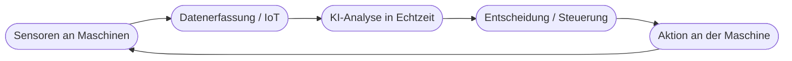
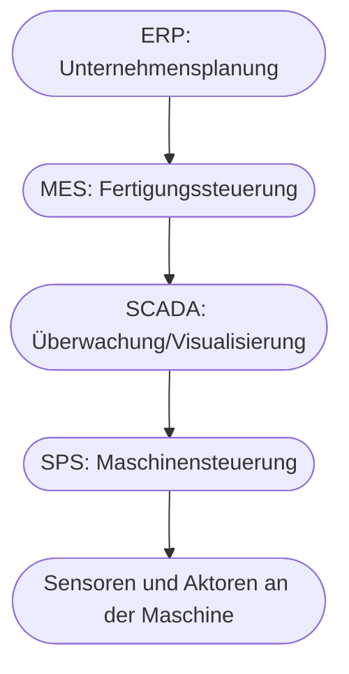

# Kapitel 24 – KI in der Produktion

{{ progress(24) }}

<div class="lernziele" markdown>
<h3>Was du in diesem Kapitel lernst</h3>

- Wie KI in der **Produktion / Industrie 4.0** eingesetzt wird
- Die Rolle von **Sensoren, IoT und Echtzeitdaten**
- Konkrete Anwendungen: **Qualitätskontrolle, Steuerung, Planung, Wartung**
- Was ein **digitaler Zwilling** ist
- Wie die **Automatisierungspyramide** (OT vs. IT) aufgebaut ist und wo KI andockt
- Wo **Copilot** in der Produktionsumgebung sinnvoll unterstützt – und wo nicht
</div>

---

## 24.1 KI und Industrie 4.0

**Industrie 4.0** steht für die Vernetzung von Maschinen, Produkten und Systemen über das Internet. KI ist ihr „Gehirn": Sie wertet die anfallenden Datenmengen aus und trifft oder unterstützt Entscheidungen – oft in **Echtzeit**.



Der Kreislauf ist entscheidend: Maschinen erzeugen laufend Daten, KI wertet sie aus, und das Ergebnis wirkt sofort auf die Produktion zurück.

---

## 24.2 Sensoren, IoT und Echtzeitdaten

Grundlage jeder Produktions-KI sind **Daten aus der Anlage**: Temperatur, Vibration, Druck, Stückzahlen, Bildaufnahmen. Diese liefern **Sensoren**, vernetzt über das **Internet of Things (IoT)**.

!!! info "Warum Echtzeit den Unterschied macht"
    In der Verwaltung darf eine Analyse Stunden dauern. In der Produktion zählt oft die **Millisekunde**: Erkennt die KI einen Fehler erst nach 1.000 produzierten Teilen, ist der Ausschuss teuer. Deshalb laufen viele Produktions-KIs **direkt an der Maschine** (Edge/On-Device, Kap. 5), nicht in einer fernen Cloud.

---

## 24.3 Konkrete Anwendungen

| Anwendung | Was KI tut | Nutzen |
|---|---|---|
| **Optische Qualitätskontrolle** | Kamera + KI erkennt Defekte | weniger Ausschuss, weniger Reklamationen |
| **Prozesssteuerung** | passt Parameter automatisch an | gleichbleibende Qualität |
| **Produktionsplanung** | optimiert Reihenfolge/Auslastung | kürzere Durchlaufzeiten |
| **Vorausschauende Wartung** | sagt Ausfälle voraus | weniger Stillstand (Kap. 26) |
| **Materialfluss/Logistik** | steuert Transporte im Werk | weniger Wartezeit |

!!! example "Optische Qualitätskontrolle in der Praxis"
    Eine Kamera fotografiert jedes Teil am Band; ein Bilderkennungsmodell (Computer Vision, Kap. 1) vergleicht es mit „gut"-Beispielen und sortiert fehlerhafte Teile in Millisekunden aus. Das ist schneller, gleichmäßiger und ermüdungsfrei im Vergleich zur Sichtprüfung durch Menschen – die dafür schwierige Grenzfälle beurteilen.

---

## 24.4 Der digitale Zwilling

Ein **digitaler Zwilling** ist ein virtuelles Abbild einer realen Maschine oder Anlage, gespeist mit deren Echtzeitdaten. Man kann daran **testen und simulieren**, ohne die echte Produktion zu stören.

!!! example "Nutzen"
    „Was passiert, wenn wir die Taktrate um 10 % erhöhen?" – statt es riskant an der echten Anlage auszuprobieren, simuliert man es am digitalen Zwilling. KI hilft, aus den Daten realistische Vorhersagen zu treffen und Optimierungen zu finden.

---

## 24.5 Die Automatisierungspyramide: wo KI andockt

Um zu verstehen, **wo** KI in einer Fabrik überhaupt sitzt, hilft die klassische **Automatisierungspyramide**. Sie beschreibt Ebenen von der Maschine ganz unten bis zur Unternehmensverwaltung ganz oben:



Unten regiert die **OT (Operational Technology)**: speicherprogrammierbare Steuerungen (SPS), die in Millisekunden und hochzuverlässig physische Abläufe steuern. Oben regiert die **IT (Information Technology)**: Planungs- und Auswertungssysteme, die eher in Minuten und Stunden denken.

!!! info "Vertiefung: Warum OT und IT nicht dasselbe sind"
    In der OT zählt **Determinismus und Sicherheit**: Eine Steuerung muss garantiert und pünktlich reagieren, sonst drohen Schäden. Ein Sprachmodell, das „meistens" richtig liegt und dessen Antwortzeit schwankt, hat auf dieser Ebene nichts verloren. KI wirkt daher überwiegend in den **oberen Ebenen** (MES/ERP) sowie als spezialisierte, geprüfte Modelle nahe der Maschine (z. B. Bilderkennung an einer Kamera). Copilot als allgemeiner Assistent lebt noch eine Etage höher: bei Auswertung, Doku und Kommunikation **über** die Produktionsdaten – nicht in ihr.

| Ebene | Zeithorizont | Rolle von KI/Copilot |
|---|---|---|
| ERP / MES | Stunden bis Tage | Planung, Auswertung, Copilot-Berichte |
| SCADA | Sekunden bis Minuten | Anomalie-Hinweise, Visualisierung |
| SPS / Sensorik | Millisekunden | keine allgemeine KI, nur geprüfte Spezialmodelle |

---

## 24.6 Wo Copilot in der Produktion passt – und wo nicht

Wichtig zur Einordnung: **Copilot ist kein Maschinensteuerungs-System.** Die eigentliche Produktions-KI (Bilderkennung, Steuerung, Predictive Maintenance) sind Spezialsysteme. Copilot hilft am **Rand** – bei Wissen, Kommunikation und Auswertung:

| Aufgabe | Beispiel-Prompt |
|---|---|
| Schichtberichte | „Fasse diese Schichtprotokolle zu den wichtigsten Vorfällen zusammen." |
| Störungsanalyse | „Erkläre mögliche Ursachen für Fehlercode X und Prüfschritte." |
| Doku & Anleitungen | „Erstelle eine verständliche Kurzanleitung aus diesem Handbuchauszug." |
| Auswertung | „Welche Auffälligkeiten zeigt diese Ausschuss-Statistik (Excel)?" |

**Beispiel-Prompt zum Ausprobieren (selbsttragend – Copilot erzeugt die Daten zuerst):**

```text
Erfinde die Schichtprotokolle einer Woche mit mehreren wiederkehrenden Störungen.
Fasse danach die häufigsten Störungen zusammen, ordne sie nach Häufigkeit und
schlage vor, welche zuerst untersucht werden sollten.
```

!!! example "So könnte Copilots Antwort aussehen (Auszug)"
    **Häufigste Störungen der Woche**

    | Störung | Häufigkeit | Zuerst untersuchen? |
    |---|---|---|
    | Materialstau Zuführung Linie 2 | 6× | ja (höchste Frequenz) |
    | Temperaturalarm Ofen | 3× | ja (Sicherheitsbezug) |
    | Etikettierer fällt aus | 2× | nachrangig |

    **Empfehlung:** Zuerst den Materialstau an Linie 2 analysieren – er tritt am häufigsten auf und blockiert die ganze Linie. Der Temperaturalarm sollte wegen des Sicherheitsbezugs parallel geprüft werden.

    Copilot liefert damit in Sekunden eine **priorisierte Ausgangsbasis** für die Frühschicht-Besprechung – die technische Ursachensuche an der Anlage bleibt Aufgabe des Teams.

!!! warning "Klare Grenze"
    Sicherheitskritische Steuerungsentscheidungen trifft **kein** Sprachmodell. Copilot unterstützt bei **Information und Kommunikation**, nicht bei der Echtzeit-Maschinensteuerung. Diese Trennung ist für die Anlagensicherheit essenziell.

---

## Zusammenfassung

- In der Produktion ist KI das „Gehirn" von **Industrie 4.0** – oft in **Echtzeit** direkt an der Maschine.
- Grundlage sind **Sensoren/IoT-Daten**; Anwendungen reichen von **Qualitätskontrolle** bis **Planung**.
- Der **digitale Zwilling** erlaubt gefahrloses Simulieren und Optimieren.
- Die **Automatisierungspyramide** zeigt: KI wirkt vor allem oben (MES/ERP) und als geprüfte Spezialmodelle – nicht in der zeitkritischen **OT**.
- **Copilot** unterstützt am Rand (Berichte, Doku, Auswertung) – **nicht** die sicherheitskritische Steuerung.

---

## Kurzübungen

{{ task(file="tasks/k24_01.yaml") }}

{{ task(file="tasks/k24_02.yaml") }}

{{ task(file="tasks/k24_03.yaml") }}

---

## Workshop

{{ task(file="tasks/workshop_k24.yaml") }}
