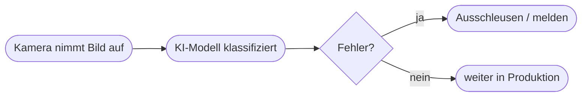

# Kapitel 25 – Praxis: KI im Qualitätsmanagement

{{ progress(25) }}

<div class="lernziele" markdown>
<h3>Was du in diesem Kapitel lernst</h3>

- Wie KI die **Qualitätssicherung** unterstützt
- Was **automatische optische Inspektion** (Computer Vision) leistet
- Die Begriffe **Fehler 1. und 2. Art** (falsch-positiv/falsch-negativ)
- Ein **Praxisbeispiel** aus der Fertigung
</div>

---

## 25.1 KI in der Qualitätssicherung

Klassische Qualitätsprüfung ist oft manuell, langsam und ermüdend. **KI-gestützte Bildprüfung** erkennt Fehler automatisch, gleichbleibend und rund um die Uhr.

| Aufgabe | KI-Ansatz |
|---|---|
| Kratzer/Risse erkennen | Computer Vision |
| Vollständigkeit prüfen | Objekterkennung |
| Maßabweichungen | Bild-/Sensoranalyse |
| Auffälligkeiten finden | Anomalieerkennung |

---

## 25.2 Automatische optische Inspektion



!!! info "Training mit Beispielbildern"
    Das Modell lernt aus vielen **markierten Beispielbildern** (gut/fehlerhaft). Je besser und ausgewogener diese Beispiele, desto zuverlässiger die Erkennung.

---

## 25.3 Fehler 1. und 2. Art

| Fehlertyp | Bedeutung | Folge |
|---|---|---|
| Falsch-positiv (Fehler 1. Art) | gutes Teil als „fehlerhaft" | unnötiger Ausschuss |
| Falsch-negativ (Fehler 2. Art) | schlechtes Teil als „gut" | fehlerhafte Ware beim Kunden |

!!! warning "Schwellwert bewusst wählen"
    Je nach Anwendung ist ein Fehlertyp schlimmer. Bei sicherheitskritischen Teilen wiegt ein **falsch-negativ** schwerer – lieber ein gutes Teil zu viel aussortieren.

---

## 25.4 Praxisbeispiel: Sichtprüfung von Bauteilen

!!! info "Fallbeispiel Elektronikfertigung"
    Ein Hersteller prüft Leiterplatten per KI-Kamera auf fehlende Bauteile und Lötfehler.

    **Nutzen:** höhere Prüfgeschwindigkeit, konstante Qualität, Entlastung der Mitarbeitenden.
    **Grenze:** neue Fehlerarten müssen nachtrainiert werden; Grenzfälle prüft weiterhin ein Mensch.

**Copilot-Prompt zum Ausprobieren:**

```text
Erkläre, wie eine KI-gestützte Sichtprüfung in der Fertigung funktioniert.
Gehe auf Trainingsdaten, falsch-positiv/falsch-negativ und die Rolle des
Menschen bei Grenzfällen ein.
```

---

## Kurzübungen

{{ task(file="tasks/k25_01.yaml") }}

{{ task(file="tasks/k25_02.yaml") }}

---

## Workshop

{{ task(file="tasks/workshop_k25.yaml") }}
