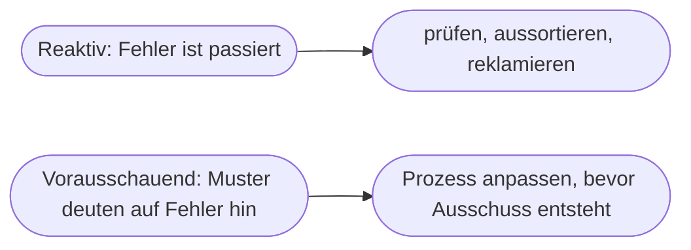

# Kapitel 25 – Praxis: KI im Qualitätsmanagement

{{ progress(25) }}

<div class="lernziele" markdown>
<h3>Was du in diesem Kapitel lernst</h3>

- Welche Rolle KI im **Qualitätsmanagement (QM)** spielt
- Der Unterschied zwischen **reaktivem** Prüfen und **vorausschauender** Qualitätssicherung
- Konkrete Anwendungen: **Fehlererkennung, Ursachenanalyse, Dokumentation**
- Wie KI bei **Reklamationen und dem 8D-/Ursache-Wirkungs-Denken** hilft
- Wie **Copilot** QM-Dokumente, Analysen und Audits unterstützt
</div>

---

## 25.1 Qualitätsmanagement und KI

**Qualitätsmanagement** sorgt dafür, dass Produkte und Prozesse **verlässlich** den Anforderungen entsprechen. KI verändert QM in zwei Richtungen: Sie macht das **Prüfen** besser (Fehler früher/genauer erkennen) und ermöglicht **vorausschauende** Qualitätssicherung (Fehler verhindern, bevor sie entstehen).

| Klassisches QM | KI-gestütztes QM |
|---|---|
| Stichprobenprüfung | 100 %-Prüfung möglich (z. B. Kamera) |
| reaktiv (Fehler feststellen) | vorausschauend (Fehler vermeiden) |
| erfahrungsbasierte Ursachensuche | datenbasierte Mustererkennung |
| manuelle Doku | automatisierte Berichte |

---

## 25.2 Reaktiv vs. vorausschauend



!!! info "Der Wertsprung"
    Reaktives QM findet Fehler, **nachdem** sie entstanden sind – das kostet Material, Zeit und Reklamationen. Vorausschauendes QM erkennt aus Daten **frühe Warnsignale** (z. B. leicht steigende Maßabweichungen) und greift ein, **bevor** Ausschuss entsteht. Das ist deutlich günstiger – der Grundgedanke ist verwandt mit Predictive Maintenance (Kap. 26).

---

## 25.3 Konkrete Anwendungen

| Anwendung | Was KI leistet |
|---|---|
| **Automatische Fehlererkennung** | Bild-KI findet Kratzer, Risse, Maßfehler |
| **Ursachenanalyse** | Muster in Prozessdaten aufdecken |
| **Prognose von Qualitätsproblemen** | Trend zu Abweichungen früh erkennen |
| **Dokumentation & Audits** | Berichte, Prüfprotokolle, Nachweise erstellen |
| **Reklamationsbearbeitung** | Beschwerden clustern, Antworten entwerfen |

---

## 25.4 KI beim Ursache-Wirkungs-Denken

Ein Kern des QM ist die **systematische Ursachensuche** (z. B. mit dem Ishikawa-/Fischgräten-Diagramm oder der 5-Why-Methode). Hier ist Copilot ein starker **Denkpartner**:

!!! example "5-Why mit Copilot"
    Problem: „Das Bauteil hat Maßabweichungen." Copilot kann helfen, systematisch nachzuhaken:
    ```text
    Wende die 5-Why-Methode auf folgendes Qualitätsproblem an: [Problem].
    Stelle bei jedem Schritt eine plausible "Warum"-Frage und mögliche Antworten,
    bis du bei wahrscheinlichen Grundursachen ankommst.
    ```
    Copilot liefert **Hypothesen** und Struktur – die Verifikation an den echten Daten und Prozessen bleibt beim QM-Team.

---

## 25.5 QM-Dokumentation mit Copilot

Ein großer Teil des QM ist **Dokumentation** – aufwendig, aber pflichtgemäß. Genau hier spart Copilot Zeit:

| Aufgabe | Beispiel-Prompt |
|---|---|
| Reklamationen bündeln | „Clustere diese 20 Reklamationen nach Fehlerart und Häufigkeit." |
| 8D-Report entwerfen | „Erstelle ein Gerüst für einen 8D-Report zu diesem Fehler." |
| Prüfanweisung | „Formuliere eine klare Prüfanweisung aus diesen Stichpunkten." |
| Audit-Vorbereitung | „Erstelle eine Checkliste für ein internes ISO-9001-Audit im Bereich X." |

**Beispiel-Prompt zum Ausprobieren:**

```text
Hier sind Kundenreklamationen der letzten Wochen: [Text]. Gruppiere sie nach
Fehlerart, nenne die drei häufigsten Probleme und schlage je ein sinnvolles
erstes Untersuchungsfeld für die Ursachenanalyse vor.
```

!!! warning "Nachweise müssen stimmen"
    QM-Dokumente sind oft **prüf- und haftungsrelevant** (Audits, Zertifizierungen, Kundenanforderungen). Copilot-Entwürfe sind eine **Arbeitserleichterung**, keine fertigen Nachweise – Inhalte müssen fachlich geprüft und freigegeben werden. Faktenfehler in einem Prüfprotokoll können teuer werden.

---

## Zusammenfassung

- KI hebt QM von **reaktivem Prüfen** zu **vorausschauender** Qualitätssicherung.
- Anwendungen: **Fehlererkennung (Bild-KI), Ursachenanalyse, Prognose, Doku, Reklamationen**.
- Copilot ist ein starker **Denkpartner** bei der Ursachensuche (5-Why, Ishikawa) und spart Doku-Zeit.
- QM-Dokumente sind **haftungsrelevant** – Copilot-Entwürfe immer fachlich prüfen und freigeben.

---

## Kurzübungen

{{ task(file="tasks/k25_01.yaml") }}

{{ task(file="tasks/k25_02.yaml") }}

---

## Workshop

{{ task(file="tasks/workshop_k25.yaml") }}
