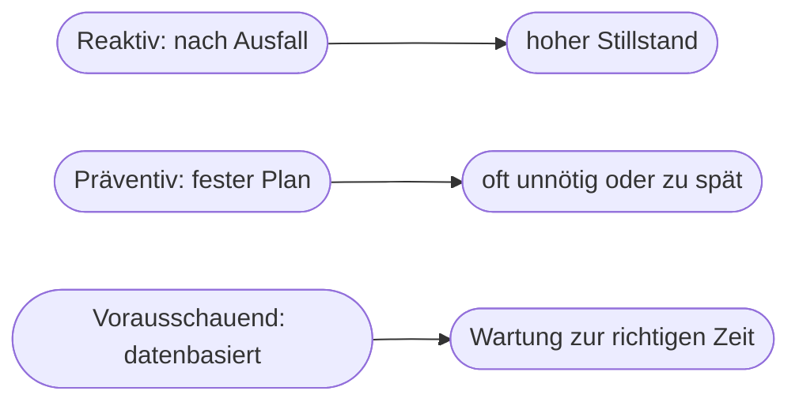

# Kapitel 26 – Vorausschauende Wartung (Predictive Maintenance)

{{ progress(26) }}

<div class="lernziele" markdown>
<h3>Was du in diesem Kapitel lernst</h3>

- Was **Predictive Maintenance (vorausschauende Wartung)** ist
- Der Unterschied zu **reaktiver** und **präventiver** Wartung
- Wie die **Vorhersage von Ausfällen** technisch grob funktioniert
- Wie man den **wirtschaftlichen Nutzen** (Business Case) berechnet
- Wie **Copilot** bei Wartungsdoku, Analyse und Kommunikation hilft
</div>

---

## 26.1 Drei Wartungsstrategien

Wartung lässt sich auf drei Arten organisieren – vorausschauende Wartung ist die modernste:

| Strategie | Prinzip | Problem |
|---|---|---|
| **Reaktiv** | reparieren, wenn kaputt | teurer Stillstand, Folgeschäden |
| **Präventiv** | nach festem Plan (z. B. alle 6 Monate) | wartet zu früh (Verschwendung) oder zu spät |
| **Vorausschauend** | wartet **genau dann**, wenn Daten es nahelegen | braucht Daten & Modelle |



!!! info "Warum vorausschauend gewinnt"
    Präventive Wartung nach starrem Kalender tauscht Teile oft aus, die noch funktionieren (Verschwendung) – oder zu spät (Ausfall). **Predictive Maintenance** nutzt den **tatsächlichen Zustand** der Maschine und wartet **im optimalen Moment**: spät genug, um die Lebensdauer auszunutzen, früh genug, um den Ausfall zu verhindern.

---

## 26.2 Wie die Vorhersage funktioniert

Sensoren messen laufend den Zustand (Vibration, Temperatur, Geräusch, Stromaufnahme). Ein Modell hat aus **historischen Daten** gelernt, welche Muster einem Ausfall **vorausgehen**.


!!! example "Das Prinzip anschaulich"
    Ein Lager, das bald ausfällt, vibriert oft schon Wochen vorher anders – zu leicht, als dass ein Mensch es bemerkt. Das Modell hat aus vielen früheren Ausfällen gelernt, dieses **Frühwarnmuster** zu erkennen, und meldet: „Lager an Maschine 3 wird in ca. 12 Tagen kritisch." Die Instandhaltung plant die Reparatur in die nächste ohnehin geplante Pause.

---

## 26.3 Der wirtschaftliche Nutzen

Predictive Maintenance ist ein Paradebeispiel für einen rechenbaren **Business Case**:

| Faktor | Wirkung |
|---|---|
| Weniger ungeplante Stillstände | höhere Verfügbarkeit |
| Weniger Folgeschäden | geringere Reparaturkosten |
| Bessere Ersatzteilplanung | weniger Lagerkosten, keine Hektik |
| Längere Maschinenlebensdauer | Investitionen später nötig |

!!! example "Rechnung als Argument"
    Kostet eine Stunde ungeplanter Stillstand z. B. 5.000 € und verhindert Predictive Maintenance im Jahr 20 solcher Stunden, sind das **100.000 €** vermiedene Kosten. Dem stehen die Kosten für Sensorik und System gegenüber. Genau so baut man einen Business Case – die Methodik gilt für viele KI-Projekte (Kap. 4, 38).

---

## 26.4 Voraussetzungen und Grenzen

!!! warning "Kein Selbstläufer"
    - Man braucht **genügend historische Daten** – idealerweise auch echte Ausfalldaten (die selten und wertvoll sind).
    - **Sensorik** muss vorhanden oder nachrüstbar sein.
    - Für **seltene** Ausfälle ist es schwer, verlässlich zu lernen (wenig Beispiele).
    - Vorhersagen sind **Wahrscheinlichkeiten**, keine Gewissheiten – Fehlalarme und verpasste Fälle bleiben möglich.

---

## 26.5 Wo Copilot unterstützt

Die Vorhersage selbst leistet ein Spezialsystem. **Copilot** hilft rundherum – bei Doku, Auswertung und Kommunikation:

| Aufgabe | Beispiel-Prompt |
|---|---|
| Wartungsberichte | „Fasse diese Wartungshistorie zu den häufigsten Ausfallursachen zusammen." |
| Business Case | „Hilf mir, den Nutzen von Predictive Maintenance für Maschine X zu berechnen." |
| Kommunikation | „Formuliere eine verständliche Info an die Produktion zur geplanten Wartung." |
| Analyse | „Welche Muster zeigt diese Ausfallstatistik (Excel)?" |

**Beispiel-Prompt zum Ausprobieren:**

```text
Erkläre mir den Unterschied zwischen reaktiver, präventiver und vorausschauender
Wartung an einem Beispiel aus einem produzierenden Betrieb. Erstelle dann eine
einfache Beispielrechnung, die den möglichen Nutzen vorausschauender Wartung zeigt.
```

---

## Zusammenfassung

- Drei Strategien: **reaktiv, präventiv, vorausschauend** – Predictive Maintenance wartet **datenbasiert** im optimalen Moment.
- Modelle erkennen aus **Sensordaten** frühe **Verschleißmuster** und schätzen das Ausfallrisiko.
- Der Nutzen (weniger Stillstand/Folgeschäden) ist gut als **Business Case** rechenbar.
- Voraussetzungen: genug **Daten und Sensorik**; Vorhersagen bleiben **Wahrscheinlichkeiten**.
- **Copilot** unterstützt bei Doku, Business Case und Kommunikation – nicht bei der Vorhersage selbst.

---

## Kurzübungen

{{ task(file="tasks/k26_01.yaml") }}

{{ task(file="tasks/k26_02.yaml") }}

{{ task(file="tasks/k26_03.yaml") }}

---

## Workshop

{{ task(file="tasks/workshop_k26.yaml") }}
