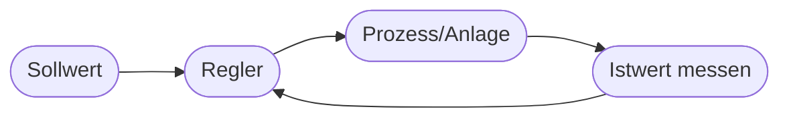

# Kapitel 27 – Praxis: KI in der Prozessregulierung

{{ progress(27) }}

<div class="lernziele" markdown>
<h3>Was du in diesem Kapitel lernst</h3>

- Was **Prozessregulierung** (Regelung/Steuerung) bedeutet
- Wie KI klassische Regelungstechnik ergänzt
- Der Unterschied zwischen **Steuerung** und **Regelung**
- Ein **Praxisbeispiel** aus der Verfahrenstechnik
</div>

---

## 27.1 Steuerung vs. Regelung

| Begriff | Prinzip | Beispiel |
|---|---|---|
| **Steuerung** | fester Ablauf ohne Rückmeldung | Heizung läuft nach Zeitplan |
| **Regelung** | misst Ist-Wert, korrigiert laufend | Thermostat hält 21 °C |

Eine **Regelung** vergleicht ständig Soll- und Ist-Wert und gleicht Abweichungen aus.



---

## 27.2 Wie KI die Regelung ergänzt

Klassische Regler funktionieren gut bei klaren Zusammenhängen. Bei **komplexen, nichtlinearen** Prozessen mit vielen Einflussgrößen hilft KI:

- lernt Zusammenhänge aus Prozessdaten
- optimiert mehrere Ziele gleichzeitig (z. B. Qualität **und** Energie)
- reagiert auf Muster, die klassische Regler nicht erfassen

!!! info "Reinforcement Learning trifft Regelung"
    Für Optimierungsaufgaben kommt oft **Reinforcement Learning** (Kapitel 17) zum Einsatz: Der Agent lernt, Stellgrößen so zu setzen, dass die Belohnung (z. B. Qualität pro Energieeinheit) maximal wird.

---

## 27.3 Praxisbeispiel: Energieoptimierte Prozessführung

!!! info "Fallbeispiel Verfahrenstechnik"
    In einer Anlage regelt eine KI Temperatur und Durchfluss so, dass die Produktqualität gehalten und **Energie gespart** wird.

    **Ergebnis:** stabile Qualität bei geringerem Verbrauch.
    **Grenze:** Sicherheit hat Vorrang – kritische Grenzwerte überwacht weiterhin eine klassische, geprüfte Sicherheitssteuerung.

**Copilot-Prompt zum Ausprobieren:**

```text
Erkläre den Unterschied zwischen Steuerung und Regelung an einem Alltagsbeispiel.
Beschreibe dann, wie KI eine Regelung bei einem komplexen Prozess verbessern kann
und wo die Grenzen aus Sicherheitsgründen liegen.
```

!!! warning "Sicherheit zuerst"
    KI-Regelungen dürfen sicherheitskritische Grenzen **nicht** allein verantworten. Bewährte Sicherheitssysteme bleiben als Rückfallebene bestehen.

---

## Kurzübungen

{{ task(file="tasks/k27_01.yaml") }}

{{ task(file="tasks/k27_02.yaml") }}

---

## Workshop

{{ task(file="tasks/workshop_k27.yaml") }}
