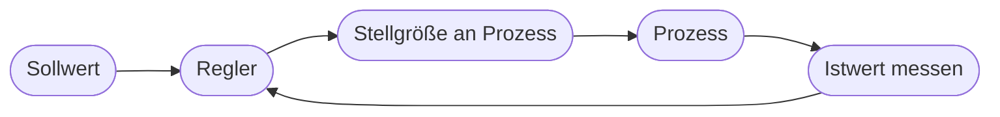

# Kapitel 27 – Praxis: KI in der Prozessregulierung

{{ progress(27) }}

<div class="lernziele" markdown>
<h3>Was du in diesem Kapitel lernst</h3>

- Was mit **Prozessregulierung / Regelung** gemeint ist (Prozesse in einem Sollzustand halten)
- Der Unterschied zwischen **Steuerung** und **Regelung** (offener vs. geschlossener Regelkreis)
- Wie KI klassische Regelungen **verbessert** (adaptiv, vorausschauend)
- Beispiele aus **Fertigung, Energie und Gebäudetechnik**
- Wo **Copilot** bei Analyse, Dokumentation und Compliance hilft
</div>

---

## 27.1 Was ist Prozessregulierung?

**Prozessregulierung** (Prozessregelung) bedeutet, einen Prozess automatisch in einem gewünschten **Sollzustand** zu halten – trotz Störungen von außen. Klassisches Beispiel: ein **Thermostat**, das eine Temperatur konstant hält.

!!! info "Steuerung vs. Regelung"
    - **Steuerung (offener Regelkreis):** wirkt „blind" nach Plan, ohne das Ergebnis zurückzumelden. Beispiel: Heizung läuft feste 2 Stunden – egal wie warm es wird.
    - **Regelung (geschlossener Regelkreis):** misst das Ergebnis **und korrigiert** laufend. Beispiel: Thermostat misst die Temperatur und passt die Heizleistung an.

    Der **Rückkopplung (Feedback)** ist der Kern jeder Regelung.



---

## 27.2 Wie KI die Regelung verbessert

Klassische Regler (z. B. PID-Regler) arbeiten mit festen Formeln und funktionieren gut bei einfachen, stabilen Prozessen. KI-gestützte Regelung geht darüber hinaus:

| Klassische Regelung | KI-gestützte Regelung |
|---|---|
| feste Parameter | **passt sich an** (adaptiv) |
| reagiert auf Ist-Abweichung | kann **vorausschauend** eingreifen |
| ein klar modellierbarer Prozess | auch **komplexe**, schwer modellierbare Prozesse |
| Mensch stellt Parameter ein | lernt optimale Strategie (RL, Kap. 17) |

!!! example "Adaptiv statt starr"
    Eine Klimaanlage mit klassischem Regler reagiert erst, **wenn** es zu warm ist. Eine KI-Regelung kann **Wetterprognose, Belegung und Tageszeit** einbeziehen und die Kühlung **vorausschauend** anpassen – das spart Energie und hält die Temperatur stabiler. Solche Ansätze nutzen oft **Reinforcement Learning** (Kap. 17).

---

## 27.3 Beispiele aus der Praxis

| Bereich | KI-Regelung |
|---|---|
| Fertigung | Prozessparameter (Druck, Temperatur) automatisch optimal halten |
| Energie | Stromnetze und Speicher ausbalancieren |
| Gebäudetechnik | Heizung/Kühlung/Licht bedarfsgerecht regeln |
| Wasser/Chemie | Dosierung präzise steuern |
| Rechenzentren | Kühlung energieoptimal regeln |

Der gemeinsame Nenner: ein **kontinuierlicher Prozess**, der stabil und effizient gehalten werden soll – und in dem viele Einflussgrößen zusammenwirken.

---

## 27.4 Grenzen und Sicherheit

!!! warning "Regelung ist sicherheitskritisch"
    Reguliert eine KI einen physischen Prozess, sind Fehler potenziell **gefährlich** (Überhitzung, Überdruck). Deshalb gelten strenge Prinzipien:
    
    - **Grenzwerte/Notabschaltungen** unabhängig von der KI absichern.
    - Verhalten muss **nachvollziehbar** genug sein (Erklärbarkeit, Kap. 34).
    - Ein Mensch (oder ein sicheres Basissystem) muss **eingreifen** können.
    
    Eine „Blackbox", die sicherheitsrelevante Ventile ungeprüft steuert, ist nicht akzeptabel.

---

## 27.5 Wo Copilot hilft

Die eigentliche Regelung übernehmen **Automatisierungs-/Steuerungssysteme**, nicht Copilot. Copilot unterstützt bei den **begleitenden** Aufgaben:

| Aufgabe | Beispiel-Prompt |
|---|---|
| Konzepte verstehen | „Erkläre den Unterschied zwischen Steuerung und Regelung mit Beispiel." |
| Datenauswertung | „Welche Auffälligkeiten zeigen diese Prozess-Messwerte (Excel)?" |
| Dokumentation | „Erstelle aus diesen Stichpunkten eine Beschreibung des Regelkreises." |
| Compliance | „Fasse zusammen, welche Sicherheitsanforderungen ich beachten muss." |

**Beispiel-Prompt zum Ausprobieren:**

```text
Erkläre an einem Beispiel aus der Gebäudetechnik den Unterschied zwischen einer
klassischen und einer KI-gestützten, vorausschauenden Regelung. Nenne je zwei
Vorteile der KI-Variante und ein Sicherheitsrisiko, das ich absichern muss.
```

---

## Zusammenfassung

- **Prozessregulierung** hält Prozesse per **Rückkopplung** im Sollzustand (Regelung = geschlossener Regelkreis).
- KI macht Regelungen **adaptiv** und **vorausschauend** – auch für komplexe Prozesse (oft mit RL).
- Anwendungen in **Fertigung, Energie, Gebäudetechnik, Chemie, Rechenzentren**.
- Regelung ist **sicherheitskritisch**: unabhängige Grenzwerte, Nachvollziehbarkeit, menschlicher Eingriff.
- **Copilot** hilft bei Verständnis, Auswertung, Doku und Compliance – nicht bei der Echtzeit-Regelung.

---

## Kurzübungen

{{ task(file="tasks/k27_01.yaml") }}

{{ task(file="tasks/k27_02.yaml") }}

---

## Workshop

{{ task(file="tasks/workshop_k27.yaml") }}
