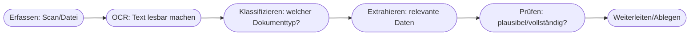
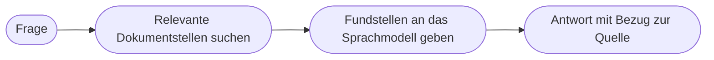

# Kapitel 28 – KI in der Dokumentenverarbeitung

{{ progress(28) }}

<div class="lernziele" markdown>
<h3>Was du in diesem Kapitel lernst</h3>

- Warum **Dokumentenverarbeitung** eines der stärksten KI-Einsatzfelder im Büro ist
- Die typische **Verarbeitungskette**: erfassen, extrahieren, klassifizieren, prüfen, weiterleiten
- Was **OCR, Extraktion und Klassifikation** bedeuten
- Der Unterschied zwischen **strukturierten, semistrukturierten und unstrukturierten** Dokumenten
- Wie **Copilot** Dokumente zusammenfasst, durchsucht und Daten herauszieht
- Was **Grounding/RAG** bedeutet und warum es Halluzinationen reduziert
- Welche **Fehlerrisiken** bestehen und wie du sie absicherst
</div>

---

## 28.1 Warum Dokumente ein idealer KI-Fall sind

Unternehmen ertrinken in Dokumenten: Rechnungen, Verträge, Berichte, E-Mails, Formulare, Protokolle. Vieles davon ist **unstrukturierter Text** (Kap. 9) – genau das, was moderne Sprach-KI besonders gut verarbeitet.

!!! info "Der Hebel"
    Dokumentenarbeit ist oft **zeitraubend, repetitiv und fehleranfällig**: lesen, verstehen, wichtige Daten heraussuchen, ablegen. Genau diese Kette kann KI stark beschleunigen. Deshalb gehört Dokumentenverarbeitung zu den **schnellsten und lohnendsten** Einsatzfeldern – ein klassischer Quick Win (Kap. 4).

---

## 28.2 Die Verarbeitungskette



| Schritt | Was passiert | Beispiel |
|---|---|---|
| **Erfassen** | Dokument digitalisieren | Rechnung scannen |
| **OCR** | Bild → maschinenlesbarer Text | gescanntes PDF wird durchsuchbar |
| **Klassifizieren** | Dokumententyp bestimmen | „das ist eine Rechnung" |
| **Extrahieren** | Kernangaben herausziehen | Betrag, Datum, Lieferant |
| **Prüfen** | Plausibilität/Vollständigkeit | „Betrag fehlt?" |
| **Weiterleiten** | ins Zielsystem/an Zuständige | Buchhaltung |

### OCR, Extraktion, Klassifikation kurz erklärt

- **OCR (Texterkennung):** wandelt ein **Bild** von Text (Scan, Foto) in **echten Text** um, mit dem man arbeiten kann.
- **Klassifikation:** ordnet ein Dokument einer **Kategorie** zu (Rechnung, Angebot, Mahnung …).
- **Extraktion:** zieht **gezielt Datenfelder** heraus (Rechnungsnummer, Betrag, Datum).

Diese Schritte bauen auf der **Sprachverarbeitung (NLP, Kapitel 13)** auf: Erst das Verstehen von Sprache erlaubt es, Betrag, Datum oder Kündigungsfrist zuverlässig als das zu erkennen, was sie bedeuten – und nicht nur als Zeichenkette.

---

## 28.3 Drei Arten von Dokumenten

Wie schwer die Verarbeitung ist, hängt stark davon ab, **wie geordnet** ein Dokument aufgebaut ist:

| Typ | Beschreibung | Beispiele | Schwierigkeit |
|---|---|---|---|
| **Strukturiert** | feste Felder an festen Positionen | ausgefülltes Web-Formular, Datenbank-Export | gering |
| **Semistrukturiert** | wiederkehrende Elemente, aber variables Layout | Rechnungen, Lieferscheine | mittel |
| **Unstrukturiert** | freier Fließtext ohne festes Schema | E-Mails, Verträge, Berichte | hoch |

!!! info "Vertiefung: Warum gerade unstrukturierte Dokumente der Durchbruch sind"
    Strukturierte Dokumente konnte man schon lange automatisch auslesen – die Felder standen ja immer an derselben Stelle. Die eigentliche Revolution moderner Sprach-KI liegt bei den **unstrukturierten** Dokumenten: Ein Sprachmodell kann eine Kündigungsfrist auch dann finden, wenn sie mal in Paragraf 3, mal in einer Fußnote und in unterschiedlichen Formulierungen steht. Genau deshalb ist Copilot so stark bei Verträgen, E-Mails und Berichten – dem größten und bislang am schwersten zu automatisierenden Teil der Büroarbeit. Bei sehr großen, gleichförmigen Mengen (z. B. tausende Rechnungen täglich) lohnen sich dagegen spezialisierte **IDP-Systeme** (Intelligent Document Processing).

---

## 28.4 Dokumentenarbeit mit Copilot

**Copilot** ist im Büroalltag extrem stark bei Text-Dokumenten:

| Aufgabe | Beispiel-Prompt |
|---|---|
| Zusammenfassen | „Fasse dieses 12-seitige Dokument in 7 Kernpunkten zusammen." |
| Gezielt fragen | „Was steht in diesem Vertrag zur Kündigungsfrist?" |
| Daten extrahieren | „Zieh aus dieser Rechnung Nummer, Datum, Betrag, Lieferant als Tabelle." |
| Vergleichen | „Was hat sich zwischen diesen zwei Vertragsversionen geändert?" |
| Umformen | „Mach aus diesem Protokoll eine To-do-Liste mit Verantwortlichen." |

**Beispiel-Prompt zum Ausprobieren (selbsttragend – Copilot erzeugt das Material zuerst):**

```text
Erfinde einen kurzen, realistischen Dienstleistungsvertrag mit einigen bewusst
unvollständigen Angaben. Erstelle danach eine Tabelle mit: Vertragspartner,
Laufzeit, Kündigungsfrist, monatliche Kosten, besondere Klauseln. Markiere alle
Angaben, die im Text nicht eindeutig zu finden sind.
```

!!! example "So könnte Copilots Antwort aussehen (Auszug)"
    | Feld | Angabe |
    |---|---|
    | Vertragspartner | Muster GmbH und IT-Service Weber |
    | Laufzeit | 24 Monate |
    | Kündigungsfrist | **im Text nicht eindeutig – prüfen** |
    | Monatliche Kosten | 1.200 € netto |
    | Besondere Klauseln | automatische Verlängerung um 12 Monate |

    Die klar markierte Lücke bei der Kündigungsfrist ist genau der Punkt, den du im Original nachschlagen musst.

!!! tip "Der 'markiere Unsicheres'-Trick"
    Die Anweisung, **unsichere oder fehlende Angaben ausdrücklich zu markieren**, ist Gold wert: So siehst du sofort, wo du nachprüfen musst, statt einer scheinbar vollständigen Tabelle blind zu vertrauen.

---

## 28.5 Grounding: Antworten aus echten Dokumenten

Ein zentraler Grund, warum Copilot im Büro verlässlicher ist als ein reines Chat-Modell, heißt **Grounding** (Verankerung). Dahinter steckt das Prinzip **RAG (Retrieval-Augmented Generation)**: Statt eine Antwort nur aus dem trainierten „Gedächtnis" zu erzeugen, **sucht** das System zuerst die relevanten Stellen in deinen echten Dokumenten (in Microsoft 365) und formuliert die Antwort **auf deren Basis**.



!!! info "Vertiefung: Warum Grounding Halluzinationen reduziert"
    Ein Sprachmodell ohne Quellen „errät" fehlendes Wissen oft überzeugend, aber falsch (Kapitel 15). Beim Grounding bekommt es die **tatsächlichen Textstellen** mitgeliefert und soll sich darauf stützen – das senkt das Risiko erfundener Inhalte deutlich und erlaubt Copilot, **Quellen anzugeben**. Aufgehoben ist das Risiko damit aber nicht: Das Modell kann relevante Stellen übersehen oder eine gefundene Stelle falsch interpretieren. Deshalb bleibt die Kontrolle wichtiger Werte Pflicht.

---

## 28.6 Fehlerrisiken und Absicherung

!!! warning "Wo es schiefgehen kann"
    - **Zahlendreher/Extraktionsfehler:** Ein falsch gelesener Betrag in der Buchhaltung ist teuer – kritische Werte gegen das Original prüfen.
    - **Halluzinierte Inhalte:** Bei fehlenden Angaben kann das Modell etwas „Plausibles" erfinden (Kap. 15).
    - **Vertraulichkeit:** Verträge und personenbezogene Dokumente nur in der **freigegebenen** M365-Umgebung verarbeiten (Kap. 33).
    - **Vollautomatik ohne Kontrolle:** Bei rechts-/geldrelevanten Dokumenten sollte ein Mensch prüfen (Human-in-the-Loop).

!!! info "Automatisierung mit Augenmaß"
    Ein bewährtes Muster: KI verarbeitet und schlägt vor, ein Mensch **prüft die kritischen Fälle** (z. B. hohe Beträge, unklare Extraktionen). So bekommt man Tempo **und** Sicherheit. Für große Volumina gibt es spezialisierte Systeme (z. B. Azure AI Document Intelligence); für den Alltag genügt oft Copilot.

---

## Zusammenfassung

- Dokumentenverarbeitung ist ein **Top-Einsatzfeld** – viel unstrukturierter Text, viel Routine.
- Die Kette: **Erfassen → OCR → Klassifizieren → Extrahieren → Prüfen → Weiterleiten**.
- Dokumente sind **strukturiert, semistrukturiert oder unstrukturiert** – bei unstrukturiertem Text liegt die eigentliche Stärke moderner Sprach-KI.
- **Copilot** ist stark beim Zusammenfassen, Durchsuchen, Extrahieren und Vergleichen von Dokumenten.
- **Grounding/RAG** verankert Antworten in echten Dokumenten und reduziert Halluzinationen – ersetzt die Prüfung aber nicht.
- Absicherung: **kritische Werte prüfen**, Unsicheres markieren lassen, Vertraulichkeit wahren, Human-in-the-Loop.

---

## Kurzübungen

{{ task(file="tasks/k28_01.yaml") }}

{{ task(file="tasks/k28_02.yaml") }}

{{ task(file="tasks/k28_03.yaml") }}

---

## Workshop

{{ task(file="tasks/workshop_k28.yaml") }}
