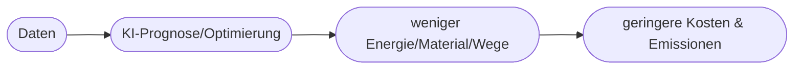

# Kapitel 29 – KI für Nachhaltigkeit und Ressourceneffizienz

{{ progress(29) }}

<div class="lernziele" markdown>
<h3>Was du in diesem Kapitel lernst</h3>

- Wie KI zu **Nachhaltigkeit** und **Ressourceneffizienz** beiträgt
- Konkrete Einsatzfelder: Energie, Material, Logistik, Kreislaufwirtschaft
- Den **Zielkonflikt**: KI spart Ressourcen, verbraucht aber selbst welche
- Wie Copilot bei Nachhaltigkeitsaufgaben unterstützt
</div>

---

## 29.1 KI als Nachhaltigkeitshebel

KI kann helfen, **Ressourcen zu sparen** – durch bessere Vorhersagen und Optimierung:

| Feld | KI-Beitrag |
|---|---|
| Energie | Verbrauch vorhersagen, Lastspitzen glätten |
| Material | Ausschuss senken (Qualitäts-KI), Design optimieren |
| Logistik | Routen und Auslastung optimieren |
| Gebäude | Heizung/Kühlung bedarfsgerecht steuern |
| Kreislaufwirtschaft | Sortierung/Recycling verbessern |

---

## 29.2 Beispiele

- **Energiemanagement:** Prognose von Verbrauch und Erzeugung (z. B. Solar) → weniger Verschwendung
- **Predictive Maintenance:** längere Lebensdauer von Anlagen → weniger Neuproduktion
- **Routenoptimierung:** weniger Kilometer → weniger Emissionen



---

## 29.3 Der Zielkonflikt: KI kostet selbst Ressourcen

!!! warning "Green AI vs. AI's Footprint"
    Das Training und der Betrieb großer KI-Modelle verbrauchen **Energie und Wasser** (siehe Kapitel 36). Nachhaltiger KI-Einsatz bedeutet: den **Netto-Nutzen** betrachten – spart die Anwendung mehr, als sie kostet?

---

## 29.4 Nachhaltigkeit mit Copilot angehen

**Copilot-Prompt zum Ausprobieren:**

```text
Wir wollen in unserem Betrieb Ressourcen sparen. Schlage 6 Ansätze vor, bei denen
KI helfen kann (Energie, Material, Logistik). Bewerte je Ansatz Nutzen und Aufwand
und weise auf den Eigen-Ressourcenverbrauch der KI hin.
```

!!! info "Nachhaltigkeit braucht Daten"
    Um Einsparungen zu belegen, braucht es **Messwerte vorher/nachher**. Ohne Daten bleibt der Nutzen Behauptung.

---

## Kurzübungen

{{ task(file="tasks/k29_01.yaml") }}

{{ task(file="tasks/k29_02.yaml") }}

---

## Workshop

{{ task(file="tasks/workshop_k29.yaml") }}
