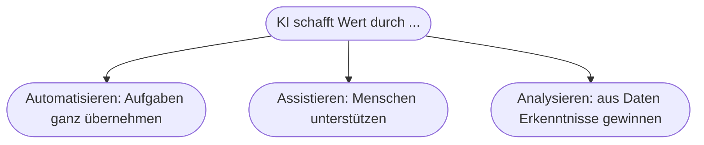
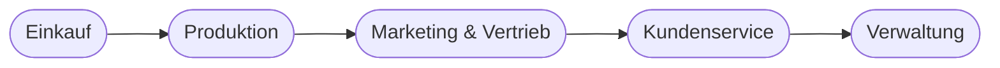

# Kapitel 3 – Einsatz von KI in Unternehmen

{{ progress(3) }}

<div class="lernziele" markdown>
<h3>Was du in diesem Kapitel lernst</h3>

- Warum Unternehmen KI einsetzen und welchen **Nutzen** sie sich davon versprechen
- In welchen **Einsatzfeldern** entlang der Wertschöpfungskette KI wirkt
- Die drei **Wirkhebel** von KI: Automatisieren, Assistieren, Analysieren
- Wie du **Microsoft Copilot** konkret im Arbeitsalltag nutzt – mit Beispielen je Office-Anwendung
- Welche typischen **Fehlerwartungen** und Stolpersteine es gibt
</div>

---

## 3.1 Warum Unternehmen KI einsetzen

Unternehmen setzen KI nicht „der Technik wegen" ein, sondern um konkrete Ziele zu erreichen:

| Ziel | Beispiel | Messgröße |
|---|---|---|
| **Effizienz** steigern | Routineaufgaben automatisieren, schneller arbeiten | Bearbeitungszeit je Vorgang |
| **Qualität** verbessern | Fehler früher erkennen, gleichbleibende Ergebnisse | Fehlerquote, Reklamationen |
| **Kosten** senken | Weniger Nacharbeit, bessere Ressourcennutzung | Kosten je Einheit |
| **Neue Angebote** schaffen | KI-gestützte Produkte und Services | Umsatz mit neuen Angeboten |
| **Entscheidungen** stützen | Prognosen und Auswertungen als Grundlage | Prognosegenauigkeit |

!!! tip "Immer den Nutzen messbar machen"
    Ein KI-Vorhaben ohne **Messgröße** ist schwer zu rechtfertigen. Frage früh: „Woran erkennen wir in Zahlen, dass es funktioniert hat?" Das ist auch die Grundlage für Business Cases (Kapitel 26) und Strategie (Kapitel 39).

---

## 3.2 Die drei Wirkhebel von KI

Bevor man an einzelne Anwendungen denkt, hilft ein Raster, **wie** KI überhaupt Wert schafft:



| Hebel | Beschreibung | Beispiel | Copilot? |
|---|---|---|---|
| Automatisieren | KI erledigt Aufgabe selbst | Rechnung automatisch verbuchen | teilweise |
| Assistieren | KI liefert Vorschlag, Mensch entscheidet | Antwortentwurf für E-Mail | **Kernfall** |
| Analysieren | KI findet Muster/Prognosen | Absatz vorhersagen | teilweise (Excel) |

**Copilot** ist vor allem ein **Assistenz-Werkzeug**: Es beschleunigt Menschen, ersetzt sie aber nicht. Das ist wichtig für realistische Erwartungen.

---

## 3.3 Einsatzfelder entlang der Wertschöpfungskette



| Bereich | Typischer KI-Einsatz | Wirkhebel |
|---|---|---|
| Einkauf | Bedarfsprognosen, Lieferantenanalyse | Analysieren |
| Produktion | Qualitätsprüfung, vorausschauende Wartung | Automatisieren/Analysieren |
| Marketing & Vertrieb | Personalisierung, Textgenerierung, Lead-Scoring | Assistieren/Analysieren |
| Kundenservice | Chatbots, automatische Ticket-Vorschläge | Assistieren/Automatisieren |
| Verwaltung | Dokumentenverarbeitung, Zusammenfassungen, Berichte | Assistieren |

Diese Felder vertiefen wir in **Block 3 (Use Cases)** – jeweils mit Praxisbeispielen.

---

## 3.4 Copilot im Arbeitsalltag – konkret

**Microsoft Copilot** ist in viele Office-Anwendungen integriert und übernimmt Aufgaben, die viel Zeit kosten:

| Anwendung | Was Copilot kann | Beispiel-Prompt (Kurzform) |
|---|---|---|
| Word | Entwürfe schreiben, umformulieren, zusammenfassen | „Schreibe einen Entwurf für …" |
| Outlook | E-Mails entwerfen, Threads zusammenfassen | „Fasse diesen Verlauf zusammen" |
| Excel | Formeln erklären, Daten analysieren, Trends benennen | „Welche Trends zeigt diese Tabelle?" |
| Teams | Meetings zusammenfassen, To-dos ableiten | „Liste die Beschlüsse und Aufgaben" |
| PowerPoint | Präsentationen aus Text erzeugen | „Erstelle 6 Folien zu …" |

### Ein durchgespieltes Beispiel

Ausgangslage: Du hast einen langen E-Mail-Verlauf und wenig Zeit.

**Schritt 1 – Überblick verschaffen:**

```text
Fasse den folgenden E-Mail-Verlauf in maximal 4 Stichpunkten zusammen und liste
alle offenen Aufgaben mit Verantwortlichem auf: [Verlauf einfügen]
```

**Schritt 2 – Handeln:**

```text
Formuliere eine höfliche Antwort (Sie-Form, max. 120 Wörter), die einen Termin
für nächste Woche vorschlägt und die offene Frage zur Lieferzeit aufgreift.
```

!!! example "Zeitersparnis – realistisch eingeschätzt"
    Statt 10 Minuten Lesen + 10 Minuten Schreiben brauchst du vielleicht 5 Minuten inklusive **Prüfung**. Der Gewinn ist real – aber nur, wenn du das Ergebnis gegenliest. Verlässt du dich blind, riskierst du falsche Termine oder unpassenden Ton.

!!! tip "Grundregel"
    Je klarer dein **Auftrag** (Rolle, Ziel, Format, Kontext), desto besser die Ausgabe. Das lernst du systematisch in **Kapitel 14 – Prompt Engineering**.

---

## 3.5 Realistische Erwartungen und Stolpersteine

!!! warning "KI ersetzt nicht das Denken"
    Copilot liefert **Entwürfe**, keine geprüften Endergebnisse. Du bleibst verantwortlich für **Fakten, Ton und Freigabe**. KI ist ein **Assistent**, kein Ersatz für Fachwissen.

**Typische Stolpersteine beim Einstieg:**

| Stolperstein | Folge | Gegenmittel |
|---|---|---|
| „KI löst alles von selbst" | Enttäuschung | klein starten, Nutzen messen |
| vage Prompts | schwache Ergebnisse | Prompt Engineering (Kap. 14) |
| Ergebnisse ungeprüft nutzen | Fehler, Fehlinformation | immer gegenlesen |
| vertrauliche Daten eingeben | Datenschutzverstoß | Regeln beachten (Kap. 33) |
| kein klares Ziel | Wildwuchs an Experimenten | Use Cases priorisieren (Kap. 4) |

---

## Zusammenfassung

- KI dient konkreten Zielen (Effizienz, Qualität, Kosten, neue Angebote, bessere Entscheidungen) – am besten **messbar**.
- Sie wirkt über drei Hebel: **Automatisieren, Assistieren, Analysieren**; Copilot ist vor allem **Assistenz**.
- Einsatzfelder ziehen sich durch die gesamte **Wertschöpfungskette**.
- Der Nutzen ist real, aber an **Prüfung, klare Aufträge und Datenschutz** gebunden.

---

## Kurzübungen

{{ task(file="tasks/k03_01.yaml") }}

{{ task(file="tasks/k03_02.yaml") }}

{{ task(file="tasks/k03_03.yaml") }}

---

## Workshop

{{ task(file="tasks/workshop_k03.yaml") }}
