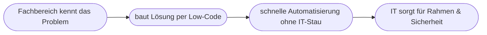
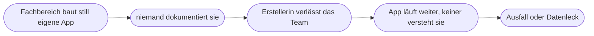

# Kapitel 30 – Low-Code-Programmierung und Citizen Development

{{ progress(30) }}

<div class="lernziele" markdown>
<h3>Was du in diesem Kapitel lernst</h3>

- Was **Low-Code / No-Code** bedeutet und wer damit arbeitet
- Das Konzept des **Citizen Developers** (Fachanwender ohne Programmierausbildung)
- Wie KI und Low-Code zusammenwirken – bis hin zu **eigenen Copilot-Agenten**
- Ein Überblick über die **Microsoft Power Platform** und **Copilot Studio**
- Wie **Schatten-IT** entsteht und warum sie gefährlich ist
- Welche **Chancen und Risiken (Governance)** damit verbunden sind
</div>

---

## 30.1 Was ist Low-Code / No-Code?

**Low-Code**- und **No-Code**-Plattformen erlauben es, Anwendungen und Automatisierungen **überwiegend visuell** zu erstellen – per Baukasten, statt Zeile für Zeile zu programmieren.

| Begriff | Bedeutung |
|---|---|
| **No-Code** | ganz ohne Programmierung, rein visuell |
| **Low-Code** | wenig Code, meist visuell + optionale Anpassungen |
| **Pro-Code** | klassische Programmierung |

!!! info "Warum das wichtig ist"
    Klassische Softwareentwicklung ist knapp und teuer – IT-Abteilungen kommen mit Anfragen nicht hinterher. Low-Code verschiebt einfache Automatisierungen zu den **Fachbereichen**, die ihre Probleme am besten kennen. Zusammen mit KI (die z. B. aus einer Beschreibung eine App-Idee erzeugt) senkt das die Hürde noch weiter.

!!! info "Vertiefung: Wo Low-Code endet"
    Low-Code ist kein Ersatz für professionelle Softwareentwicklung. Es glänzt bei **abgegrenzten, gut strukturierten** Aufgaben: Formulare, Genehmigungen, Benachrichtigungen, kleine Datenlisten. Bei hoher Komplexität, kritischer Sicherheit, großen Datenmengen oder vielen Sonderfällen stößt der Baukasten an Grenzen – dann ist **Pro-Code** und die IT gefragt. Ein Citizen Developer sollte deshalb erkennen, **wann eine Aufgabe zu groß** für Low-Code wird, statt eine fragile Bastellösung immer weiter aufzublähen.

---

## 30.2 Der Citizen Developer

Ein **Citizen Developer** ist ein **Fachanwender ohne Programmierausbildung**, der mit Low-Code-Werkzeugen eigene Lösungen baut – z. B. eine Sachbearbeiterin, die einen Genehmigungs-Workflow automatisiert.



!!! example "Typisches Beispiel"
    Statt monatelang auf eine IT-Lösung zu warten, baut die Einkaufsabteilung selbst ein kleines Genehmigungsformular: Antrag ausfüllen → automatische Weiterleitung an die Führungskraft → bei Freigabe Eintrag in eine Liste + Benachrichtigung. Früher ein IT-Projekt, heute eine Nachmittagsaufgabe – mit den richtigen Werkzeugen und **Leitplanken**.

Der Reiz liegt in der **Nähe zum Problem**: Wer eine Aufgabe täglich erledigt, weiß am besten, wo es klemmt. Genau diese Person kann mit Low-Code die Lösung bauen, ohne ihr Wissen erst mühsam an ein IT-Team zu übersetzen. Der Preis dafür ist Verantwortung: Auch eine „kleine" App verarbeitet echte Unternehmensdaten und muss verlässlich funktionieren.

---

## 30.3 Die Microsoft Power Platform

Microsofts Low-Code-Baukasten, eng mit Copilot verzahnt:

| Werkzeug | Wofür |
|---|---|
| **Power Apps** | eigene Apps ohne (viel) Code bauen |
| **Power Automate** | Abläufe automatisieren (Workflows) |
| **Power BI** | Daten auswerten und visualisieren |
| **Copilot Studio** | eigene KI-Assistenten/Chatbots bauen |

### Copilot Studio: eigene KI-Assistenten

Mit **Copilot Studio** kann man – weitgehend ohne Programmierung – **eigene Copilot-Agenten** erstellen: z. B. einen Assistenten, der Fragen zum internen Urlaubsprozess beantwortet, indem er auf die Personalrichtlinien zugreift (RAG, Kap. 5). Man definiert Rolle, Wissensquellen und erlaubte Aktionen – der Bogen zu den KI-Agenten aus Kapitel 5.

---

## 30.4 KI + Low-Code = starke Kombination

KI verstärkt Low-Code auf zwei Ebenen:

1. **KI beim Bauen:** Man beschreibt in Worten, was man will, und die Plattform erzeugt einen ersten Entwurf der App/des Workflows.
2. **KI in der Lösung:** Die gebaute Anwendung nutzt selbst KI (z. B. ein Chatbot, eine automatische Klassifikation von Anfragen).

**Beispiel-Prompt (Konzept mit Copilot vorbereiten):**

```text
Ich möchte einen einfachen Genehmigungsprozess für Urlaubsanträge
automatisieren. Beschreibe Schritt für Schritt, wie ich das mit Power Automate
umsetzen könnte, welche Auslöser und Aktionen ich brauche und worauf ich beim
Datenschutz achten muss.
```

!!! example "Ausgearbeiteter Copilot-Dialog"
    **Prompt:**
    ```text
    Erfinde einen fiktiven, einfachen Freigabeprozess für Büromaterial-
    Bestellungen und beschreibe ihn dann als Power-Automate-Flow: Auslöser,
    2-3 Aktionen, Verzweigung bei Freigabe/Ablehnung. Nenne am Ende, welche
    Governance-Fragen ich vor dem Live-Gang klären muss.
    ```
    **Beispiel-Antwort von Copilot (gekürzt):**
    ```text
    Fiktiver Prozess: Mitarbeitende bestellen Büromaterial bis 100 €.

    Flow:
    - Auslöser: Neues Element in SharePoint-Liste "Bestellwünsche".
    - Bedingung: Betrag > 50 € ?
        - Ja  -> Genehmigung an Teamleitung senden; bei "Ja" Status=freigegeben.
        - Nein -> automatisch freigeben (Kleinbetrag).
    - Aktion: E-Mail an Einkauf + Eintrag in Liste "Bestellungen".

    Vor dem Live-Gang klären:
    1. Wer besitzt/wartet den Flow, wenn die Erstellerin das Team verlässt?
    2. Auf welche Daten greift der Flow zu – sind alle berechtigt?
    3. Was passiert bei Fehlern (Genehmigung bleibt liegen)?
    ```

Beachte: Der Dialog liefert dir ein **Denkgerüst**, keine fertige, produktionsreife Lösung. Genau die drei Governance-Fragen am Ende führen zum nächsten Abschnitt.

---

## 30.5 Schatten-IT: die Kehrseite der Freiheit

**Schatten-IT** bezeichnet Anwendungen und Automatisierungen, die **an der IT vorbei** entstehen und betrieben werden – ohne dass jemand sie zentral kennt, prüft oder wartet.



So entsteht Schatten-IT typischerweise: Eine engagierte Person baut schnell eine nützliche App, sie verbreitet sich im Team – und wird zur „geschäftskritischen" Lösung, die **niemand offiziell verantwortet**. Verlässt die Person das Unternehmen oder ändert sich eine angebundene Datenquelle, bricht die Lösung zusammen, und es gibt keine Dokumentation.

!!! warning "Das häufigste Missverständnis"
    „Es ist ja nur eine kleine App, da kann nichts passieren." Doch: Gerade weil sie klein und unscheinbar ist, wird sie nicht gesichert, nicht dokumentiert und nicht getestet – und verarbeitet trotzdem echte, oft **personenbezogene** Daten (Kap. 33). Das Risiko einer Low-Code-Lösung bemisst sich nicht an ihrer Größe, sondern an den **Daten und Entscheidungen**, die sie berührt.

---

## 30.6 Chancen und Risiken (Governance)

| Chance | Risiko |
|---|---|
| schnelle Lösungen aus dem Fachbereich | Wildwuchs unkontrollierter Apps |
| Entlastung der IT | Sicherheits-/Datenschutzlücken |
| mehr Innovation an der Basis | „Schatten-IT" ohne Wartung |
| KI senkt Einstiegshürde weiter | schlecht gebaute, fehleranfällige Lösungen |

Gute **Governance** verbietet Citizen Development nicht, sondern gibt ihm einen sicheren Rahmen. Bewährt hat sich ein Satz einfacher Leitplanken:

| Governance-Frage | Warum sie zählt |
|---|---|
| **Wer besitzt die Lösung?** | verhindert „verwaiste" Apps ohne Wartung |
| **Welche Daten sind erlaubt?** | schützt vor Datenschutz-Verstößen (Kap. 33) |
| **Wer darf welche Umgebung nutzen?** | trennt Experimente von produktiven Lösungen |
| **Ab wann übernimmt die IT?** | fängt kritisch gewordene Lösungen auf |
| **Wie wird geprüft & freigegeben?** | sichert Qualität vor dem Live-Gang |

!!! warning "Ohne Governance wird Low-Code zum Risiko"
    Wenn jeder unkontrolliert Apps baut, entstehen Sicherheitslücken, doppelte Lösungen und „Schatten-IT", die niemand wartet. Erfolgreiche Unternehmen geben Citizen Developers **klare Leitplanken**: Welche Daten dürfen genutzt werden? Wer prüft und betreibt die Lösung? Das ist Teil der **Data Governance** (Kap. 11) und des verantwortungsvollen KI-Einsatzes (Block 4).

---

## Zusammenfassung

- **Low-Code/No-Code** erlaubt Anwendungen per Baukasten – **Citizen Developers** lösen eigene Probleme.
- Low-Code glänzt bei **abgegrenzten** Aufgaben und hat klare Grenzen – große/kritische Projekte bleiben bei der IT.
- Die **Power Platform** (Power Apps, Automate, BI) und **Copilot Studio** sind Microsofts Werkzeuge dafür.
- KI wirkt doppelt: sie hilft **beim Bauen** und steckt **in der Lösung** (z. B. eigene Copilot-Agenten).
- **Schatten-IT** entsteht, wenn Lösungen ungewartet und undokumentiert an der IT vorbeilaufen – das Risiko hängt an den **Daten**, nicht an der Größe.
- Ohne **Governance** droht Wildwuchs – klare Leitplanken (Besitz, erlaubte Daten, Freigabe) sind Pflicht.

---

## Kurzübungen

{{ task(file="tasks/k30_01.yaml") }}

{{ task(file="tasks/k30_02.yaml") }}

{{ task(file="tasks/k30_03.yaml") }}

---

## Workshop

{{ task(file="tasks/workshop_k30.yaml") }}
