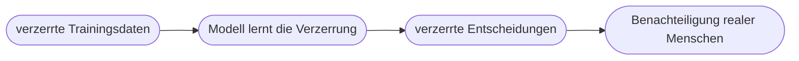
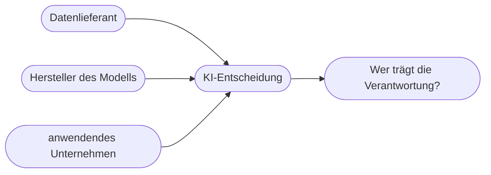

# Kapitel 31 – Ethik und soziale Verantwortung

{{ progress(31) }}

<div class="lernziele" markdown>
<h3>Was du in diesem Kapitel lernst</h3>

- Warum **Ethik** bei KI kein „Beiwerk", sondern geschäftskritisch ist
- Was **Bias (Verzerrung)** ist, wie er entsteht und welche Folgen er hat
- Welche **Arten von Bias** es gibt und wo sie im Prozess entstehen
- Zentrale ethische Prinzipien: **Fairness, Transparenz, Verantwortung, Nicht-Schaden**
- Warum die **Verantwortungsfrage** bei KI besonders heikel ist
- Wie du im Alltag – auch mit **Copilot** – verantwortungsvoll handelst
</div>

---

## 31.1 Warum KI-Ethik geschäftskritisch ist

KI-Systeme treffen oder beeinflussen Entscheidungen, die **Menschen betreffen**: wer einen Kredit bekommt, wer zum Vorstellungsgespräch eingeladen wird, welche Diagnose vorgeschlagen wird. Fehler oder Verzerrungen haben hier **reale Folgen**.

!!! info "Nicht nur 'nice to have'"
    Ethik ist bei KI nicht bloß eine moralische Frage, sondern **geschäftskritisch**: Diskriminierende oder intransparente KI führt zu **Rechtsstreit, Bußgeldern (EU AI Act, Kap. 32), Reputationsschäden** und Vertrauensverlust. Verantwortungsvolle KI ist damit auch ein **wirtschaftliches** Gebot.

---

## 31.2 Bias: die verzerrte KI

**Bias** (Verzerrung) bedeutet, dass ein KI-System bestimmte Gruppen systematisch **benachteiligt** oder ein schiefes Weltbild widerspiegelt. Die Hauptursache: **verzerrte Trainingsdaten**.



!!! example "Der klassische Fall"
    Ein Unternehmen trainiert eine Bewerbungs-KI mit den Einstellungsdaten der letzten 10 Jahre. Wurden damals überwiegend Männer eingestellt, „lernt" die KI, männliche Bewerber zu bevorzugen – nicht aus Absicht, sondern weil sie das **Muster der Vergangenheit** reproduziert. Genau das ist mehreren realen Unternehmen passiert. Die KI ist dabei nur ein **Spiegel** der Daten.

!!! warning "Auch Copilot ist nicht neutral"
    Sprachmodelle lernen aus riesigen Textmengen aus dem Internet – inklusive der darin enthaltenen **Vorurteile und Einseitigkeiten**. Antworten können daher stereotype oder einseitige Sichtweisen enthalten. Man muss aktiv gegensteuern (z. B. um ausgewogene Darstellung bitten) und Ergebnisse **kritisch prüfen**.

---

## 31.3 Wo Bias entsteht: die Arten der Verzerrung

Bias ist kein einzelner Fehler, sondern kann an **mehreren Stellen** im Prozess einsickern. Wer die Arten kennt, erkennt sie leichter.

| Art des Bias | Wo er entsteht | Beispiel |
|---|---|---|
| **Daten-Bias** | in den Trainingsdaten selbst | historische Ungleichheit wird gelernt |
| **Stichproben-Bias** | einseitige Datenauswahl | eine Gruppe ist unterrepräsentiert |
| **Label-Bias** | subjektive Bewertung der Beispiele | „gut/schlecht" nach Vorurteil vergeben |
| **Bestätigungs-Bias** | beim Menschen, der das Ergebnis liest | man glaubt der KI, weil sie die eigene Meinung stützt |
| **Automatisierungs-Bias** | Übervertrauen in die Maschine | Ergebnis wird ungeprüft übernommen |

!!! info "Vertiefung: Der Rückkopplungs-Kreislauf"
    Besonders tückisch ist, dass sich Bias **selbst verstärken** kann. Empfiehlt eine KI z. B. überwiegend eine Gruppe, entstehen daraus neue Daten, die genau dieses Muster bestätigen – das Modell „lernt" die Verzerrung beim nächsten Training noch stärker. Ohne bewusstes Gegensteuern entsteht so eine Abwärtsspirale. Deshalb reicht es nicht, ein Modell einmal zu prüfen; Fairness muss **laufend** überwacht werden.

Wichtig: Die letzten beiden Arten – Bestätigungs- und Automatisierungs-Bias – liegen **beim Menschen**, nicht in den Daten. Auch die beste Technik schützt nicht davor, dass wir einer flüssigen KI-Antwort zu schnell glauben.

---

## 31.4 Ethische Grundprinzipien

| Prinzip | Bedeutung | Praktische Frage |
|---|---|---|
| **Fairness** | keine Diskriminierung | Werden Gruppen benachteiligt? |
| **Transparenz** | nachvollziehbar, offengelegt | Weiß der Mensch, dass/wie KI beteiligt ist? |
| **Verantwortung** | jemand haftet | Wer verantwortet die Entscheidung? |
| **Nicht-Schaden** | kein Schaden für Menschen | Welche negativen Folgen sind möglich? |
| **Selbstbestimmung** | Mensch behält Kontrolle | Kann der Mensch widersprechen/eingreifen? |

Diese Prinzipien finden sich auch in offiziellen Leitlinien (z. B. der EU) und im **EU AI Act** wieder (Kap. 32).

---

## 31.5 Die Verantwortungsfrage: das „Problem der vielen Hände"

Bei KI ist oft **unklar, wer verantwortlich ist**, wenn etwas schiefgeht. Viele Beteiligte wirken zusammen: Wer die Daten lieferte, wer das Modell baute, wer es einkaufte, wer es bediente.



Diese Diffusion ist gefährlich, weil sich alle hinter „die KI hat entschieden" verstecken könnten. Ethisch – und rechtlich (Kap. 32) – gilt aber klar: **Verantwortung lässt sich nicht an eine Maschine abgeben.** Wer eine KI einsetzt, um eine Entscheidung zu treffen oder vorzubereiten, bleibt für das Ergebnis verantwortlich.

!!! warning "„Die KI war's" ist keine Entschuldigung"
    Ein verbreitetes Missverständnis ist, dass eine KI Verantwortung „übernehmen" könne. Das kann sie nicht: Sie ist ein Werkzeug. Die Verantwortung bleibt immer bei den **Menschen und Organisationen**, die es einsetzen. Deshalb dürfen bedeutsame Entscheidungen über Menschen nie **allein** einer KI überlassen werden.

---

## 31.6 KI, Arbeit und Gesellschaft

KI verändert die Arbeitswelt – das wirft ehrliche Fragen auf:

| Chance | Sorge |
|---|---|
| Entlastung von Routine | Wegfall von Tätigkeiten |
| neue Berufsbilder (z. B. Prompt-Kompetenz) | Qualifikationsdruck |
| höhere Produktivität | Überwachung/Kontrolle am Arbeitsplatz |
| bessere Entscheidungen | Verantwortungsdiffusion („die KI war's") |

!!! info "Realistische Einordnung"
    Die Erfahrung zeigt: KI ersetzt meist **Aufgaben**, nicht ganze **Menschen**. Berufe verändern sich – repetitive Anteile fallen weg, dafür kommen Steuerung, Prüfung und Kommunikation hinzu. Deshalb ist **Weiterbildung** (wie dieser Kurs) die beste Antwort auf die Sorgen. Verantwortungsvolle Unternehmen nehmen die Belegschaft aktiv mit (Change Management, Kap. 37).

---

## 31.7 Verantwortungsvoll handeln mit Copilot

Konkrete Leitplanken für den Alltag:

- **Prüfen statt vertrauen:** Ergebnisse auf Fakten, Fairness und Ton kontrollieren.
- **Transparenz:** offenlegen, wenn Inhalte KI-gestützt entstanden sind (wo relevant).
- **Keine heiklen Entscheidungen delegieren:** über Menschen (Personal, Bewertung) entscheiden Menschen.
- **Bias aktiv entgegenwirken:** ausgewogene Perspektiven anfordern.

**Copilot-Prompt zum Ausprobieren (selbsttragend – Copilot erzeugt den Text zuerst):**

```text
Schreibe einen kurzen Text über eine Berufsgruppe, der unbewusst einige Stereotype
enthält. Prüfe ihn danach auf mögliche Stereotype oder einseitige Formulierungen und
schlage neutralere, ausgewogene Alternativen vor.
```

!!! example "Ausgearbeiteter Copilot-Dialog"
    **Prompt:**
    ```text
    Erfinde eine kurze Stellenbeschreibung für eine Pflegekraft, die
    unbewusst geschlechtsbezogene Stereotype enthält. Analysiere sie danach
    auf Verzerrungen und schlage eine neutrale, diskriminierungsfreie
    Formulierung vor.
    ```
    **Beispiel-Antwort von Copilot (gekürzt):**
    ```text
    Entwurf (mit Stereotypen): "Wir suchen eine einfühlsame Krankenschwester,
    die als gute Seele der Station mit weiblichem Fingerspitzengefühl ..."

    Verzerrungen:
    - "Krankenschwester" schließt Männer sprachlich aus.
    - "weibliches Fingerspitzengefühl" schreibt Eigenschaften einem Geschlecht zu.

    Neutrale Fassung: "Wir suchen eine empathische Pflegefachkraft (m/w/d),
    die Patient:innen einfühlsam betreut und im Team zuverlässig zusammenarbeitet."
    ```

Der Dialog zeigt das Muster: Copilot kann Verzerrungen **erkennen und benennen** – aber nur, wenn du es aktiv darum bittest. Die Entscheidung, welche Formulierung veröffentlicht wird, bleibt bei dir.

!!! tip "Ethik ist eine Haltung, kein Häkchen"
    Verantwortungsvolle KI-Nutzung entsteht nicht durch ein einmaliges Regelwerk, sondern durch eine **wache Grundhaltung** bei jeder Anwendung: „Wen betrifft das? Kann das ungerecht wirken? Muss ich das offenlegen?"

---

## Zusammenfassung

- KI-Ethik ist **geschäftskritisch** – wegen Recht, Bußgeldern, Reputation und Vertrauen.
- **Bias** entsteht aus verzerrten Daten; KI ist ein **Spiegel** – auch Copilot ist nicht neutral.
- Bias hat **viele Arten** (Daten-, Stichproben-, Label-, Bestätigungs-, Automatisierungs-Bias) und kann sich **selbst verstärken**.
- Leitprinzipien: **Fairness, Transparenz, Verantwortung, Nicht-Schaden, Selbstbestimmung**.
- **Verantwortung** lässt sich nicht an eine Maschine abgeben – „die KI war's" gilt nicht.
- KI ersetzt meist **Aufgaben**, nicht Menschen – **Weiterbildung** und Mitnahme der Belegschaft sind zentral.
- Im Alltag: prüfen, offenlegen, heikle Entscheidungen beim Menschen lassen, Bias entgegenwirken.

---

## Kurzübungen

{{ task(file="tasks/k31_01.yaml") }}

{{ task(file="tasks/k31_02.yaml") }}

{{ task(file="tasks/k31_03.yaml") }}

---

## Workshop

{{ task(file="tasks/workshop_k31.yaml") }}
