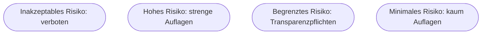

# Kapitel 32 – Rechtliche Aspekte der KI

{{ progress(32) }}

<div class="lernziele" markdown>
<h3>Was du in diesem Kapitel lernst</h3>

- Welche **Rechtsgebiete** beim KI-Einsatz berührt werden
- Was der **EU AI Act** ist und wie sein **risikobasierter Ansatz** funktioniert
- Fragen zu **Urheberrecht, Haftung und Kennzeichnung**
- Warum **„der Mensch bleibt verantwortlich"** rechtlich zentral ist
- Wo die **Grenzen** liegen: Copilot ersetzt keine Rechtsberatung
- Wie du im Alltag mit **Copilot** rechtssicher(er) arbeitest
</div>

---

## 32.1 Ein Überblick: berührte Rechtsgebiete

KI ist kein rechtsfreier Raum – im Gegenteil, sie berührt viele Bereiche gleichzeitig:

| Rechtsgebiet | Beispiel-Frage |
|---|---|
| **KI-Regulierung** (EU AI Act) | Welche Pflichten hat unser KI-System? |
| **Datenschutz** (DSGVO) | Dürfen wir diese personenbezogenen Daten nutzen? (Kap. 33) |
| **Urheberrecht** | Wem gehören Eingaben und Ergebnisse? |
| **Haftung** | Wer haftet für einen KI-Fehler? |
| **Arbeitsrecht** | Mitbestimmung bei KI am Arbeitsplatz? |
| **Wettbewerbs-/Vertragsrecht** | Zusicherungen, Werbung mit KI |

!!! warning "Dieser Kurs ersetzt keine Rechtsberatung"
    Die folgenden Punkte schaffen **Orientierung** und Problembewusstsein – im konkreten Fall ist **juristischer Rat** einzuholen. Ziel ist, dass du **weißt, wann** eine rechtliche Prüfung nötig ist.

---

## 32.2 Der EU AI Act

Der **EU AI Act** ist das weltweit erste umfassende KI-Gesetz. Sein Kern ist ein **risikobasierter Ansatz**: Je höher das Risiko einer KI-Anwendung, desto strenger die Pflichten.



| Risikostufe | Beispiele | Folge |
|---|---|---|
| **Inakzeptabel** | Social Scoring, manipulative Systeme | **verboten** |
| **Hoch** | KI in Personalauswahl, Kreditvergabe, Medizin | strenge Pflichten (Doku, Aufsicht, Qualität) |
| **Begrenzt** | Chatbots, generierte Inhalte | **Transparenz** (Kennzeichnung) |
| **Minimal** | Spamfilter, Spiele | kaum Auflagen |

!!! info "Was das praktisch heißt"
    Nutzt du Copilot zum Texten von E-Mails, bist du im **minimalen/begrenzten** Bereich. Setzt ein Unternehmen KI für **Einstellungsentscheidungen** ein, ist das **Hochrisiko** – mit umfangreichen Pflichten. Die zentrale Frage lautet also immer: **Wofür** wird die KI genau eingesetzt?

!!! info "Vertiefung: Das Gesetz gilt gestaffelt – und trifft auch Copilot"
    Der EU AI Act tritt **nicht auf einen Schlag** in Kraft, sondern gestuft über mehrere Jahre: zuerst die Verbote, dann die Transparenzpflichten, zuletzt die vollen Hochrisiko-Auflagen. Wichtig ist auch die Einordnung als **Universal-KI** (General Purpose AI): Große Sprachmodelle wie das hinter Copilot fallen als „Allzweck-KI" unter eigene Transparenzpflichten der Anbieter. Für dich als Nutzer:in zählt vor allem: **Kennzeichnung** generierter Inhalte, wo sie nötig ist, und die Einordnung deines konkreten **Einsatzzwecks** in die Risikostufen.

---

## 32.3 Urheberrecht, Haftung, Kennzeichnung

### Urheberrecht

- **Eingaben:** Fremde geschützte Werke nicht ungefragt hochladen/verarbeiten.
- **Ausgaben:** Ob und wem KI-generierte Inhalte urheberrechtlich „gehören", ist teils **ungeklärt** und je nach Land unterschiedlich. Für kommerzielle Nutzung genau prüfen.

### Haftung

!!! warning "Die KI haftet nicht"
    Ein KI-System ist keine juristische Person – es kann nicht haften. Verantwortlich bleibt immer der **Mensch bzw. das Unternehmen**, das die KI einsetzt. „Die KI hat den Fehler gemacht" ist **keine** Entschuldigung vor Gericht oder Kunden. Deshalb ist die **Prüfung** von KI-Ergebnissen nicht nur Sorgfalt, sondern rechtliche Notwendigkeit.

### Kennzeichnung

Der EU AI Act verlangt zunehmend, dass **KI-generierte oder -manipulierte Inhalte** (Texte, Bilder, „Deepfakes") als solche **gekennzeichnet** werden (Bezug zu Kap. 19).

---

## 32.4 „Human in the Loop" als rechtliches Prinzip

Weil der Mensch verantwortlich bleibt, ist die menschliche Kontrolle (**Human in the Loop**) bei bedeutsamen Entscheidungen nicht nur gute Praxis, sondern rechtlich geboten. Die DSGVO gibt Menschen z. B. ein Recht, **nicht ausschließlich** einer automatisierten Entscheidung unterworfen zu werden (Kap. 33). Die menschliche Kontrolle muss dabei **echt** sein: Ein bloßes „Durchklicken" ohne inhaltliche Prüfung erfüllt das Prinzip nicht.

---

## 32.5 Grenzen: Copilot ist kein Rechtsberater

Copilot kann juristische Themen erklären und Texte entwerfen – aber es **ersetzt keine Rechtsberatung**. Der Grund liegt in der Funktionsweise: Ein Sprachmodell erzeugt **wahrscheinliche Formulierungen**, keine geprüften Rechtsauskünfte.

| Copilot kann … | Copilot kann **nicht** … |
|---|---|
| Begriffe und Prinzipien erklären | verbindlich sagen, ob *dein* Fall rechtens ist |
| Vertrags- oder Textentwürfe liefern | die Aktualität von Gesetzen garantieren |
| Checklisten und Struktur vorschlagen | für einen Fehler haften |
| auf mögliche Prüfpunkte hinweisen | ein Mandatsverhältnis mit Anwaltsvertraulichkeit ersetzen |

!!! warning "Erfundene Paragraphen und Urteile"
    Ein besonders gefährlicher Fallstrick: Sprachmodelle können **Paragraphen, Fristen oder Gerichtsurteile schlicht erfinden** – oft in sehr überzeugendem Ton. Es sind bereits reale Fälle bekannt, in denen sich Fachleute auf von einer KI „zitierte", aber nicht existierende Urteile verlassen haben. **Verlasse dich nie** auf konkrete Rechtsverweise aus Copilot, ohne sie in einer verlässlichen Quelle zu verifizieren. Für rechtsverbindliche Fragen führt der Weg zu Fachanwält:innen oder der Rechtsabteilung.

---

## 32.6 Rechtssicherer arbeiten mit Copilot

Praktische Leitplanken:

- **Freigegebene Umgebung nutzen:** Microsoft 365 Copilot verarbeitet Daten im geschützten Unternehmensrahmen (Kap. 33).
- **Keine fremden geschützten Werke** ungefragt einspeisen.
- **Ergebnisse prüfen und verantworten** – besonders bei rechtlich/wirtschaftlich Relevantem.
- **Kennzeichnen**, wo KI-Inhalte offengelegt werden müssen.
- **Interne Richtlinie** beachten (Was ist erlaubt? Welche Tools?).

**Copilot-Prompt zum Ausprobieren:**

```text
Erkläre den risikobasierten Ansatz des EU AI Act in einfachen Worten und ordne
drei Beispiele (Spamfilter, Kundenservice-Chatbot, KI in der Personalauswahl)
den passenden Risikostufen zu. Nenne je eine Pflicht, die daraus folgt.
```

!!! example "Ausgearbeiteter Copilot-Dialog"
    **Prompt:**
    ```text
    Erfinde ein fiktives kleines Unternehmen mit drei KI-Anwendungen. Ordne jede
    einer EU-AI-Act-Risikostufe zu, nenne je eine Pflicht und markiere klar,
    wo ich zusätzlich echte Rechtsberatung brauche.
    ```
    **Beispiel-Antwort von Copilot (gekürzt):**
    ```text
    Fiktiv: "Muster-Logistik GmbH" mit drei KI-Systemen.

    1. Spamfilter im Postfach -> minimales Risiko. Pflicht: praktisch keine.
    2. Kundenservice-Chatbot -> begrenztes Risiko. Pflicht: Nutzer erkennbar
       darauf hinweisen, dass sie mit einer KI sprechen (Transparenz).
    3. KI-gestützte Vorauswahl von Bewerbungen -> HOCHRISIKO. Pflichten:
       Dokumentation, menschliche Aufsicht, Datenqualität, Diskriminierungsschutz.

    Rechtsberatung nötig bei: Ausgestaltung des Bewerbungs-Systems (3) und der
    Betriebsrats-Mitbestimmung. Diese Einordnung ist nur Orientierung, keine
    verbindliche Rechtsauskunft.
    ```

Beachte den letzten Satz der KI-Antwort – genau diese **Selbstbegrenzung** solltest du bei rechtlichen Themen immer mitdenken.

---

## Zusammenfassung

- KI berührt viele Rechtsgebiete: **EU AI Act, DSGVO, Urheberrecht, Haftung, Arbeitsrecht**.
- Der **EU AI Act** arbeitet **risikobasiert** – vom Verbot bis zu minimalen Auflagen; entscheidend ist der **Einsatzzweck**. Er gilt **gestaffelt** und trifft auch Allzweck-KI.
- **Die KI haftet nie** – Verantwortung bleibt beim Menschen/Unternehmen; Ergebnisse prüfen ist Pflicht.
- **Kennzeichnung** von KI-Inhalten und **Human in the Loop** werden rechtlich zunehmend verlangt – die Kontrolle muss echt sein.
- **Copilot ersetzt keine Rechtsberatung** und kann Paragraphen/Urteile erfinden – verbindliche Fragen gehören zu Fachleuten.
- Im Zweifel: **Rechtsberatung** einholen und interne Richtlinien beachten.

---

## Kurzübungen

{{ task(file="tasks/k32_01.yaml") }}

{{ task(file="tasks/k32_02.yaml") }}

{{ task(file="tasks/k32_03.yaml") }}

---

## Workshop

{{ task(file="tasks/workshop_k32.yaml") }}
