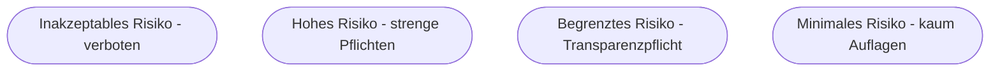

# Kapitel 32 – Rechtliche Aspekte der KI

{{ progress(32) }}

<div class="lernziele" markdown>
<h3>Was du in diesem Kapitel lernst</h3>

- Welche **Rechtsbereiche** beim KI-Einsatz relevant sind
- Grundzüge des **EU AI Act** und seiner **Risikoklassen**
- Fragen zu **Haftung** und **Urheberrecht** bei KI-Ergebnissen
- Wie du rechtliche Risiken früh erkennst
</div>

!!! warning "Kein Rechtsrat"
    Dieses Kapitel gibt einen **Überblick zur Orientierung**, ersetzt aber keine Rechtsberatung. Bei konkreten Fällen sind Fachleute hinzuzuziehen.

---

## 32.1 Relevante Rechtsbereiche

| Bereich | Frage |
|---|---|
| Datenschutz | Dürfen (personenbezogene) Daten so genutzt werden? (Kapitel 33) |
| Urheberrecht | Wem gehören Trainingsdaten und KI-Ergebnisse? |
| Haftung | Wer haftet für Fehler der KI? |
| Antidiskriminierung | Werden Personen unzulässig benachteiligt? |
| KI-Regulierung | EU AI Act – welche Pflichten gelten? |

---

## 32.2 Der EU AI Act

Die EU reguliert KI **risikobasiert**: Je höher das Risiko, desto strenger die Pflichten.



| Klasse | Beispiel | Folge |
|---|---|---|
| Verboten | Social Scoring | untersagt |
| Hochrisiko | KI in Bewerbung, Kreditvergabe | strenge Auflagen |
| Begrenzt | Chatbots | Kennzeichnungspflicht |
| Minimal | Spamfilter | kaum Auflagen |

!!! info "Transparenzpflicht"
    Nutzer müssen z. B. erkennen können, dass sie mit einer **KI (Chatbot)** sprechen oder dass Inhalte **KI-generiert** sind.

---

## 32.3 Haftung und Urheberrecht

- **Haftung:** Wer eine KI einsetzt, trägt in der Regel Verantwortung für die Ergebnisse. „Die KI war schuld" gilt nicht.
- **Urheberrecht:** Rechte an KI-generierten Inhalten sind je nach Land/Dienst unterschiedlich; Eingaben dürfen keine fremden Rechte verletzen.

**Copilot-Prompt zum Ausprobieren:**

```text
Erkläre die Risikoklassen des EU AI Act mit je einem Beispiel. Ordne die
Anwendung "[deine Anwendung]" einer Klasse zu und nenne mögliche Pflichten.
```

Prüfe die Einordnung anschließend fachlich – KI-Auskünfte zu Rechtsfragen können ungenau sein.

---

## Kurzübungen

{{ task(file="tasks/k32_01.yaml") }}

{{ task(file="tasks/k32_02.yaml") }}

---

## Workshop

{{ task(file="tasks/workshop_k32.yaml") }}
