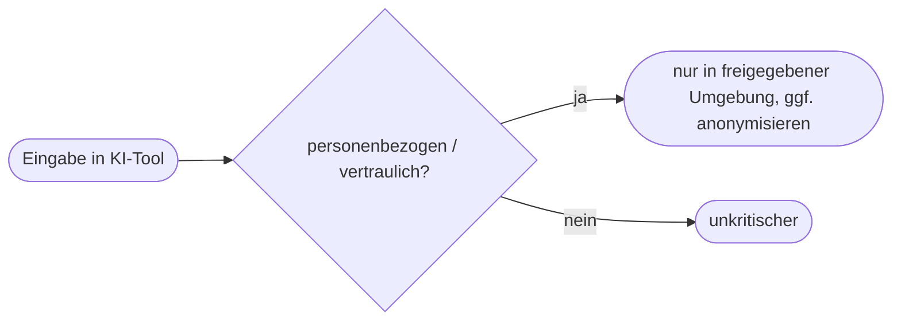

# Kapitel 33 – Datenschutz

{{ progress(33) }}

<div class="lernziele" markdown>
<h3>Was du in diesem Kapitel lernst</h3>

- Was **personenbezogene Daten** sind
- Die wichtigsten **DSGVO-Grundsätze**
- Worauf du bei **Copilot & KI-Tools** datenschutzrechtlich achten musst
- Praktische Regeln für den Alltag
</div>

---

## 33.1 Personenbezogene Daten

**Personenbezogene Daten** sind alle Informationen, die sich auf eine **identifizierbare Person** beziehen: Name, E-Mail, Telefonnummer, Standort, aber auch Kundennummer oder IP-Adresse.

!!! info "Besonders geschützt"
    **Besondere Kategorien** (Gesundheit, Religion, Herkunft, Gewerkschaft …) unterliegen noch strengeren Regeln.

---

## 33.2 DSGVO-Grundsätze

| Grundsatz | Bedeutung |
|---|---|
| Rechtmäßigkeit | Es braucht eine Rechtsgrundlage (z. B. Einwilligung) |
| Zweckbindung | Daten nur für den festgelegten Zweck |
| Datenminimierung | nur so viele Daten wie nötig |
| Richtigkeit | Daten aktuell und korrekt halten |
| Speicherbegrenzung | nicht länger speichern als nötig |
| Transparenz | Betroffene informieren |

---

## 33.3 Datenschutz bei Copilot & KI-Tools



!!! warning "Wichtige Regeln"
    - Gib **keine** personenbezogenen oder vertraulichen Daten in **nicht freigegebene** KI-Tools ein.
    - Nutze die vom Unternehmen **freigegebene Copilot-Umgebung** (mit entsprechenden Datenschutzzusagen).
    - **Anonymisiere** oder pseudonymisiere Daten, wo möglich.
    - Beachte, was mit den Eingaben passiert (Training? Speicherung?).

---

## 33.4 Praktische Faustregeln

- **Im Zweifel weglassen:** keine Klarnamen, Ausweis-, Gesundheits- oder Kontodaten in Prompts.
- **Zweck prüfen:** Wofür brauche ich die Daten wirklich?
- **Rollen beachten:** Datenschutzbeauftragte einbeziehen.

**Copilot-Prompt zum Ausprobieren:**

```text
Ich möchte Kundendaten mit einem KI-Tool auswerten. Erstelle eine
Datenschutz-Checkliste nach DSGVO: Rechtsgrundlage, Zweckbindung,
Datenminimierung, Anonymisierung und Betroffenenrechte.
```

---

## Kurzübungen

{{ task(file="tasks/k33_01.yaml") }}

{{ task(file="tasks/k33_02.yaml") }}

---

## Workshop

{{ task(file="tasks/workshop_k33.yaml") }}
