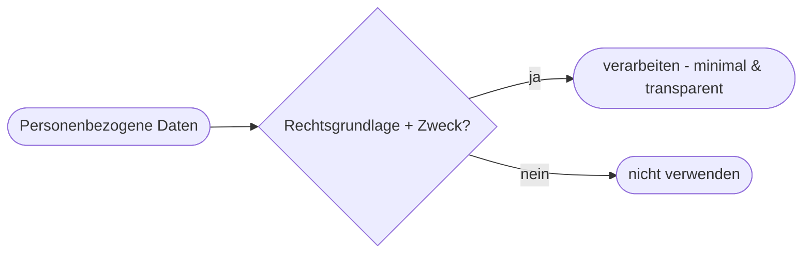

# Kapitel 33 – Datenschutz

{{ progress(33) }}

<div class="lernziele" markdown>
<h3>Was du in diesem Kapitel lernst</h3>

- Was **personenbezogene Daten** sind und warum sie besonders geschützt sind
- Die **Grundprinzipien der DSGVO**, die für KI besonders relevant sind
- Warum das Prinzip **„keine sensiblen Daten in offene Tools"** so wichtig ist
- Was **konkret nicht** in einen Copilot-Prompt gehört
- Der Unterschied zwischen **Anonymisierung** und **Pseudonymisierung**
- Wie **Microsoft 365 Copilot** Datenschutz technisch adressiert
- Konkrete **Verhaltensregeln** für den KI-Alltag
</div>

---

## 33.1 Personenbezogene Daten

**Personenbezogene Daten** sind alle Informationen, die sich auf eine **identifizierbare Person** beziehen: Name, E-Mail, Telefonnummer, Personalnummer, aber auch IP-Adressen oder Kombinationen, die eine Person erkennbar machen.

!!! info "Besonders sensible Daten"
    Einige Kategorien sind **besonders geschützt**: Gesundheit, Religion, ethnische Herkunft, politische Meinung, Gewerkschaftszugehörigkeit, sexuelle Orientierung. Deren Verarbeitung ist nur unter strengen Voraussetzungen erlaubt. Gerade solche Daten dürfen **niemals** unbedacht in ein KI-Tool gelangen.

---

## 33.2 DSGVO-Prinzipien, die für KI zählen

Die **Datenschutz-Grundverordnung (DSGVO)** gilt EU-weit. Für KI besonders relevant:

| Prinzip | Bedeutung | KI-Bezug |
|---|---|---|
| **Rechtsgrundlage** | Verarbeitung braucht einen legitimen Grund | Darf ich diese Daten für KI nutzen? |
| **Zweckbindung** | Daten nur für den erhobenen Zweck | Trainingsdaten ≠ beliebiger Zweitzweck |
| **Datenminimierung** | so wenig Daten wie möglich | nur nötige Daten in Prompts |
| **Transparenz** | Betroffene informieren | Wissen Kunden von der KI-Nutzung? |
| **Betroffenenrechte** | Auskunft, Löschung etc. | auch bei KI-Daten umsetzbar? |
| **Keine reine Automatik** | kein Alleinentscheid der KI bei wichtigen Dingen | Human in the Loop (Kap. 32) |



---

## 33.3 Die goldene Regel: keine sensiblen Daten in offene Tools

!!! warning "Der häufigste Datenschutz-Fehler"
    Der klassische Fehler: Mitarbeitende geben **vertrauliche oder personenbezogene Daten** in ein **frei zugängliches** KI-Tool ein (z. B. eine private ChatGPT-Nutzung mit echten Kundendaten). Damit verlassen die Daten möglicherweise das Unternehmen und können – je nach Anbieter und Einstellung – zu Trainingszwecken verwendet oder gespeichert werden. Das ist oft ein **klarer DSGVO-Verstoß**.

**Merksatz:** Behandle jede Eingabe in ein offenes KI-Tool so, als würdest du sie **öffentlich ins Internet stellen**. Was so nicht raus darf, gehört auch nicht in ein solches Tool.

---

## 33.4 Was gehört NICHT in einen Copilot-Prompt?

Der Merksatz wird konkret, wenn man weiß, welche Angaben man **weglassen oder ersetzen** sollte – gerade in offenen oder nicht freigegebenen Tools.

| Nicht hineingeben | Warum | Besser stattdessen |
|---|---|---|
| Echte Namen, Adressen, Personalnummern | direkter Personenbezug | Platzhalter „Person A", „Kunde X" |
| Gesundheits-, Religions-, Gewerkschaftsdaten | besonders geschützte Kategorie | ganz weglassen |
| Passwörter, Zugangsdaten, API-Schlüssel | Sicherheitsrisiko | niemals eingeben |
| Vollständige Verträge/Kundendaten Dritter | Vertraulichkeit & Urheberrecht (Kap. 32) | nur das Nötigste, anonymisiert |
| Interne Zahlen/Geschäftsgeheimnisse | Wettbewerbsrisiko | nur in freigegebener Umgebung |

!!! warning "Das gefährliche Bequemlichkeits-Denken"
    Der typische Fehler entsteht aus Bequemlichkeit: „Ich kopiere schnell die ganze Kundenmail rein, dann muss ich nichts kürzen." Genau so gelangen Namen, Kontaktdaten und Vertragsdetails ungefiltert in ein Tool. Nimm dir die **zehn Sekunden**, sensible Stellen durch Platzhalter zu ersetzen – meist wird die Antwort dadurch kein bisschen schlechter.

---

## 33.5 Anonymisieren oder Pseudonymisieren?

Datenminimierung gelingt oft durch das Ersetzen echter Angaben. Dabei gibt es zwei Stufen, die man nicht verwechseln sollte:

| Verfahren | Was passiert | Rückführbar? |
|---|---|---|
| **Pseudonymisierung** | echte Daten durch Kürzel ersetzen, Schlüssel bleibt woanders | ja, mit Zusatzwissen |
| **Anonymisierung** | Personenbezug **unwiederbringlich** entfernen | nein |

!!! info "Vertiefung: Warum der Unterschied zählt"
    Pseudonymisierte Daten („Kunde 4711") bleiben **rechtlich personenbezogen**, weil man sie mit einem Schlüssel wieder auflösen kann – die DSGVO gilt weiter. Erst **echte Anonymisierung** (kein Weg zurück zur Person) fällt aus dem Anwendungsbereich der DSGVO. Für den Copilot-Alltag heißt das: Ein Kürzel im Prompt ist gut und richtig, macht die Angabe aber nicht „datenschutzfrei", solange irgendwo eine Zuordnung existiert. Behandle pseudonymisierte Prompts also weiter mit Sorgfalt.

---

## 33.6 Wie Microsoft 365 Copilot Datenschutz adressiert

Ein wichtiger Grund, **die freigegebene Unternehmensversion** zu nutzen: Microsoft 365 Copilot ist auf betriebliche Datenschutzanforderungen ausgelegt.

| Aspekt | Microsoft 365 Copilot |
|---|---|
| Datenverarbeitung | innerhalb des Microsoft-365-Mandanten (Tenant) |
| Nutzung als Trainingsdaten | Unternehmensdaten werden **nicht** zum Training der Basismodelle verwendet |
| Berechtigungen | Copilot sieht nur Daten, für die du **berechtigt** bist (Kap. 9) |
| Datenschutz-Compliance | vertraglich (u. a. Auftragsverarbeitung) abgesichert |

!!! info "Warum der Unterschied so wichtig ist"
    Die **private/kostenlose** Nutzung eines KI-Chatbots und die **unternehmensweit freigegebene** Microsoft-365-Version sind datenschutzrechtlich **völlig verschieden**. Für betriebliche Daten ist nur die freigegebene, vertraglich abgesicherte Umgebung zulässig. Kläre im Zweifel mit IT/Datenschutz, **welches** Tool freigegeben ist.

!!! warning "Berechtigungen sind keine Zauberei"
    Copilot zeigt dir nur Daten, für die du ohnehin Zugriffsrechte hast. Sind interne Berechtigungen aber **zu großzügig** vergeben (z. B. eine für alle offene Personalliste), kann Copilot diese Daten auffindbar und nutzbar machen. Sauberer Datenschutz beginnt also **vor** Copilot – bei ordentlich gesetzten Zugriffsrechten.

---

## 33.7 Verhaltensregeln für den Alltag

- **Nur freigegebene Tools** für betriebliche Daten nutzen.
- **Datenminimierung:** anonymisieren/pseudonymisieren, wo möglich (Platzhalter statt echter Namen).
- **Keine besonders sensiblen Daten** ohne ausdrückliche Rechtsgrundlage.
- **Interne Richtlinie & Datenschutzbeauftragte:n** einbeziehen.
- **Transparenz** gegenüber Betroffenen, wo erforderlich.

**Copilot-Prompt zum Ausprobieren:**

```text
Erstelle eine kompakte Checkliste (max. 8 Punkte) mit Datenschutzregeln für
Mitarbeitende, die im Arbeitsalltag KI-Werkzeuge nutzen. Formuliere sie klar
und verständlich, ohne Juristendeutsch.
```

!!! example "Ausgearbeiteter Copilot-Dialog"
    **Prompt:**
    ```text
    Erfinde eine fiktive Kundenbeschwerde-Mail mit echten wirkenden
    personenbezogenen Daten. Zeige mir danach dieselbe Mail in einer
    datenschutzfreundlichen, anonymisierten Fassung und erkläre, was du
    warum ersetzt hast.
    ```
    **Beispiel-Antwort von Copilot (gekürzt):**
    ```text
    Original (fiktiv): "Sehr geehrte Damen und Herren, ich, Julia Berger,
    Kundennr. 88231, wohnhaft Lindenweg 4, beschwere mich über ..."

    Anonymisiert: "Sehr geehrte Damen und Herren, ich (Kundin A) beschwere
    mich über ..."

    Ersetzt & warum:
    - Name "Julia Berger" -> "Kundin A" (direkter Personenbezug).
    - Kundennr. 88231 -> entfernt (eindeutige Kennung).
    - Adresse -> entfernt (nicht für die Sachfrage nötig, Datenminimierung).
    ```

So übst du gefahrlos: Die Daten sind erfunden, und du siehst zugleich das **Muster**, wie man echte Prompts vor dem Absenden bereinigt.

!!! tip "Anonymisieren als einfacher Schutz"
    Oft brauchst du für eine gute KI-Antwort gar keine echten Namen. Ersetze „Kunde Herr Meier, Personalnr. 4711" durch „Kunde A". Das Ergebnis ist genauso brauchbar – aber ohne Personenbezug.

---

## Zusammenfassung

- **Personenbezogene Daten** sind geschützt; **besonders sensible** Kategorien noch strenger.
- Die **DSGVO** verlangt u. a. **Rechtsgrundlage, Zweckbindung, Datenminimierung, Transparenz** und Betroffenenrechte.
- **Goldene Regel:** keine vertraulichen/personenbezogenen Daten in **offene** KI-Tools.
- **Konkret nicht** in Prompts: echte Namen, sensible Kategorien, Passwörter, fremde Verträge, Geschäftsgeheimnisse.
- **Anonymisierung** entfernt den Personenbezug endgültig; **Pseudonymisierung** bleibt rückführbar und weiterhin DSGVO-relevant.
- **Microsoft 365 Copilot** verarbeitet Daten im Tenant, nutzt sie **nicht** fürs Modelltraining und wahrt Berechtigungen – die aber sauber gesetzt sein müssen.
- Alltag: freigegebene Tools, **anonymisieren**, Richtlinien und Datenschutzbeauftragte einbeziehen.

---

## Kurzübungen

{{ task(file="tasks/k33_01.yaml") }}

{{ task(file="tasks/k33_02.yaml") }}

{{ task(file="tasks/k33_03.yaml") }}

---

## Workshop

{{ task(file="tasks/workshop_k33.yaml") }}
