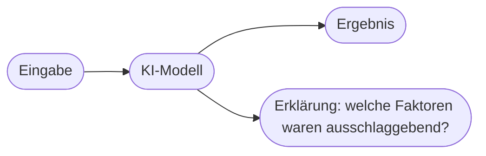

# Kapitel 34 – Explainable AI: Erklärbarkeit von KI

{{ progress(34) }}

<div class="lernziele" markdown>
<h3>Was du in diesem Kapitel lernst</h3>

- Was das **Black-Box-Problem** ist
- Warum **Erklärbarkeit (Explainable AI, XAI)** wichtig ist
- Der Unterschied zwischen **interpretierbaren** und **erklärenden** Verfahren
- Wie du Copilot nach **Begründungen** fragst
</div>

---

## 34.1 Das Black-Box-Problem

Viele leistungsstarke KI-Modelle (v. a. tiefe neuronale Netze) sind **Black Boxes**: Sie liefern ein Ergebnis, aber **warum**, ist von außen schwer nachvollziehbar.

!!! warning "Warum das problematisch ist"
    Ohne Erklärung fehlt **Vertrauen**, und Fehler bleiben unentdeckt. Bei Entscheidungen über Menschen (Kredit, Bewerbung) ist Nachvollziehbarkeit oft sogar **rechtlich gefordert**.

---

## 34.2 Warum Erklärbarkeit wichtig ist

| Grund | Bedeutung |
|---|---|
| Vertrauen | Nutzer akzeptieren, was sie verstehen |
| Fehlersuche | falsche Begründungen aufdecken |
| Fairness | Bias erkennen (Kapitel 31) |
| Recht | Auskunfts-/Begründungspflichten |



---

## 34.3 Wege zur Erklärbarkeit

- **Interpretierbare Modelle:** von Haus aus verständlich (z. B. Entscheidungsbäume)
- **Erklärungsmethoden (nachträglich):** zeigen, welche Merkmale ein Ergebnis beeinflusst haben (z. B. „Der Antrag wurde v. a. wegen X und Y abgelehnt")

!!! info "Trade-off"
    Oft gilt: Je leistungsfähiger das Modell, desto schwerer erklärbar. Man wägt zwischen **Genauigkeit** und **Nachvollziehbarkeit** ab – je nach Anwendung.

---

## 34.4 Copilot nach Begründungen fragen

Auch bei Copilot kannst du **Nachvollziehbarkeit** einfordern.

**Copilot-Prompt zum Ausprobieren:**

```text
Bewerte diese drei Angebote und empfiehl eines. Begründe deine Empfehlung
Schritt für Schritt und nenne, welche Kriterien am stärksten gewichtet wurden.
[Angebote einfügen]
```

!!! tip "Begründung anfordern"
    Formulierungen wie „Begründe Schritt für Schritt", „Nenne deine Annahmen" oder „Woran machst du das fest?" erhöhen die Nachvollziehbarkeit der Antwort – prüfen musst du sie trotzdem.

---

## Kurzübungen

{{ task(file="tasks/k34_01.yaml") }}

{{ task(file="tasks/k34_02.yaml") }}

---

## Workshop

{{ task(file="tasks/workshop_k34.yaml") }}
