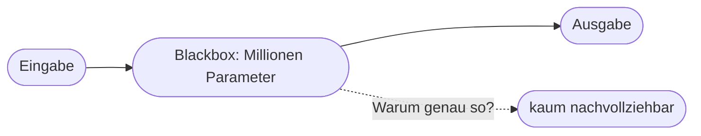

# Kapitel 34 – Explainable AI: Erklärbarkeit von KI

{{ progress(34) }}

<div class="lernziele" markdown>
<h3>Was du in diesem Kapitel lernst</h3>

- Was das **Blackbox-Problem** ist und warum es entsteht
- Was **Explainable AI (XAI)** bedeutet und warum sie wichtig ist
- Der Unterschied zwischen **Nachvollziehbarkeit** und **Vertrauen**
- Warum eine **plausibel klingende** Erklärung keine echte Erklärung sein muss
- Welche Wege es gibt, KI-Entscheidungen **erklärbarer** zu machen
- Wie du bei **Copilot** mehr Transparenz einforderst (Quellen, Begründung)
</div>

---

## 34.1 Das Blackbox-Problem

Moderne KI-Modelle – besonders tiefe neuronale Netze und LLMs – haben Millionen bis Milliarden interner Parameter. **Warum** genau ein Modell zu einer bestimmten Ausgabe kommt, lässt sich von außen kaum nachvollziehen. Das nennt man das **Blackbox-Problem**.



!!! info "Warum das entsteht"
    Bei klassischer Software kann man die Regel im Code nachlesen. Ein neuronales Netz hat **keine lesbaren Regeln** – sein „Wissen" steckt in unzähligen Zahlenwerten, die gemeinsam wirken. Es gibt keine einzelne Stelle, die man aufschlagen und lesen könnte. Das macht Erklärbarkeit technisch schwierig.

---

## 34.2 Warum Erklärbarkeit wichtig ist

**Explainable AI (XAI)** umfasst Methoden, die KI-Entscheidungen **nachvollziehbar** machen. Das ist aus mehreren Gründen zentral:

| Grund | Beispiel |
|---|---|
| **Vertrauen** | Menschen nutzen nur, was sie verstehen |
| **Fehlersuche** | Warum lag das Modell falsch? |
| **Fairness** | War die Entscheidung diskriminierend? (Kap. 31) |
| **Recht** | Betroffene haben teils ein Recht auf Erklärung (Kap. 32/33) |
| **Verantwortung** | Wer entscheidet, muss begründen können |

!!! warning "Besonders bei Hochrisiko-Anwendungen"
    Bei einer abgelehnten Kreditanfrage oder einer aussortierten Bewerbung reicht „die KI hat entschieden" **nicht** – weder rechtlich noch ethisch. Betroffene müssen eine nachvollziehbare Begründung erhalten. Der EU AI Act verlangt für Hochrisiko-KI deshalb ausdrücklich **Transparenz und Nachvollziehbarkeit**.

---

## 34.3 Nachvollziehbarkeit ≠ Vertrauen

Ein wichtiger Unterschied: Eine **flüssige Erklärung** ist nicht automatisch eine **korrekte** Erklärung.

!!! warning "Die 'plausible Begründung'-Falle"
    Fragst du Copilot „Warum hast du das so beantwortet?", liefert es eine **plausibel klingende** Begründung. Aber Achtung: Das Modell rekonstruiert diese Erklärung im Nachhinein – sie muss **nicht** der tatsächliche innere „Rechenweg" sein. Eine überzeugende Erklärung ist also kein Beweis für Richtigkeit. Vertrauen sollte auf **Prüfung** basieren, nicht auf der Eloquenz der Begründung.

Der Grund liegt in der Funktionsweise (Kap. 12, 15): Ein Sprachmodell sagt Wort für Wort das **wahrscheinlichste nächste Wort** voraus. Fragst du nach einer Begründung, erzeugt es einen **plausiblen Begründungstext** – wieder nach Wahrscheinlichkeit, nicht durch Introspektion in seine eigenen Berechnungen. Die Erklärung ist damit eine nachträgliche Geschichte, kein Protokoll.

!!! example "Ausgearbeiteter Copilot-Dialog: die Falle sichtbar gemacht"
    **Prompt:**
    ```text
    Erfinde eine kurze Rechenaufgabe, bei der du dich absichtlich verrechnest.
    Nenne das falsche Ergebnis mit einer selbstbewussten Begründung. Erkläre
    danach, warum die Begründung überzeugend klingt, aber trotzdem falsch ist.
    ```
    **Beispiel-Antwort von Copilot (gekürzt):**
    ```text
    Aufgabe: "Ein Rabatt von 20 % auf 250 €."
    (Falsches) Ergebnis: "Der Preis sinkt um 60 €, also auf 190 €."
    Begründung (klingt gut): "20 % sind rund ein Fünftel, ich habe großzügig
    gerundet, daher 60 €."

    Warum das täuscht: Die Begründung wirkt souverän und benutzt Fachwörter
    wie 'ein Fünftel'. Korrekt sind aber 20 % von 250 € = 50 € (Preis 200 €).
    Der flüssige, sichere Ton ist KEIN Beweis für Richtigkeit.
    ```

Genau das ist die Kernbotschaft: Der **selbstbewusste Ton** einer Erklärung sagt nichts über ihre Korrektheit. Deine Prüfung – hier eine simple Nachrechnung – ist unverzichtbar.

---

## 34.4 Zwei Arten von Erklärbarkeit

Fachlich unterscheidet man, **wann** die Erklärbarkeit entsteht:

| Ansatz | Idee | Beispiel |
|---|---|---|
| **Intrinsisch** (eingebaut) | das Modell ist von sich aus verständlich | Entscheidungsbaum, einfache Regeln |
| **Post-hoc** (nachträglich) | eine Zusatzmethode erklärt eine Blackbox | SHAP, LIME, Quellenangaben |

!!! info "Vertiefung: lokale vs. globale Erklärung"
    Man unterscheidet außerdem, **wie viel** erklärt wird. Eine **lokale** Erklärung betrifft einen **Einzelfall** („Warum wurde *dieser* Kredit abgelehnt?"). Eine **globale** Erklärung beschreibt das **Verhalten des ganzen Modells** („Welche Faktoren zählen generell am meisten?"). Für Betroffene ist meist die lokale Erklärung entscheidend, für Entwickler und Aufsicht die globale. Bei generativer KI wie Copilot sind beide nur eingeschränkt verfügbar – umso wichtiger ist der praktische Hebel aus dem nächsten Abschnitt: **Quellen verlangen und selbst verifizieren**.

---

## 34.5 Wege zu mehr Erklärbarkeit

| Ansatz | Idee |
|---|---|
| **Einfachere Modelle** | wo möglich erklärbare Verfahren (z. B. Entscheidungsbäume) statt Blackbox nutzen |
| **Erklärmethoden (z. B. SHAP)** | zeigen, welche Eingabemerkmale die Entscheidung beeinflusst haben |
| **Quellenangaben** | Antworten mit Belegen versehen (RAG, Kap. 5) |
| **Human in the Loop** | Mensch prüft und verantwortet (Kap. 32) |
| **Dokumentation** | nachhalten, wie ein System funktioniert und getestet wurde |

Bei generativer KI ist der praktikabelste Hebel oft, **Quellen und Belege** zu verlangen und die Aussagen **selbst zu verifizieren**.

---

## 34.6 Transparenz bei Copilot einfordern

Du kannst Copilot aktiv zu mehr Nachvollziehbarkeit bringen:

| Ziel | Beispiel-Prompt |
|---|---|
| Quellen nennen | „Nenne für jede Aussage die Quelle bzw. das Dokument." |
| Annahmen offenlegen | „Welche Annahmen hast du bei dieser Antwort getroffen?" |
| Unsicherheit zeigen | „Wie sicher bist du? Was könnte falsch sein?" |
| Schritte zeigen | „Erkläre deinen Gedankengang Schritt für Schritt." |

**Beispiel-Prompt zum Ausprobieren:**

```text
Beantworte meine Frage und nenne anschließend: (1) welche Annahmen du getroffen
hast, (2) wie sicher du dir bist, und (3) welche Angaben ich unbedingt selbst
überprüfen sollte. Frage: [deine Frage]
```

!!! tip "Merke"
    Erklärbarkeit ist bei generativer KI (noch) begrenzt. Umso wichtiger ist deine **prüfende Rolle**: Quellen verlangen, Unsicherheiten sichtbar machen, kritische Aussagen selbst verifizieren. Transparenz ersetzt nicht die Kontrolle – sie erleichtert sie.

---

## Zusammenfassung

- Das **Blackbox-Problem**: Bei komplexen Modellen ist das „Warum" von außen kaum nachvollziehbar.
- **Explainable AI (XAI)** schafft Nachvollziehbarkeit – wichtig für Vertrauen, Fehlersuche, Fairness und Recht.
- **Nachvollziehbarkeit ≠ Vertrauen:** eine plausible, selbstbewusst klingende Erklärung ist nicht automatisch korrekt.
- Erklärbarkeit kann **intrinsisch** (eingebaut) oder **post-hoc** (nachträglich), **lokal** (Einzelfall) oder **global** (Gesamtmodell) sein.
- Hebel: einfachere Modelle, Erklärmethoden, **Quellenangaben**, Human in the Loop, Doku.
- Bei **Copilot** aktiv Quellen, Annahmen und Unsicherheiten einfordern – und selbst verifizieren.

---

## Kurzübungen

{{ task(file="tasks/k34_01.yaml") }}

{{ task(file="tasks/k34_02.yaml") }}

{{ task(file="tasks/k34_03.yaml") }}

---

## Workshop

{{ task(file="tasks/workshop_k34.yaml") }}
