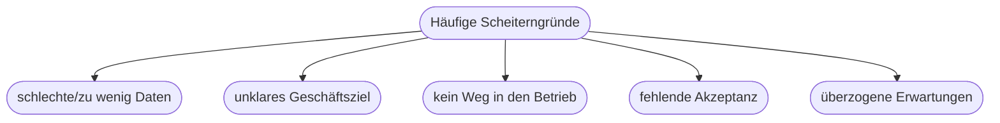

# Kapitel 35 – Herausforderungen im KI-Projektmanagement

{{ progress(35) }}

<div class="lernziele" markdown>
<h3>Was du in diesem Kapitel lernst</h3>

- Warum KI-Projekte **anders** sind als klassische IT-Projekte
- Typische **Gründe für Scheitern**
- Wichtige **Rollen** in KI-Projekten
- Wie du Risiken früh adressierst
</div>

---

## 35.1 Was KI-Projekte besonders macht

| Klassisches IT-Projekt | KI-Projekt |
|---|---|
| Anforderungen früh klar | Ergebnis **datenabhängig**, unsicher |
| Erfolg gut planbar | Erfolg erst nach Experimenten sichtbar |
| Test = „funktioniert es?" | Test = „ist es **gut genug**?" |
| Einmal fertig | Modell muss **gepflegt** werden (Drift) |

!!! info "Experimentell statt deterministisch"
    Ob ein KI-Modell gut genug wird, weiß man oft erst nach dem Ausprobieren. KI-Projekte brauchen daher **iteratives** Vorgehen und Puffer für Unsicherheit.

---

## 35.2 Warum KI-Projekte scheitern



| Grund | Gegenmaßnahme |
|---|---|
| Datenprobleme | früh Datenlage prüfen (Kapitel 9/10) |
| unklares Ziel | messbaren Nutzen definieren |
| „Prototyp-Falle" | Betrieb von Anfang an mitdenken (Kapitel 11) |
| fehlende Akzeptanz | Change Management (Kapitel 37) |
| Übererwartung | realistisch kommunizieren |

---

## 35.3 Rollen im KI-Projekt

| Rolle | Aufgabe |
|---|---|
| Auftraggeber / Fachbereich | Ziel und Nutzen definieren |
| Data Scientist / KI-Fachkraft | Modell entwickeln |
| Data Engineer | Datenpipelines bauen |
| Projektleitung | Planung, Kommunikation, Risiken |
| Datenschutz/Recht | Compliance sichern |
| Nutzer | Feedback, Akzeptanz |

---

## 35.4 Risiken früh adressieren

**Copilot-Prompt zum Ausprobieren:**

```text
Erstelle eine Risiko-Checkliste für ein KI-Projekt mit den Kategorien Daten,
Ziel, Betrieb, Akzeptanz und Recht. Formuliere je Kategorie 2 Prüffragen und
eine typische Gegenmaßnahme.
```

!!! tip "Klein anfangen"
    Starte mit einem klar abgegrenzten **Pilotprojekt** mit messbarem Ziel. Erfolg schafft Vertrauen für größere Vorhaben.

---

## Kurzübungen

{{ task(file="tasks/k35_01.yaml") }}

{{ task(file="tasks/k35_02.yaml") }}

---

## Workshop

{{ task(file="tasks/workshop_k35.yaml") }}
