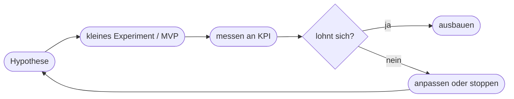

# Kapitel 35 – Herausforderungen im KI-Projektmanagement

{{ progress(35) }}

<div class="lernziele" markdown>
<h3>Was du in diesem Kapitel lernst</h3>

- Warum KI-Projekte **anders** sind als klassische IT-Projekte
- Die häufigsten **Gründe für das Scheitern** – und wie man sie vermeidet
- Warum KI-Projekte **iterativ und experimentell** sein müssen
- Die Rolle von **interdisziplinären Teams** und klaren **Rollen**
- Warum **Daten und Akzeptanz** über Erfolg oder Scheitern entscheiden
- Wie **Copilot** bei Planung, Doku und Kommunikation im Projekt hilft
</div>

---

## 35.1 Warum KI-Projekte anders sind

Ein klassisches IT-Projekt hat meist ein klar definierbares Ergebnis („die Software macht X"). KI-Projekte sind **unsicherer**: Ob ein Modell die gewünschte Qualität erreicht, weiß man oft erst **nach** dem Ausprobieren mit echten Daten.

| Klassisches IT-Projekt | KI-Projekt |
|---|---|
| Ergebnis vorab spezifizierbar | Ergebnis **datenabhängig**, unsicher |
| linear planbar | **iterativ, experimentell** |
| Erfolg = Spezifikation erfüllt | Erfolg = KPI/Qualität erreicht (statistisch) |
| Daten oft Nebensache | **Daten sind zentral** |

!!! info "Der Kern des Unterschieds"
    Man „bestellt" keine KI-Lösung wie ein fertiges Möbelstück. Man **erforscht**, ob und wie gut sie funktioniert. Das erfordert eine andere Denkweise: **Hypothesen testen** statt „Auftrag abarbeiten". Wer KI-Projekte wie Bauprojekte plant (fixer Umfang, fixer Termin, fixe Qualität), scheitert oft.

---

## 35.2 Warum KI-Projekte scheitern

Studien nennen seit Jahren ähnliche Gründe:

| Grund | Ursache | Gegenmittel |
|---|---|---|
| **Kein klares Problem** | „KI um der KI willen" | vom Problem aus starten (Kap. 4) |
| **Schlechte Daten** | Menge/Qualität unzureichend | Datenrealität früh prüfen (Kap. 9/10) |
| **Kein messbarer Nutzen** | KPI fehlt | KPI vorab definieren |
| **Fehlende Akzeptanz** | Belegschaft zieht nicht mit | Change Management (Kap. 37) |
| **Überzogene Erwartung** | Hype statt Realismus | MVP, klein starten |
| **Keine Operationalisierung** | Pilot geht nie in Betrieb | von Anfang an Betrieb mitdenken (Kap. 11) |

!!! warning "Der 'Pilot-Friedhof'"
    Ein sehr häufiges Muster: Es gibt viele beeindruckende **Piloten**, aber kaum etwas geht in den **Regelbetrieb**. Gründe sind fehlende Integration, unklare Zuständigkeit und mangelnde Akzeptanz. Ein Pilot ist erst dann ein Erfolg, wenn geklärt ist, **wie er skaliert und wer ihn betreibt**.

---

## 35.3 Iterativ und experimentell arbeiten

KI-Projekte folgen einem **Lernzyklus**, nicht einem starren Plan:



!!! tip "Das Recht zu scheitern – schnell und günstig"
    Nicht jedes Experiment gelingt – das ist **normal**. Wichtig ist, **schnell und günstig** zu scheitern (kleiner Pilot statt Großprojekt) und daraus zu lernen. Ein früh gestopptes aussichtsloses Projekt ist ein **Erfolg**, kein Versagen.

!!! info "Vertiefung: Warum der Wasserfall bei KI bricht"
    Klassische Projekte laufen oft im **Wasserfall**: Anforderungen → Umsetzung → Abnahme, sauber nacheinander. Das setzt voraus, dass man das Ergebnis **vorab kennt**. Bei KI ist genau das nicht gegeben – die erreichbare Qualität hängt von Daten ab, die man erst im Tun versteht. Deshalb arbeitet man in **kurzen Schleifen** (agil): kleine Hypothese, schneller Test, Erkenntnis, nächste Schleife. Man plant nicht den ganzen Weg, sondern den **nächsten Lernschritt**. Fixiert man dagegen früh Umfang, Termin und Qualität gleichzeitig, entsteht ein unlösbares Versprechen – eine der Hauptursachen für gescheiterte KI-Vorhaben.

---

## 35.4 Team und Rollen

KI-Projekte brauchen **verschiedene Kompetenzen** an einem Tisch:

| Rolle | Beitrag |
|---|---|
| **Fachbereich** | kennt Problem, Prozess, Daten (unverzichtbar!) |
| **Daten/IT** | Datenzugang, Technik, Integration |
| **Data Science** (bei Eigenentwicklung) | Modelle, Methodik |
| **Management** | Ziele, Budget, Rückendeckung |
| **Datenschutz/Recht** | Compliance (Block 4) |

!!! info "Der Fachbereich ist der Schlüssel"
    Der häufigste Fehler ist, KI-Projekte rein als „IT-Sache" zu behandeln. Ohne das **Fachwissen** derer, die den Prozess täglich leben, fehlen Problemverständnis, Datenwissen und spätere Akzeptanz. Für Copilot-Einführungen gilt das besonders: Die besten Use Cases kommen aus dem Fachbereich selbst.

---

## 35.5 Copilot als Projekthelfer

Auch die **Projektarbeit selbst** lässt sich mit Copilot beschleunigen:

| Aufgabe | Beispiel-Prompt |
|---|---|
| Projektstruktur | „Erstelle eine grobe Projektstruktur für die Einführung von Copilot im Vertrieb." |
| Risiken | „Nenne die 8 größten Risiken dieses KI-Projekts und je eine Gegenmaßnahme." |
| Statusbericht | „Fasse diese Projektnotizen zu einem knappen Statusbericht zusammen." |
| Kommunikation | „Formuliere eine Info an die Belegschaft zum Start des Pilotprojekts." |

**Beispiel-Prompt zum Ausprobieren:**

```text
Ich plane ein KI-Pilotprojekt zur automatischen Zusammenfassung von
Kundenanfragen. Erstelle einen Plan mit Zielen, einem messbaren KPI, den
größten Risiken und den Rollen, die ich im Team brauche.
```

---

## 35.6 Daten und Akzeptanz – die zwei stillen Killer

Zwei Faktoren entscheiden früher über Erfolg oder Scheitern, als die meisten Projekte annehmen: die **Datenrealität** und die **Akzeptanz**.

**Datenrealität** heißt: Bevor man ein Modell trainiert oder einen Copilot-Anwendungsfall aufbaut, prüft man ehrlich, ob überhaupt genug Daten in ausreichender Qualität vorliegen (Kapitel 9 – Datenbeschaffung, Kapitel 10 – Datenaufbereitung). Oft zeigt sich: Die Daten sind verstreut, uneinheitlich gepflegt oder rechtlich nicht nutzbar. Ein Projekt, das diese Prüfung überspringt, „entdeckt" das Problem erst nach Monaten – der teuerste Zeitpunkt.

**Akzeptanz** heißt: Die spätere Nutzung durch Menschen wird von Anfang an mitgeplant, nicht am Ende „angehängt". Ein technisch funktionierendes System, das niemand nutzt, ist gescheitert. Deshalb gehören Betroffene früh an den Tisch (Kapitel 37 – Change Management).

| Erfolgsfaktor | Frühe Prüffrage | Wenn ignoriert |
|---|---|---|
| **Datenmenge** | Haben wir genug Fälle? | Modell lernt nichts Verlässliches |
| **Datenqualität** | Sind die Daten sauber und aktuell? | „Müll rein, Müll raus" |
| **Datenzugang** | Dürfen/können wir die Daten nutzen? | rechtlicher Stopp spät im Projekt |
| **Akzeptanz** | Wollen die Nutzenden das? | Werkzeug bleibt ungenutzt |

!!! warning "Der Trugschluss vom 'Datenschatz'"
    Viele glauben, sie säßen auf einem „Datenschatz", weil viel gespeichert wird. Menge ist aber nicht gleich Nutzbarkeit: Daten ohne einheitliche Struktur, ohne verlässliche Beschriftung oder mit Lücken sind für ein KI-Projekt oft **wertlos**. Prüfe die Daten **konkret an einem Muster**, bevor du auf ihrer Basis Zusagen machst.

---

## 35.7 Ein durchgerechnetes Mini-Beispiel

Wie sieht ein sauber aufgesetztes KI-Vorhaben konkret aus? Ein Beispiel für die automatische Vorsortierung eingehender E-Mails im Kundenservice:

| Element | Konkrete Festlegung |
|---|---|
| **Problem** | Eingehende Mails werden manuell sortiert – langsam, fehleranfällig |
| **Hypothese** | KI kann 80 % der Mails korrekt einer Kategorie zuordnen |
| **KPI** | Trefferquote der Zuordnung; eingesparte Minuten pro Tag |
| **Baseline (Ist)** | 15 Min./Mitarbeiter/Tag fürs Sortieren, ~5 % Fehlzuordnungen |
| **Zielwert** | ≥ 80 % Trefferquote im Pilot, dann Entscheidung |
| **Pilotumfang** | 4 Wochen, eine Abteilung, ~500 Mails |
| **Stopp-Kriterium** | < 70 % Trefferquote → anpassen oder beenden |

Der entscheidende Punkt: Der **KPI und das Stopp-Kriterium stehen vorher fest**. So wird aus „gefühlt hilft es" eine überprüfbare Aussage – und man weiß am Ende der vier Wochen, ob der Ausbau (Kapitel 21 – Prozessoptimierung) sinnvoll ist.

!!! example "Copilot hilft beim Aufsetzen – mit erfundenem Material"
    Prompt:
    ```text
    Erfinde ein realistisches KI-Pilotprojekt zur E-Mail-Vorsortierung im
    Kundenservice. Lege einen messbaren KPI, eine Baseline, einen Zielwert und
    ein Stopp-Kriterium fest und erkläre in zwei Sätzen, warum ein festes
    Stopp-Kriterium wichtig ist.
    ```
    Beispiel-Antwort (gekürzt):
    ```text
    KPI: Anteil korrekt zugeordneter E-Mails (Trefferquote).
    Baseline: manuell ~95 % korrekt, aber 15 Min./Person/Tag Aufwand.
    Zielwert: >= 80 % Trefferquote bei < 3 Min. Nachkontrolle/Tag.
    Stopp-Kriterium: < 70 % Trefferquote nach 4 Wochen -> Projekt anpassen
    oder beenden.
    Warum: Ohne festes Stopp-Kriterium läuft ein aussichtsloser Pilot aus
    Prestige-Gründen weiter und bindet Ressourcen, die anderswo mehr Nutzen
    stiften würden.
    ```

---

## Zusammenfassung

- KI-Projekte sind **unsicherer** und **datenabhängiger** als klassische IT-Projekte – iterativ statt linear.
- Häufige Scheiterngründe: **kein klares Problem, schlechte Daten, kein KPI, fehlende Akzeptanz, kein Betrieb**.
- Arbeite in **Lernzyklen** (MVP → messen → anpassen); schnelles, günstiges Scheitern ist erlaubt.
- **Interdisziplinäre Teams** mit starkem **Fachbereich** sind entscheidend.
- **Datenrealität und Akzeptanz** früh prüfen – nicht Datenmenge, sondern Nutzbarkeit zählt.
- Ein **fester KPI und ein Stopp-Kriterium** machen aus „gefühltem Nutzen" eine überprüfbare Aussage.
- **Copilot** hilft bei Struktur, Risiken, Statusberichten und Kommunikation.

---

## Kurzübungen

{{ task(file="tasks/k35_01.yaml") }}

{{ task(file="tasks/k35_02.yaml") }}

{{ task(file="tasks/k35_03.yaml") }}

---

## Workshop

{{ task(file="tasks/workshop_k35.yaml") }}
