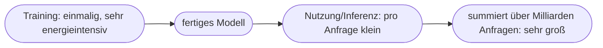

# Kapitel 36 – Energie- und Ressourcenverbrauch von KI

{{ progress(36) }}

<div class="lernziele" markdown>
<h3>Was du in diesem Kapitel lernst</h3>

- Warum KI **Energie, Wasser und Rohstoffe** verbraucht – und wo genau
- Der Unterschied im Verbrauch zwischen **Training** und **Nutzung (Inferenz)**
- Größenordnungen: Was kostet eine KI-Anfrage die Umwelt (grob)?
- Wie Anbieter und Nutzer den **Fußabdruck senken** können
- Warum **Modellgröße** den Verbrauch stark beeinflusst und was **Green AI** bedeutet
- Wie du als **Copilot-Nutzer:in** bewusst und effizient umgehst
</div>

---

## 36.1 KI ist nicht „immateriell"

KI wirkt körperlos – doch dahinter stehen **riesige Rechenzentren** mit hohem Verbrauch an:

| Ressource | Wofür |
|---|---|
| **Strom** | Rechenleistung (v. a. GPUs) für Training und Nutzung |
| **Wasser** | Kühlung der Rechenzentren |
| **Rohstoffe** | Hardware (Chips, seltene Metalle) |

!!! info "Die unsichtbaren Kosten"
    Jede Copilot-Antwort läuft auf physischer Hardware, die Strom zieht und gekühlt werden muss. Einzeln ist der Verbrauch klein, in der **Masse** aber erheblich. Nachhaltige KI-Nutzung (Kap. 29) setzt voraus, diese Seite ehrlich mitzudenken – sonst „spart" man an einer Stelle und verbraucht an anderer mehr.

---

## 36.2 Training vs. Nutzung

Der Verbrauch verteilt sich auf zwei sehr unterschiedliche Phasen:



| Phase | Verbrauch | Charakter |
|---|---|---|
| **Training** | sehr hoch, aber **einmalig** | wie ein großer Bau |
| **Nutzung (Inferenz)** | pro Anfrage klein | aber **milliardenfach** täglich |

!!! example "Warum beides zählt"
    Das **Training** eines sehr großen Modells kann so viel Energie verbrauchen wie hunderte Haushalte in einem Jahr – aber es passiert nur einmal. Die **Nutzung** kostet pro Prompt wenig, doch bei **weltweit Milliarden** Anfragen täglich summiert sich das zu einem enormen Dauerverbrauch. Beide Phasen sind daher relevant.

!!! info "Vertiefung: Warum Training so teuer ist"
    Beim Training „liest" ein Modell riesige Textmengen und passt dabei viele Milliarden interner Parameter in unzähligen Rechenschritten immer wieder an (Kapitel 12 – Machine Learning, Kapitel 15 – Large Language Models). Das läuft wochen- bis monatelang auf tausenden spezialisierten Prozessoren (GPUs) parallel. Bei der **Inferenz** (Nutzung) dagegen wird das fertige Modell nur noch einmal „durchgerechnet", um eine Antwort zu erzeugen – ungleich weniger Aufwand pro Anfrage. Genau deshalb gilt: Training ist ein seltener Kraftakt, Nutzung ein häufiger kleiner Verbrauch. Für Anwender:innen ist fast nur die Inferenz-Seite direkt beeinflussbar.

---

## 36.3 Größenordnungen einordnen

Genaue Zahlen schwanken je nach Modell und Rechenzentrum stark und werden selten offengelegt. Wichtiger als exakte Werte ist das **Größengefühl**:

- Eine KI-Textanfrage verbraucht deutlich **mehr** Energie als eine klassische Websuche.
- Bild- und Videogenerierung ist **energieintensiver** als reine Textausgabe.
- Der Wasserverbrauch für Kühlung ist real und in wasserarmen Regionen ein Thema.

!!! warning "Vorsicht bei kursierenden Zahlen"
    Im Netz kursieren viele konkrete Verbrauchszahlen („X Liter Wasser pro Anfrage") – sie sind oft **Schätzungen** mit großen Unsicherheiten oder veraltet. Nutze sie zur **Sensibilisierung**, nicht als exakte Fakten, und prüfe die Quelle (Anwendung von Kap. 15: nicht jeder plausiblen Zahl trauen).

---

## 36.4 Den Fußabdruck senken

**Was Anbieter tun (können):**

| Hebel | Wirkung |
|---|---|
| Erneuerbare Energie für Rechenzentren | geringerer CO₂-Fußabdruck |
| Effizientere Hardware und Kühlung | weniger Strom/Wasser |
| **Kleinere, spezialisierte Modelle** (SLMs) | weniger Verbrauch pro Aufgabe (Kap. 5) |
| Standortwahl (Klima, grüner Strom) | weniger Kühlbedarf |

**Was Nutzer:innen tun können:**

- **Bewusst prompten:** klare Prompts statt endloser Trial-and-Error-Serien.
- **Das richtige Werkzeug** für die Aufgabe – nicht für jede Kleinigkeit ein großes Modell.
- **Massenhafte, sinnlose Generierung vermeiden** (z. B. „mach mir mal 500 Varianten zum Spaß").

!!! tip "Effizientes Prompten ist auch grünes Prompten"
    Gutes Prompt Engineering (Kap. 14) spart nicht nur **deine Zeit**, sondern auch **Energie**: Wer sein Ziel in 1–2 präzisen Prompts erreicht statt in 15 vagen Versuchen, verursacht weniger Rechenlast. Qualität und Nachhaltigkeit gehen hier Hand in Hand.

---

## 36.5 Bewusste Nutzung mit Copilot

**Beispiel-Prompt zum Ausprobieren:**

```text
Erkläre den Unterschied im Energieverbrauch zwischen dem Training und der
Nutzung eines KI-Modells. Nenne anschließend drei konkrete Verhaltensweisen,
mit denen ich als Nutzer:in den Ressourcenverbrauch gering halte.
```

!!! info "Abwägung statt Verzicht"
    Es geht nicht darum, KI aus Umweltgründen zu meiden – sie kann ja selbst viel Ressourcen sparen (Kap. 29). Es geht um eine **ehrliche Abwägung** und **bewusste Nutzung**: KI dort einsetzen, wo sie echten Mehrwert schafft, und dabei effizient vorgehen.

---

## 36.6 Modellgröße und „Green AI"

Nicht jede Aufgabe braucht das größte verfügbare Modell. Die **Modellgröße** (grob: die Zahl der Parameter) ist einer der stärksten Hebel für den Verbrauch: Ein größeres Modell rechnet pro Antwort mehr und zieht mehr Strom. Für viele Alltagsaufgaben genügt ein **kleineres, spezialisiertes Modell** (SLM, Kapitel 5 – KI-Trends) mit einem Bruchteil des Verbrauchs.

| Modelltyp | Typische Nutzung | Verbrauch pro Anfrage |
|---|---|---|
| **Großes Allzweckmodell** | komplexe Analyse, Kreatives, Code | hoch |
| **Kleineres/spezialisiertes Modell** | Klassifizieren, Zusammenfassen, feste Aufgaben | deutlich niedriger |
| **Klassische Regel/Software** | einfache, klar definierte Logik | minimal |

Der Begriff **Green AI** fasst die Bemühung zusammen, KI so zu entwickeln und zu betreiben, dass Nutzen **im Verhältnis zum Ressourcenverbrauch** steht – im Gegensatz zu „Red AI", bei der immer größere Modelle allein für ein paar Prozent mehr Leistung gebaut werden. Dazu gehören effizientere Architekturen, grüner Strom, gute Auslastung der Hardware und die bewusste Wahl des **kleinsten Modells, das die Aufgabe noch löst**.

!!! warning "Nicht mit Kanonen auf Spatzen"
    Ein typisches Missverständnis: „Mehr Modell ist immer besser." Für das Zusammenfassen einer kurzen Notiz oder das Sortieren von Stichworten das größte verfügbare Modell zu bemühen, ist wie ein Fernstart-LKW für den Wocheneinkauf – teuer und verschwenderisch. Die passende **Werkzeuggröße zur Aufgabe** zu wählen, spart Kosten *und* Ressourcen.

---

## Zusammenfassung

- KI verbraucht real **Strom, Wasser und Rohstoffe** – über die Rechenzentren dahinter.
- **Training** ist einmalig sehr intensiv; **Nutzung** ist pro Anfrage klein, aber milliardenfach.
- Konkrete Verbrauchszahlen sind unsicher – zur **Sensibilisierung** nutzen, nicht als harte Fakten.
- Fußabdruck senken: grüne Energie, effiziente/kleine Modelle – und **bewusstes, effizientes Prompten**.
- Die **Modellgröße** ist ein starker Hebel: das kleinste Modell wählen, das die Aufgabe noch löst (**Green AI**).
- **Effizientes Prompten** spart Zeit **und** Ressourcen; entscheidend ist die ehrliche Nutzen-Abwägung.

---

## Kurzübungen

{{ task(file="tasks/k36_01.yaml") }}

{{ task(file="tasks/k36_02.yaml") }}

{{ task(file="tasks/k36_03.yaml") }}

---

## Workshop

{{ task(file="tasks/workshop_k36.yaml") }}
