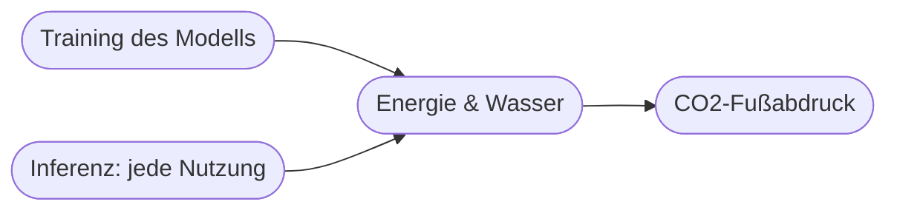

# Kapitel 36 – Energie- und Ressourcenverbrauch von KI

{{ progress(36) }}

<div class="lernziele" markdown>
<h3>Was du in diesem Kapitel lernst</h3>

- Warum KI **Energie und Ressourcen** verbraucht
- Der Unterschied zwischen **Training** und **Inferenz**
- Was **Green AI** bedeutet
- Wie du KI **ressourcenbewusst** einsetzt
</div>

---

## 36.1 Wo KI Ressourcen verbraucht



| Phase | Beschreibung | Verbrauch |
|---|---|---|
| **Training** | Modell wird einmalig gelernt | sehr hoch, aber einmalig |
| **Inferenz** | jede einzelne Nutzung/Anfrage | pro Anfrage klein, in Summe groß |

!!! info "Rechenzentren"
    KI läuft in Rechenzentren, die **Strom** für Rechenleistung und **Wasser/Energie** für Kühlung benötigen. Bei Millionen Nutzern summiert sich die Inferenz erheblich.

---

## 36.2 Green AI

**Green AI** verfolgt das Ziel, KI **effizienter und ressourcenschonender** zu machen:

- **Kleinere, spezialisierte Modelle** statt immer größerer
- **Effiziente Hardware** und grüner Strom
- **Sinnvoller Einsatz:** nicht jede Aufgabe braucht das größte Modell

---

## 36.3 Der ehrliche Blick: Netto-Nutzen

!!! warning "Verbrauch gegen Nutzen abwägen"
    KI kann Ressourcen sparen (Kapitel 29) – verbraucht aber selbst welche. Verantwortungsvoll ist, den **Netto-Effekt** zu betrachten: Spart die Anwendung mehr, als sie kostet?

**Ressourcenbewusster Einsatz:**

- passendes (nicht das größte) Modell wählen
- unnötige Wiederholungen vermeiden
- Aufgaben bündeln statt zerstückeln

**Copilot-Prompt zum Ausprobieren:**

```text
Erkläre den Unterschied zwischen Training und Inferenz beim Energieverbrauch von
KI. Nenne 4 konkrete Maßnahmen, mit denen ein Unternehmen KI ressourcenschonender
einsetzen kann.
```

---

## Kurzübungen

{{ task(file="tasks/k36_01.yaml") }}

{{ task(file="tasks/k36_02.yaml") }}

---

## Workshop

{{ task(file="tasks/workshop_k36.yaml") }}
