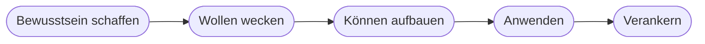

# Kapitel 37 – Change Management

{{ progress(37) }}

<div class="lernziele" markdown>
<h3>Was du in diesem Kapitel lernst</h3>

- Warum **Akzeptanz** über den Erfolg von KI entscheidet
- Typische **Ängste und Widerstände** – und wie man ihnen begegnet
- Ein einfaches **Change-Modell** für KI-Einführungen
- Die Rolle von **Kommunikation und Qualifizierung**
</div>

---

## 37.1 Warum Change Management?

KI verändert **Arbeitsweisen**. Technik allein reicht nicht – wenn Mitarbeitende nicht mitziehen, scheitert die Einführung. **Change Management** begleitet den Wandel bei den Menschen.

!!! info "Die halbe Miete ist der Mensch"
    Studien zeigen: Die meisten KI-/Digitalprojekte scheitern nicht an der Technik, sondern an **fehlender Akzeptanz und Kompetenz**.

---

## 37.2 Ängste und Widerstände

| Widerstand | Hintergrund | Antwort |
|---|---|---|
| „KI nimmt mir den Job" | Existenzangst | Rolle als Assistenz betonen, Weiterbildung |
| „Das funktioniert eh nicht" | Skepsis | kleine Erfolge zeigen |
| „Zu kompliziert" | Überforderung | Schulung, einfache Einstiege (Copilot) |
| „Wozu das alles?" | fehlender Sinn | Nutzen konkret machen |

---

## 37.3 Ein einfaches Change-Modell



Angelehnt an bekannte Modelle (z. B. ADKAR): erst **verstehen, warum**, dann **wollen**, dann **können** (Schulung), dann **anwenden**, dann **verankern** (Routine).

---

## 37.4 Kommunikation und Qualifizierung

- **Transparent kommunizieren:** Ziele, Nutzen, was sich ändert – und was nicht.
- **Betroffene beteiligen:** früh einbinden, Feedback ernst nehmen.
- **Qualifizieren:** praktische Schulungen (z. B. Prompting mit Copilot – dieser Kurs!).
- **Vorbilder nutzen:** „Champions" im Team, die andere mitnehmen.

**Copilot-Prompt zum Ausprobieren:**

```text
Erstelle einen Kommunikationsplan für die Einführung von Microsoft Copilot in
einem Team. Berücksichtige typische Ängste, nenne Botschaften je Phase und
schlage Qualifizierungsmaßnahmen vor.
```

---

## Kurzübungen

{{ task(file="tasks/k37_01.yaml") }}

{{ task(file="tasks/k37_02.yaml") }}

---

## Workshop

{{ task(file="tasks/workshop_k37.yaml") }}
