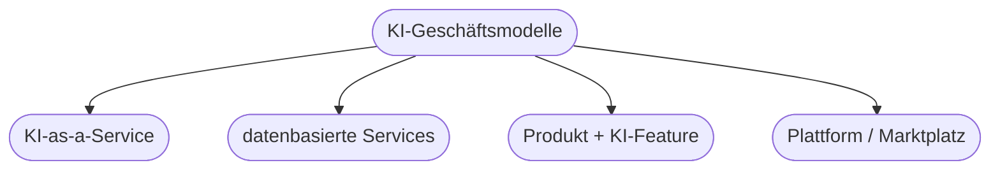

# Kapitel 38 – Digitale KI-Geschäftsmodelle

{{ progress(38) }}

<div class="lernziele" markdown>
<h3>Was du in diesem Kapitel lernst</h3>

- Wie KI **neue Geschäftsmodelle** ermöglicht
- Zentrale Bausteine eines Geschäftsmodells
- Typische **Muster** KI-basierter Geschäftsmodelle
- Wie du mit Copilot ein Geschäftsmodell durchdenkst
</div>

---

## 38.1 Vom Produkt zum KI-Geschäftsmodell

KI verändert nicht nur *wie* Unternehmen arbeiten, sondern *womit* sie Geld verdienen. Aus Daten und KI-Fähigkeiten entstehen neue **Wertangebote**.

**Bausteine eines Geschäftsmodells (vereinfacht):**

| Baustein | Frage |
|---|---|
| Wertangebot | Welchen Nutzen bieten wir? |
| Kundensegment | Für wen? |
| Kanäle | Wie erreichen wir Kunden? |
| Einnahmequellen | Wie verdienen wir? |
| Schlüsselressourcen | Was brauchen wir (Daten, Modelle)? |

---

## 38.2 Muster KI-basierter Geschäftsmodelle



| Muster | Beschreibung | Beispiel |
|---|---|---|
| KI-as-a-Service | KI-Funktion gegen Gebühr | Übersetzungs-API |
| Datenbasierter Service | aus Daten Mehrwert schaffen | Predictive Maintenance als Service |
| Produkt + KI-Feature | bestehendes Produkt aufwerten | Kamera mit Objekterkennung |
| Plattform | Angebot und Nachfrage vermitteln | KI-Marktplatz |

!!! info "Von Verkauf zu Abo"
    Häufig geht der Trend vom Einmalverkauf zu **wiederkehrenden Einnahmen** (Abo/Nutzung) – ermöglicht durch datenbasierte, laufend verbesserte KI-Services.

---

## 38.3 Geschäftsmodell mit Copilot durchdenken

**Copilot-Prompt zum Ausprobieren:**

```text
Ich habe Zugriff auf folgende Daten/Fähigkeiten: [beschreiben]. Entwickle 3 Ideen
für KI-basierte Geschäftsmodelle. Beschreibe je Idee Wertangebot, Zielgruppe und
Einnahmequelle und nenne eine zentrale Hürde.
```

!!! warning "Machbarkeit prüfen"
    Ein spannendes Modell muss auch **umsetzbar** und **rechtlich zulässig** sein (Daten, Datenschutz, Kosten). Die Idee ist der Anfang, nicht das Ende.

---

## Kurzübungen

{{ task(file="tasks/k38_01.yaml") }}

{{ task(file="tasks/k38_02.yaml") }}

---

## Workshop

{{ task(file="tasks/workshop_k38.yaml") }}
