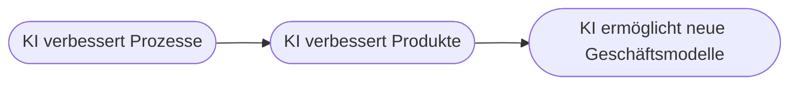

# Kapitel 38 – Digitale KI-Geschäftsmodelle

{{ progress(38) }}

<div class="lernziele" markdown>
<h3>Was du in diesem Kapitel lernst</h3>

- Wie KI nicht nur Prozesse verbessert, sondern **neue Geschäftsmodelle** ermöglicht
- Die zentralen **Muster** KI-basierter Geschäftsmodelle
- Was ein **Business Model Canvas** ist und wie KI es verändert
- Die Rolle von **Daten als Wettbewerbsvorteil**
- Wie du mit **Copilot** Geschäftsmodell-Ideen entwickelst und schärfst
</div>

---

## 38.1 Von der Effizienz zum neuen Geschäft

Die meisten Unternehmen nutzen KI zunächst, um **bestehende Prozesse** zu verbessern (Kap. 3, 21). Der nächste Schritt ist größer: KI ermöglicht **ganz neue Angebote und Erlösquellen** – also **Geschäftsmodellinnovation** (Kap. 6).



!!! info "Der Unterschied"
    „Wir bearbeiten Angebote schneller" ist Effizienz. „Wir verkaufen unseren Kunden einen KI-gestützten **Vorhersage-Service** als monatliches Abo" ist ein **neues Geschäftsmodell**. Letzteres verändert, **womit** man Geld verdient – und ist oft schwerer kopierbar.

---

## 38.2 Muster KI-basierter Geschäftsmodelle

| Muster | Idee | Beispiel |
|---|---|---|
| **KI-as-a-Service** | KI-Funktion als Abo verkaufen | Vorhersage-/Analyse-Service |
| **Personalisierung** | individuelle Angebote in Echtzeit | Empfehlungen, dynamische Preise |
| **Ergebnis statt Produkt** | Kunde zahlt für Resultat | „Betriebszeit garantiert" (Predictive Maintenance, Kap. 26) |
| **Plattform/Daten** | Vermittlung + Daten als Kern | Marktplätze mit KI-Matching |
| **Automatisierter Service** | 24/7 ohne Personal skalieren | KI-Beratung/-Support |

!!! example "Vom Produkt zum Ergebnis (Pay-per-Outcome)"
    Ein Maschinenbauer verkauft nicht mehr nur die Maschine, sondern **garantierte Verfügbarkeit** („99 % Betriebszeit") – möglich durch Predictive Maintenance. Der Kunde zahlt für das **Ergebnis**, nicht das Produkt. Das bindet Kunden enger und schafft laufende Einnahmen. Solche Modelle sind ohne KI kaum denkbar.

---

## 38.3 Das Business Model Canvas

Das **Business Model Canvas** ist ein einfaches Werkzeug, um ein Geschäftsmodell auf einer Seite darzustellen. KI berührt fast jeden seiner Bausteine:

| Baustein | KI-Wirkung |
|---|---|
| Wertangebot | KI-gestützter Nutzen (schneller, personalisiert) |
| Kundenbeziehung | automatisiert, 24/7 |
| Kanäle | KI-Empfehlungen, Chatbots |
| Schlüsselressourcen | **Daten** und Modelle |
| Schlüsselaktivitäten | Datenanalyse, Modellpflege |
| Kostenstruktur | Rechenkosten (Kap. 36), Datenbeschaffung |
| Einnahmequellen | Abos, Pay-per-Use, Ergebnis-Preise |

---

## 38.4 Daten als Wettbewerbsvorteil

Bei KI-Geschäftsmodellen sind **Daten** oft die wichtigste Ressource – und ein schwer kopierbarer Vorteil.

!!! info "Der Datenkreislauf (Datennetzwerkeffekt)"
    Ein gutes KI-Angebot zieht mehr Nutzer an → mehr Nutzer erzeugen mehr Daten → mehr Daten verbessern die KI → das bessere Angebot zieht noch mehr Nutzer an. Dieser sich selbst verstärkende Kreislauf ist der Grund, warum datenstarke Anbieter ihren Vorsprung ausbauen. Wer früh eigene, einzigartige Daten sammelt, baut einen echten Burggraben.

!!! warning "Aber: rechtlich und ethisch sauber"
    Daten als Vorteil zu nutzen, entbindet nicht von **Datenschutz, Zweckbindung und Fairness** (Block 4). Ein Geschäftsmodell, das auf zweifelhaft erhobenen Daten beruht, ist ein Risiko – rechtlich und für die Reputation.

---

## 38.5 Geschäftsmodelle mit Copilot entwickeln

Copilot ist ein guter **Ideengeber und Sparringspartner** für Geschäftsmodell-Arbeit:

**Beispiel-Prompts:**

```text
Unser Unternehmen [Kurzbeschreibung] besitzt Daten über [Datenart]. Entwickle
5 Ideen für KI-basierte Geschäftsmodelle, ordne sie nach Umsetzbarkeit und
nenne je das zentrale Wertangebot und die größte Herausforderung.
```

```text
Fülle für folgende Geschäftsidee ein Business Model Canvas aus: [Idee].
Markiere die zwei Bausteine, die über Erfolg oder Misserfolg entscheiden.
```

!!! tip "Idee ist billig, Umsetzung entscheidet"
    Copilot liefert schnell viele Geschäftsmodell-Ideen. Der Wert entsteht bei der **kritischen Prüfung**: Gibt es echten Kundenbedarf? Haben wir die Daten? Ist es rechtlich sauber und wirtschaftlich tragfähig? Nutze Copilot für die Breite (viele Ideen) und dein Urteil für die Tiefe (die richtige auswählen).

---

## Zusammenfassung

- KI ermöglicht über Effizienz hinaus **neue Geschäftsmodelle** – verändert also, **womit** man Geld verdient.
- Muster: **KI-as-a-Service, Personalisierung, Ergebnis statt Produkt, Plattformen, automatisierter Service**.
- Das **Business Model Canvas** hilft, KI-Wirkung auf alle Bausteine zu durchdenken.
- **Daten** sind oft der zentrale, schwer kopierbare Wettbewerbsvorteil (Datennetzwerkeffekt) – aber rechtlich sauber halten.
- **Copilot** liefert Ideen; die **kritische Auswahl** bleibt beim Menschen.

---

## Kurzübungen

{{ task(file="tasks/k38_01.yaml") }}

{{ task(file="tasks/k38_02.yaml") }}

{{ task(file="tasks/k38_03.yaml") }}

---

## Workshop

{{ task(file="tasks/workshop_k38.yaml") }}
