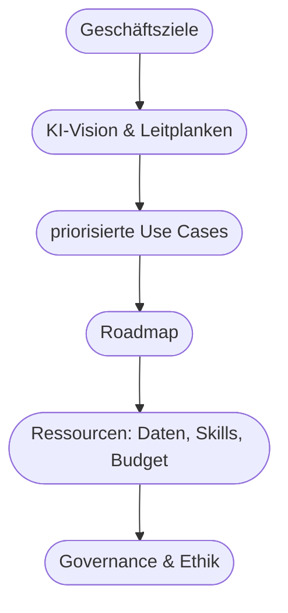

# Kapitel 39 – KI-Strategie und strategisches KI-Management

{{ progress(39) }}

<div class="lernziele" markdown>
<h3>Was du in diesem Kapitel lernst</h3>

- Was eine **KI-Strategie** ist und warum „einfach mal machen" scheitert
- Die zentralen **Bausteine** einer KI-Strategie
- Wie man Use Cases **priorisiert** und in eine **Roadmap** bringt
- Die Rolle von **Governance, Kompetenzaufbau und Kultur**
- Wie du mit **Copilot** eine erste Strategie-Skizze erstellst
</div>

---

## 39.1 Warum es eine Strategie braucht

Viele Unternehmen starten mit **verstreuten KI-Experimenten** ohne roten Faden. Das führt zu Insellösungen, doppelter Arbeit und Frust. Eine **KI-Strategie** gibt Richtung: Wo wollen wir mit KI hin, warum, und wie kommen wir dahin?

!!! info "Strategie vs. Aktionismus"
    „Wir setzen jetzt überall KI ein" ist **kein** Ziel, sondern Aktionismus. Eine Strategie verbindet KI mit den **Geschäftszielen**: Welche Ziele unterstützt KI? Welche Use Cases zahlen darauf ein? Ohne diese Verbindung verpuffen Investitionen. Strategie ist die Klammer um alles, was du in diesem Kurs gelernt hast.

---

## 39.2 Bausteine einer KI-Strategie



| Baustein | Frage |
|---|---|
| **Geschäftsziele** | Worauf zahlt KI ein? |
| **Vision & Leitplanken** | Wofür nutzen wir KI – und wofür nicht? |
| **Use Cases** | Welche konkreten Anwendungen (Kap. 4)? |
| **Roadmap** | In welcher Reihenfolge, bis wann? |
| **Ressourcen** | Daten, Kompetenzen, Budget, Werkzeuge |
| **Governance** | Regeln, Verantwortung, Ethik (Block 4) |

---

## 39.3 Use Cases priorisieren und als Roadmap ordnen

Nicht alles auf einmal. Die **Nutzen-Machbarkeit-Matrix** (Kap. 4) hilft, die Reihenfolge zu bestimmen:

| | Geringer Aufwand | Hoher Aufwand |
|---|---|---|
| **Hoher Nutzen** | ✅ zuerst (Quick Wins) | strategische Leuchttürme (planen) |
| **Geringer Nutzen** | nebenbei | vermeiden |

Daraus wird eine **Roadmap** in Wellen:


!!! tip "Copilot ist der ideale Start"
    Für die meisten Unternehmen ist die **erste Welle** die breite Einführung von **Copilot** in Office-Aufgaben: hoher Nutzen, geringer Aufwand, keine eigene Infrastruktur (Kap. 7). Das schafft schnelle Erfolge, Akzeptanz und Kompetenz – die Basis für ambitioniertere Wellen.

---

## 39.4 Governance, Kompetenz, Kultur

Eine Strategie ist mehr als eine Use-Case-Liste. Drei „weiche", aber entscheidende Elemente:

| Element | Warum entscheidend |
|---|---|
| **Governance** | Regeln für Datenschutz, Ethik, erlaubte Tools (Block 4, Kap. 11) |
| **Kompetenzaufbau** | ohne Skills keine Nutzung – Schulung, Prompt-Kompetenz (Kap. 40) |
| **Kultur** | Offenheit, Ausprobieren dürfen, Change (Kap. 37) |

!!! warning "Der häufigste Strategiefehler"
    Viele Strategien listen **Technologien und Use Cases**, vergessen aber **Menschen und Regeln**. Dann steht die Technik bereit, aber niemand kann oder darf sie richtig nutzen. Eine gute KI-Strategie plant **Kompetenzaufbau und Governance von Anfang an** mit ein.

---

## 39.5 Eine Strategie-Skizze mit Copilot

**Beispiel-Prompt zum Ausprobieren:**

```text
Ich erstelle eine erste KI-Strategie für ein mittelständisches Unternehmen in
der Branche [Branche]. Hilf mir mit: (1) 3 möglichen strategischen Zielen,
(2) 5 priorisierten Use Cases mit Einordnung nach Nutzen/Aufwand,
(3) einer groben Roadmap in 3 Wellen und (4) den wichtigsten Governance-Punkten.
```

!!! tip "Skizze, nicht Endprodukt"
    Copilot liefert eine schnelle, strukturierte **erste Skizze** – hervorragend als Diskussionsgrundlage. Die echte Strategie entsteht dann im **Dialog mit Führung, Fachbereichen und Betroffenen**, angepasst an eure reale Situation und Datenlage.

---

## Zusammenfassung

- Eine **KI-Strategie** verbindet KI mit **Geschäftszielen** – gegen Aktionismus und Insellösungen.
- Bausteine: **Ziele, Vision/Leitplanken, priorisierte Use Cases, Roadmap, Ressourcen, Governance**.
- Use Cases nach **Nutzen/Aufwand** priorisieren und in **Wellen** ordnen – Copilot-Einführung ist der ideale Start.
- **Governance, Kompetenzaufbau und Kultur** von Anfang an mitplanen – der häufigste Strategiefehler ist, sie zu vergessen.
- **Copilot** liefert eine gute Strategie-**Skizze**; die Ausarbeitung geschieht im Dialog.

---

## Kurzübungen

{{ task(file="tasks/k39_01.yaml") }}

{{ task(file="tasks/k39_02.yaml") }}

---

## Workshop

{{ task(file="tasks/workshop_k39.yaml") }}
